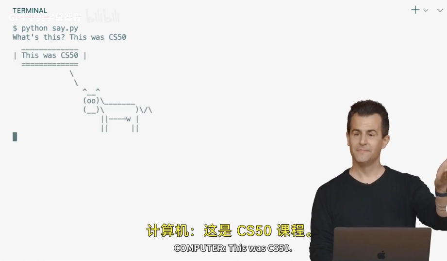

**CS50P:Python速通**  

针对python本身进行比较系统的速通学习，以便后面的CV、机器学习、深度学习等能迅速看得懂代码。  

*由于速通学习，框架较乱，争取看着明晰，方便复习。*  
感谢老师 **David J. Malan**!  

***

# Week0 Functions,Varibles

## 速览

笼统的，函数的写法是**函数名(参数...)**  
函数一般都有**返回值**与"**副作用side effects**"（非贬义，而是指伴随日志的打印、音频发出、数据更改等）  
能够用**伪代码(pseudocode)**先构建思路。  
编程使用什么标准无所谓，但是要说，喂，为什么这样用，有什么好处？  

## 各类方法

### 注释：计算机自动忽略

+ 井号#（注释其后一行）
+ 三引号"""（注释其包围的内容）（**注：最后一课讲，这里其实严格的是文档字符串**）  

### 输入&打印

**input("xxx")**:
会输出其中的参数字符串，并在命令行接受一个参数，其返回的是字符串，需要其他类型得额外转换。  

**print()**：  
+ 可以通过‘**+**’来连接多个变量，例如`print("fku " + name)`，直接连接，不会加空格  
+ 也通过‘**,**’输出多个变量，例如`print("fku", name)`，这个会在变量之间加空格  
+ 有特性称为f字符串，能便利的混合输出，如`print(f"fku {name}")`，`print(f"{z:,}")`（会按英美方式格式化），`print("f{z:.2f}")`（会输出截止2位的浮点）  
+ 对于输出引号字符"**"**"的边缘情况，可以使用反斜杠转义  

其原型为*print(\*objects, sep=' ', end='\n', file=sys.stdout, flush-False)* ，\*objects意味可以接受任意多个参数，sep为参数之间的字符，end为调用结束后的字符，可以自行覆盖默认参数。  

### 字符串方法（可以嵌套使用）

+ `str.strip()`：返回str去除两侧空格与换行符等的结果，还有进阶的指定左右
+ `str.capitalize()`：会返回字符串开头大写
+ `str.title()`：会像标题一样将每个单词开头置大写
+ `str.split(" ")`：会将str按“ ”内的对应字符串分割并返回元组
+ `str.replace(str, str)`：用后者代替前者

### Others

将调用的类、函数都定义在最上方，其下定义其他函数，最下方调用main()即可，但要`__name__ == "__main__"`的判断。  
直接命令行用python可以进入**交互模式**  
浮点数可以用`round`函数，原型为`round(number[, ndigits])`，输入number，将其在第ndigits位进行四舍五入  
**自定义函数使用def**进行，可以添加默认参数，记得缩进；  
n \*\* 3表示 n的三次方  

***

# Week1 条件句

if下方也要加**缩进**  
**布尔类型**：True与False  
条件判断有**if**、**elif**、**else**、**or**、**and**、**match**等  
写条件句时要注意让其更简洁、逻辑清晰  
python可以写出`80 <= score < 90`这样的双向条件代码，`return True if n % 2 == 0 else False`也是python的特有形式   
python的“match”语句类似于switch,并且其中的`case _：`与default相同  
case中用 |来联系不同情况，而if中用or来连接  

***

# Week2 Loops

while、for、continue、break  
**list**类型，用方括号[]表示，也可xx = list()；使用".append()"方法可以将新元素添加到列表   
**dict**类型，用于将不同类型关联起来(key & value)，用大括号{}来表示，相当于列表的索引不再是数字，调用要用["key"]，也可xx = dict()  
**range()**函数，输入的第一个参数，从0开始到小于它，如`range(3)`实际上是0、1、2  
**len()**函数，输入一个列表，返回列表、字符串的长度  
for循环与range有一种“**Pythonic**”的写法：`for _ in range(3)`，能够忽略循环中循环变量的名字，而只关注于循环的特性；然而当循环变量本身有作用、而不是单纯计数，就要清晰表示：`for student in students`，students为字符串列表  
可以字面上的**乘法**来输出一个字段多次：`print("meow\n" * 3)`  
可以使用无限循环(while True)限制用户  
None表示缺失  

***

# Week3 Exceptions 异常

**异常分类**：  
+ SyntaxError：语法错误  
+ ValueError：数值错误，输入的值不正确等  
+ NameError：名称错误，变量未定义时引用等  
+ KeyError：索引错误，新元素引入等  
+ EOFError：文件结束错误，用于ctrl+d来结束连续输出等  

**流程**：  
+ **try**：要测试的代码  
+ **except**：加上预期的错误类型，捕捉错误，进行错误处理  
+ **else**：若没有出问题执行这个  
+ **pass**：可以用作占位，譬如except了错误，但不想处理，pass；if了条件不想处理，pass等  

**手动抛错误**：  
+ 使用**rasie 错误类型 **来手动制造错误类型  
+ 错误可以加上提示，比如`raise ValueError("xxxx")`  

***

# Week4 Libraries 资源库

库就是模块化（modules）的代码  
使用**import**关键字从某个库中加载函数，引入的函数必须要与其作用域相关联，如`import random`后只能`random.choice(seq)`  
使用**from**关键字从一个库中导入函数，但比import更具体，如`from random import choice`后可以直接`choice()`，因为相当于直接导入进命名空间，可以简化代码，前提是命名不会冲突  

第三方的代码库称为包（packages）（包在python的严格意义是由一个文件夹实现的），可以安装，来获得其他人实现的更强大的代码，有一个有名的cowsay包，可以用cow画奶牛说话，trex画霸王龙说话  
包通常需要管理，这就有了**包管理器**（**pip**）  

API安装，API这里指代python文件和函数，如r**equests**库，访问互联网：  		
+ requests.get()，访问URL并获取信息

python也自带json库，可以简化、解析获取的json信息：  
+ json.dumps()  

python自带一整套模块，包括随机库(radom.py)，其中有：  
+ choice(seq)，等概率返回seq中的随机一元素  
+ randint(a,b)，等概率返回包括a、b的中间一元素  
+ shuffle(x)，接受一个列表并将其打乱，直接修改自身  

还包含一个统计库(statistics.py)，其中有：  
+ mean()，返回平均值  

在sys.py中还有命令行参数特性，能够访问在命令行中输入的值:  
+ argv，是命令行中输入的所有参数的列表，第0个元素是程序名，后面的是各个输入参数  
+ exit(s)，打印s并立刻停止函数  

在列表中，**slices**为切片列表，即取列表的子集，例如`sys.argv[1:]`就是从列表的1号索引元素到最后的切片，而`sys.argv[1:-1]`就是索引为1的元素到倒数第二个元素的切片，因为**包括开头元素但不包括结尾元素**（列表索引为负时，-1为最后一个元素，以此类推）  

创建自己的库：  
在定义时沿用main，会在其他地方重新引用时整个再运行，因此要用：`if __name__ = "__main__"`:  
**__name__**：特殊变量，当在当前文件使用时，由python自动设置为"__main__"，而当作模块被调用时就不会。所以就应该将main函数加载这个条件下以使用。  

***

# Week5 Unit Tests 单元测试

可能过去一直通过运行程序来测试代码again and again，但是，要尽早养成测试自己的代码的习惯，而不是等到代码很多时才整个测试程序。  

**assert**关键字：允许做exactly that，**断言**某件事，当其为真时无事发生，为假时抛出错误信息以及asserterror。  
测试时凭借自己的经验判断潜在的边缘条件  

**测试工具：pytest**：  
+ 写法:  
	1. import待测试的模块/函数  
	2. 对于**值类型**，定义一或多个测试函数（这样测试的覆盖面广，如果全部放在一个里面，会被一个错误阻塞），里面全放断言即可，不用try、except,也不用加主函数等  
	3. 对于**捕捉错误类型**，可以在测试函数import pytest，然后再with pytest.raises(错误类型):xxx  
+ 其会输出是否正确以及错误信息  
+ 还可以测试**一整个包package**，为例则是在目录下增加一个"__init__.py"文件来告诉python这是一个包，然后`pytest 目录`，这样就会搜寻目录中所有的可用的测试案例进行测试  

为了方便测试，可以将输出信息返回主函数进行输出，这样便于捕捉返回值来测试  

***

# Week6 File I/O 文件输入/输出

目前的程序仅仅将变量、数据存放在**内存**中，也就是程序一退出，数据都会**消失**。研究如何保存一些文件，从而使数据**持久保存**。  

回归**list类型**，可以存储不止一条信息，但是数据都在内存里，程序退出即会消失。

**open()函数**：可以打开一个文件，然后从中**读取**或**写入**信息  
其第一个参数为**文件名**，第二个参数是**w、r、a”**，为w时会重新创建文件，相当于新内容**覆盖**，为a时会在文件尾部追加，为r或不加参数会进入只读模式  
返回一个文件句柄  

**sorted()函数**，返回对参数（列表、字典、文件等可迭代类型）进行字典排序的结果，想要进行**反向排序**可以将reverse参数置True，想要指定**键排序**就将key参数设为想要指定的键。  
一般想要以某种方式更改数据（如排序），就在顶部创建空列表，向其中追加以将数据集中，最后对列表进行统一处理  

**with关键字**：有时我们可能会忘记关闭文件，使用这个关键字可以在指定的上下文内**打开并自动关闭**某些文件，写法为`with open("xxx", "a") as file:`，当下方不再缩进时就会自动关闭  

**文件句柄**：  
+ ".write()"，将参数**写**进文件  
+ ".close()"，**关闭**并有效保存文件  
+ ".readlines()"，读取文件的**所有行**，并将其作为一个**列表**返回  
对于遍历文件中所有行，有一种**更高效**的方法：`for line in file:`  

**csv文件**，以逗号分割，相当于二维数据，通过split方法将一行断开就能使用  
split方法还有很好的**特性**，放多个变量来接，但当数量对不上就会ValueError，譬如某一个值内部有逗号分割——事情变**复杂**得很快。  
其实，python有自己的**csv库**，能够解决这些问题。   

**CSV库**：  
+ **csv.reader**()：输入文件句柄，其会将csv中的分隔符、换行符等的边界条件等进行自动解析，返回一个包含csv每一行的列表  
+ **csv.DictReader**()：输入文件句柄，将文件从顶到底进行迭代，加载每行文本，最后作为一个**存放字典的列表**，而不是作为列的列表，前提是CSV文件要有一个头，这样使得代码更加健壮  
譬如一份包含姓名、学院信息的CSV文件，**reader**会返回一个列表，列表的每一项里面是["某某某", "HC"]；而**DictReader**也会返回一个列表，但每一项是一个字典，里面是{"姓名":“某某某”， “学院”："HC"}  
+ **csv.writer**()：接受文件变量，返回一个writer类型，writer的方法：  
	+ **writer.writerow()**，参数为一个列表，是要写进一行的内容  
+ **csv.DictWriter**()：同样的，是一个字典写入writer，在有表头时用。其有**两个参数**，第一个参数为文件，第二个参数为"fieldnames"，相当于告诉python都有哪些列将会被写入。方法为：  
	+ **writer.writerow()**，参数为一个字典，也是要写入的对应内容  

**PIL库**：pillow库是一个**图像文件处理库**，可以用来做gif：  
+ 导入PIL库中的Image函数、建立一个空列表images，后面用来放gif的每一帧、用Image.open()打开图像文件，返回一个图像句柄、将图像append进列表内、循环、用images[0].save()方法自动保存并关闭，道理是保存第一张，但将其他加在第一张上，暂停时间、无限循环、保存路径等  
+ `from PIL import Image, ImageOps`：  
	+ Image.open(path):打开文件，返回一个Iamge类型 
	+ .size:返回Image类型的图片长宽  
	+ ImageOps.fit(Image,size)，调整Image类型的大小，返回调整结果  
	+ .paste(Image, 掩码)，将Image覆盖到调用类型上，并只在掩码图像区域内覆盖  
	+ .save(path)，将Image类型保存至指定路径

**函数作为参数传递给其他函数**：  
正如sorted()的对字典操作，假如有一个字典名为student，有name与house两个键，想要按名字进行排序，可以用`sorted()`来进行排序，其会自动调用key等于的函数：  
	
	def get_name():  
		return student["name"]  
	for student in sorted(students, key=get_name):  
		...  

正如某些不严格必要的变量可以省略，函数也可以用一个**匿名函数**来表示：  
`for student in sorted(student, key=lambda student:student["name"])`  
更一般的，匿名函数可以在多个地方定义并调用，其可以有多个输入参数，用逗号分隔。  

***

# Week7 正则表达式

我个人其实并不喜欢正则表达式，因此这一节选择略过（懒）。  

***

# Week8 面向对象编程OOP

前面用到的都是**过程式代码**：编写过程、函数，并从上至下执行操作，一步一步按照预期中的算法执行；但是随着程序变长、变复杂而会遇到一些麻烦。  
因此需要转移到**面向对象式代码**来优化。  

面向对象的一个思路是将与某研究对象的所有相关功能都放在类里实现，而不是随机的放在外面。  

## tuple 元组/list 列表/dict 字典

一组数据，不同于列表可以改变其任意元素的值，元组元素是**不可更改**的，通常是为了高效的返回多个不需要更改的值，只需要用逗号隔开返回即可；也可以用圆括号()包围，表示明确的打包成为元组。  

要注意的是，元组本身是一个返回值，而不是返回了多个返回值，是一个元组里包含了多个返回值。并且元组也可以嵌套。   

访问元组与列表类似，用方括号作为索引。  

使用元组是一种防御性编程。当明确的知道某些返回值不应当被改变。

### 引号混淆

尤其是在使用字典时，会出现`print(f"{student["name"]}")`这样的混淆，会造成语法错误，应该让内外的引号单双分明。  

## classes 类

当思考一个事物使用哪种方式来更好的存储信息时，要是有一个开发者预留好的数据类型就好了，尽管这是一个滑坡，但是的确留有一个类型作为蓝图能够实现自定义的数据类型，那就是类class。  

定义一个类用`class Xxxx:`这样，默认第一个字母大写来表明是一个类。  
类内对象objects用“.”来引出；还有方法methods,其实就是类的内部函数。  

一旦定义好了类，就可以调用类的初始化函数并创建一个实例instence了。

## 类的初始化函数

每一个类都需要有一个初始化方法，这个初始化方法实例用法是固定的：  
`def __init__(self, xx, xx...):`如此。  
其实就是一个外部参数xx写进类的通道，self的用法是代指刚刚创建的对象，提供访问权限（但是事实上self可以替换为任意，只不过约定俗成用self），创建类内新的实例；  
也可以有一些默认值；  

如此每当调用类的创建函数，python会自动的执行这个init函数来完成初始化。  

## print 类会怎样

获得一个类实例后，尝试打印它，会发现打印出来的实际上是晦涩难懂的在计算机内部的地址或者原始数据，就和c语言的指针一样，没有有效内容。  

但是这默认的也不是不能改。与其相关的方法是`__str__`，print期望得到一个字符串类型的，所以可以通过改str来修改print类的输出，如`def __str__(self):`紧跟`return "xxxx"`这样的。  

## 类的方法method

**方法其实就是函数**，只不过只限于类内使用。前面的\_\_init\_\_()与\_\_str\_\_都是方法，只不过是特殊方法，无需其他操作。  

## 防御性编程：properties

属性就是一个是我们能够更精细操作的特性，让特定变量得到更细粒化的控制。  

实例如下描述：  
有一个Student类，其中有name、house等对象，并且为了安全考虑，内部对象设置时要进行一个检查才能成为一个实例。  
但是在实践中会发现，在初始化完成后仍然可以通过`student.house = xxxx`直接更改内部对象，而无法实现安全检查。  

可知问题的核心是student.house的内容需要一直检查，但是只在初始化时做了一次，后面再次更改就不会。需要找到一个办法能够在每次更改其内容时就进行一次安全检查。  

解决方法就是使用**property**。具体的，就是将house**变为一个属性而不是一个变量**，然后用getter与setter的组合来对其加以限制：  
```
@property
def house(self):
	return self._house
@house.setter
def house(self, house):
	if house not in ["xxx", "yyy"]:
		raise ValueError("xxx")
	self._house = house
```

其中的**要点**：  
+ getter对应的就是@property修饰后的house属性，而setter紧接着对应
+ 每当调用house时，就会由这两个评估
+ self.\_house的用法是约定俗成的，当属性名、变量名冲突时就会加一个下划线；**但是**python并不会保护其不被外界改变，因此遇到下划线开头的实例，千万不要改变，将其视为“**私有变量**”  

## class methods 类方法

有时候某个函数不一定只对特定的实例有关，更有可能对整个类都有关而无关实例自身；或者说我们不需要类作为一个通用的模板来创造实例，而是仅仅需要其提供的功能。这时使用**class method**就能解决问题。  

前面的Student类，的确是每一个人都需要成为一个具体的实例进行不同的操作；但是有时候所要的仅有一个，独一无二，就像哈利波特的分院帽一样，以此为例就可以引出类方法的使用：  

```
class Hat:
	houses = ["G", "H", "R", "S"]
	
	@classmethod
	def sort(cls, name):
		print(name, "is in", random.choice(cls.houses))

Hat.sort("Tree boss")
```

新的要点：  
+ 使用**@classmethod**关键字
+ 当使用类方法时，就不需要\_\_init\_\_的初始化了，所需要的类内变量直接开始定义就行
+ 这些变量就不存在self中，而是cls中
+ 使用类方法时要用到类变量，用“cls.”来引出
+ 最后使用时就直接用“类名.类方法”即可  

除上面的情况之外，在将相关功能打包为一个类时，类方法也能提供便利：  
```
class Student:
	def __init__(self, name, house):
		self.name = name
		self.house = house
	
	@classmethod
	def get(cls):
		name = input()
		house = input()
		return cls(name, house)
		
treeboss = Student.get()
treeboss.xxxxx....
```
上面的这些self、cls都是特指的引用  

### 为什么使用类方法，而非创建函数

事实上，功能简单时的确用一个函数也能实现替代的方法；  
但是一旦代码越来越复杂、与他人一起协作，就会发现函数会极其复杂，有的相关，有的不相关，那时就需要将其区分开来，也就是成了类，这也是面向对象编程的思想  

## inheritance 继承

类与类之间也有一些联系，可以抓住这些联系来使代码简化、清晰。  
以巫师是教授的父类为例：  
```
class Wizard:
	def __init__(self, name):
		self.name = name
	...(other)

class Professor(Wizard):
	def __init__(self, name, subject):
		super().__init__(name)
		self.subject = subject
	...
```
其中**要点**：  
+ Professor类定义时是继承自Wizard类，所以Wizard类是父类  
+ super()表示调用当前类的父类

## operator overloading 运算符重载

详见官方手册，事实上就是一个特殊方法：  
```
class Money:
	def __init__(self, gold, silver, dollar):
		self.gold = gold
		...
	
	def __add__(self, other):
		gold = self.gold + other.gold
		...
		return Money(gold, silver, dollar)
		
lzt = Money(1, 0, 0)
treeboss = Money(0, 1, 1)
total = lzt + treeboss
...
```

# Week9 End & Other 启发

python还有其他多种功能  

## set 集合

可以利用集合内部元素不重复的特性，使用集合，简化某些问题  

可以用`xx = set()`来创建一个空集合，然后用append向其中增加元素。  

## global 全局变量

告知python这一变量并非局部变量，而是外部对应有的一个全局变量，是整个函数都可以更改的变量。譬如在一开始在其他函数之外定义了`balance = 0`，其他函数调用balance时就要先`global balance`来确认是一个全局变量。  

但是随着面向对象编程，全局变量可以用公私变量之分来解决；更一般的，不建议过多使用全局变量。  

（注：这里上课时讲到的**bank.py**中，balance作为一个属性，是只读的，因为没有定义setter，符合现实规律；同样也解决了一个问题，之前getter与setter同时存在时，在init部分是直接对属性赋值的，因为setter的存在，能够进行约束；但是本例中只有初始化的要求，因此直接用更底层的对\_balance直接赋值，后续不再直接接触，而是通过deposit与withdraw来间接控制，十分合理。）  

## constants 常量

和其他语言一样，有些值我们设定了就希望不会再被更改，比如某些硬编码的数，一方面是稳定，另一方面是上浮到定义区好找。  

但是python是基于信任约定体系的（比如私有变量用下划线表明、全大写），代码中并没有某种可以强制恒定的关键字，需要注意。  

新介绍的共识是在类中，类的全局变量全大写来如此表示:  
```
class Cat:
	MEOWS = 3
	def meow(self):
		for _ in range(MEOWS):
			print("meow")
```
这样。  

## type hints 类型提示

python不是强类型语言，所以不需要像c一样给出具体数据类型，更多的是动态推测出一个变量。   
所以如果要想主动的要求python按照某类型存放数据，需要加上一定的类型提示。**但是**python并不一定会按照提示行事，所以有相关的工具用于检测是否按照我们的要求来指定类型——**mypy**  

具体的类型提示:  
+ 变量后加上**冒号、空格、类型**,如number: int
+ 函数返回值加上**空格、箭头、空格、类型**,如def meow(n: int) -> None:  
**但是这只是一个注释类型的，并不会看，只是方便debug！**  
```
def meow(n: int):
	...

number: int = input("Number: ") # 纠错后变为 number: int = int(input())
...
```

有了类型提示后，就可以用mypy工具运行，其会按照我们的类型注释来寻找错误；另外的，这也算是一种注释的习惯吧。  

## docstrings 文档字符串

使代码与说明文档化，也就是三重引号，放在函数/方法定义开头：:  
`"""xxx"""`or`'''xxx'''`  

其内容也有一些共识，譬如第一行为函数的简介，然后空一行，然后对参数以及可能引起的错误进行介绍等：  
+ :param n: xxxxx
+ :type n: xxx
+ :raise TypeError: xxx
+ :return: xxx
+ :rtype: xxx
+ ......  

python会捕获这些字符串作为文档（之前一直当成长注释语法用......），因此不同于前面的类型提示，这个不是python自带的某种语法，而是社区的共同约定，以便于在不同方法下都能自动化的生成文档以供阅读。  

## argparse库 命令行参数管理

开发库时，命令行参数有多种，譬如-n、-a或者--number等情况出现，类型不一样，位置也可能随机调换，手动用`sys.argv[x] == xxx`控制的话会非常麻烦。  

好在python自带了这个名为**argparse**的库，便于命令行参数的处理。  

### 基础用法

以命令行参数“-n”为例：
```
import argparse

parser = argparse.ArgumentParser()
parser.add_argument("-n")
args = parser.parse_args()
```
首先导入这个库，然后用库里的**ArgumentParser()**方法创建解析器对象，用解析器对象的**add_argument()**方法将-n参数添加进解析列表，然后用解析器的**args = parse_args()**方法将解析结果输出。  

后面要用到-n的参数，就用args.n就行（这里应该是字符串，如果是数字的话还需要强制类型转换，或者指定type,见下面）  

同时，当引入argparse库之后，执行程序时加上**-h**或**--help**就也能看到具体的用法、程序描述、参数意义了，见下。  

### 额外用法

+ **程序描述**：在创建解析器对象时，加上描述字符串，`parser = argparse.ArgumentParser(description="xxx")`即可。  
+ **参数描述**：在增加参数时，加上help参数即可，`parser.add_argument("-n", help="number of xxxx")`即可；类型强转也可以在这里加上一个`type=xx`来获取的时候就转换；若期望有一个默认值，还可以加上`default=xx`。  
+ 更多的用法用时查手册吧。  

## unpack 解包

有时函数或者方法需要的参数是一系列彼此相关的值，可以归纳到一个列表里，当想要将其传入时却较为繁琐。如果能将整个列表直接输入，其自动分析就好，这就是**unpack**。  

解包很简单，在列表前加上“**\***”即可：  
```
def compute(gold, silver, dollar):
	...

coins = [10, 20, 30]

print(compute(*coins))
```
解包会将列表中的成员一一传出，对于元组也有用，字典见下。  

### 字典解包

字典也能被解包，其解包用法为“**\*\***”，其解包的结果是带有值的量，如下（假定字典是`coins = {"gold":10, "silver":20, "dollar":30}`）：  
执行`**coins`实际上就相当于`gold=10, silver=20, dollar=30`  
### 函数的可变参数

上述列表、元素的解包与字典的解包，实际上与函数的可变参数是一体两面。  

在定义函数时，可以用`*args`来表示期望获得任意数量的**位置参数**（也就是直接的参数，如("this is a str", 100)这样的），以及用`**kwargs`来表示期望获得任意数量的**关键字参数**（形如键=值的参数，如a=1, b=2这样的）   

## map 映射

有时会遇到拥有一个序列（元组或列表），我们期望使用一个函数对这个序列中的每一个元素使用，使用手动的迭代写法固然可以，但是实际上python自带有一个**map**功能，实现将一个函数映射到一个列表上。  

map是一个函数，其语法大体是**map(调用的函数名, 序列)**，注意函数名不含括号。  

假定words是一个字符串列表，想要对words里面的每一个word执行函数str.upper()，则写成`uppercased = map(str.upper, words)`即可。  

这是一种**函数式编程**的思想。  

## list comprehensions 列表推导

这个是一种更有python风味的解决上面map问题的方式。  

指的是在运行时轻松构建一个列表，但不使用循环（比如while、for里面用append），而是只通过一行代码。  

其只是一种语法：在代表列表的“**[]**”内编写逻辑，就会自动根据逻辑生成新的列表。继续沿用上面的例子，写成`uppercased = [str.upper() for word in words]`即可。  

更复杂的写法，还有这样的：  
```
NWPUstudents = [
	student["name"] for student in students if student["school"] == "NWPU"
]
```

## filter 

和**map**类似，还有一种有**函数式编程**味道的函数：**fliter**  

filter函数至少需要两个参数，其中一个是返回值为布尔量的**函数名**，另一个是需要接受filter的字典，如下，假设students是一个包含姓名、学校的字典：  
```
def is_NWPU(s):
	return s["school"] == "NWPU"
	
NWPUstudents = filter(is_NWPU, students)
```
这个有点像pytorch这种东西操作时，用mask筛选的那样  

提问时有一个有用的工具：**black**，其可以把python代码文件/整个工程自动的按照官方推荐的方式格式化，用“pip install black”就行  

## dictionary comprehensions 字典推导

和列表推导一样，字典推导也是一样的思路，用一行顺畅的得到一个大字典。  

假定students是一个列表，里面每个元素都是名字，先从一个特殊的列表推导开始：  
`NWPU = [{"name":student, "school":"NWPU"} for student in students]`  
其会生成一个列表，列表的每一个元素是一个字典，里面的键是名字与学校。  

但我们想要的是一个大字典，键是名字，值是学校，所以可以真正使用字典推导：  
`NWPU = {student: "NWPU" for students in student}`  
这就实现了上面那个大字典。  

但是这里我有个问题，课上竟然没有人提：如果我想让每一个学生对应不同的学校呢，比如还有一个列表叫schools，我想构造一个一一对应的，那不还得用之前的语法吗？还是说这种复杂的问题本来就不能通过这种方式构建？  

问了下GPT，给了我一种用zip绑定两个列表的写法：`{student: school for student, school in zip(students, schools)}`，其实就是用zip让两个列表并排走，至于其他边界情况的处理还可以让其更复杂，因为这本来就是**循环+条件判断的语法糖**。  

## enumerate 

有时会有一个对列表对象输出时加一个序号的需求，一般就是用循环+range(len(listxx))一起输出。但是这是从0开始的，会有从1开始的需求，尽管输出+1就行，**但**其实python自带有个功能来实现：**enumerate**。  

基本语法就是**enumerate(iterable, start=0)**，能够遍历某个序列，同时获取每个元素对应的索引，用法如下：  
```
for i, student in enumerate(students, start=1)
	print(i, student)
```

## generators

编写的代码在处理过大的数据量时往往可能用尽内存而崩溃，或者执行时间过长而失去价值。  
**gennerator**解决这些问题有价值，将函数定义为generator，就能够让其同样生成大量数据，但每次只返回一小部分数据，而不用担心其一次性返回过多内容。  

比如写一个生成绵羊emoji的代码，最符合“*main函数里不应有过多逻辑，最好只输出结果*”的方案是构建一个flock（羊群）列表，把每次数的羊增加到flock里面，最后把flock每一个元素打印出来。**但是**这样做的结果就是在数到很大数时就会崩溃，因为单个变量flock所占内存过大；要解决也好说，就是每次数的结果都输出，但就与信条不符了。  

**解决方案就是generator**，关键字是**yield**，其可以告诉python有效的从一次循环只返回一个值。  

```
def sleep(n):
	for i in range(n):
		yield i*🐏
```

这个应该在哪里见过，与斐波那契数列那里有关，用的是**保留上次运行状态**的特性，而不用生成新数据时从头再来。  

也可以说是iterators 迭代器。  

***

## about homework & Final Project

前八周的作业，除过正则表达式的，都完成，放在另一个**CS50P_Assignment**文件夹内了（整理好加一个超链接）。  

课程的FinalProject我自然当前是构思不出新活儿了；  
但是我觉得暑假电赛的代码也不错，是OpenMV上的动物识别，尽管实现细节都还是AI代工，但也是我构思的一系列过程之上。  
哪一天也将其整理整理，一并发上去（整理好也加一个超链接）。  

***

**The END**  
***thank you, David J. Malan!***  
  
*2025-09-03*
