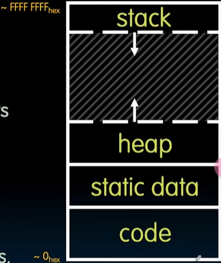

CS61C 计算机体系结构

学习整个系统从上到下是如何工作的，从**顶层——最高抽象层**一直到电流流动和电子填补空穴的硬件底层。  

***

# Lec1 Intro

## 内容

1. 理解计算机结构
2. 计组的伟大思想
3. 

### 计算机结构

### 计组伟大思想

+ 抽象
+ 摩尔定律
+ 局部性原则/内存层次结构
+ 并行性
+ 性能测量/改进反馈
+ 可靠性与冗余性

以上是CS61C的，黑皮书上有另外一种，~~学习按上面，备考按下面~~：  

+ 使用抽象简化设计
+ 加速大概率事件
+ 通过并行提高性能
+ 通过流水线提高性能
+ 通过预测提高性能
+ 存储层次
+ 通过冗余提高安全性

**理解：**   
1. 抽象创造出简化的接口，从而使上层不必对下层理解就可使用下层。如下面的内存层次，通过抽象的视角设计，实现了感知上类似于无穷大无穷快。  
2. 集成电路上晶体管的数量按照每年增长一定倍率，尽管近年来有所下降。摩尔定律带来的红利为每年都会有更优秀的处理器来运行之前的糟糕程序，使得对应用不重视，但随着速度放缓，开发专用计算机就有了用  
3. 从寄存器、cache、内存、硬盘到输出是很漫长的，在宏观视角来看就类似于家、学校、附近城市、其他星球、其他星系等
4. 并行、多线程提高某些部分的效率，但是由阿姆达尔定律，对部分进行优化，即使到极限也还有短板 
5. 略，理解还没到  
6. 正如宇宙粒子撞击，如果随机的一个bit变化，可能会造成不好的后果，比如银行，自动驾驶。为防止这样，为提高可靠，使用冗余设计  

***

# Lec2 Number_Representations

## 数据的输入：Analog->Digital

现实世界是模拟的，但要转换成数字形式计算机才能处理和操作他们。  

### 方法-两件事：时间离散化与数值离散化  
1. 采样（Sample）  
	每个时间点询问一次数值，通常是固定时间间隔  
2. 量化（Quantize）  
	获得的数据可能是一个小数，从存储角度看仍然属于“连续”，因此规定一系列的标尺，将其量化  

~~此事在《信号与系统分析》中也有记载~~  

### 但是数字数据不一定必须从模拟数据中来
比如纯数字世界生成的概念图片

## 本讲核心理念：比特可以代表任何事物

1. 字符  
	**7bit**可以组成**ASCLL**码，英文足够；还有8、16、32位的Unicode存储所有语言、所有符号  
2. 逻辑值  
	通常0假1真  
3. 颜色  
	RGB-00、01、11  
4. and others
	任何能够列举的事物，都可以指定比特表示规律，并将其数字化。	

***N位可以表示2的N次方种事物***  

## 二进制、八进制、十进制、十六进制

幽默笑话：人类遇到了外星人，大家都用的基数"10"(幺零)  
相互转换，老生常谈了  

### 数字表示法
正数无所谓  
负数：没有免费的午餐（Ain't no free lunch），牺牲原本能表示的最大的来换取负数，但正数会溢出到0到负数  
反码：直接取反，如+7为00111，-7为11000，同样的正书会溢出到最负数，方向对了，但有重叠（两个0）  
**补码**：那么只要将下面负数部分向左平移一下就可，在补码中，全1为-1。补码负转正只要翻转位+1。这样没有重叠，方向一致，负数比正数多一个  
**偏置编码**：有一组非负数，想要将其钳制成在“0”上下，则可以使用偏置码，比如五位二进制时**减15（2^5-1）**，这样从00000到11111就是一个纯粹的上升顺序，只有一个0，正数比负数多1。其过程为：得到一些正负值-->转换为无符号值-->应用偏置解码为原本有符号值  

***因此最常用的编码方式：无符号，补码，偏置码bias，在C中分别为uintx_t、intx_t、手动实现（类似通信协议）***

***

# Lec3 C_Intro 

ENIAC（第一台），EDSAC（存储程式）  

## Why C?
在计组这门课中，更倾向利用**底层架构的特性**，C更接近于硅片，能够操作位，实现更多的**控制**。***在语言抽象层次中越往上走，你在编程中放弃的控制权就越多，但C足够底层，让你明确知道自己在做什么，***（~~CS106L亦有提到~~）  

## 编译vs解释
**C编译后**，所得到的是基于所构建的特定架构，而不能在不同机器上直接用  
**Java编译后**，得到的是**架构独立性**的字节码，可以传递给不同机器并直接运行  
**Python则是被解释的**  

### C Pre-Processor(CPP) 预编译

**预编译命令**：任何以“**#**”开头的都是C预处理器的命令，生成.**i**文件  
+ "\#include"会提出里面的.h文件并将其放入.i文件中，是直接插入，而非引用等，同样的，使用尖括号也做同样的事，只不过是从标准库的位置抓取  
+ "\#define"宏定义，一般要在周围加括号，有时会使阅读性下降，因为是文本替换，也会造成重复引用  

	#define min (X,Y) ((X)<(Y)?(X):(Y))  
	next = min(w, foo(z))  
	next = ((w)<(foo(z)?(w):(foo(z)))  

+ "#if/#endif"条件编译  

### C的编译：隐藏的两步
1. 由.**c**编译为.**o**，这是将其编译为**汇编语言**  
2. 然后将这些与库**链接**，形成**可执行文件**  

由此，当用**Makefile**时，只更改一个.c，那么只用更新一个.o，剩下的没有变，依然可以**链接**，而不需要重新编译所有文件，***这也是为什么大项目要分成多个文件***。

### 编译的缺点
1. 验证功能时必须**依赖于特定代码**  
2. .o文件与可执行文件都是**基于特定机器的**，移植性不好，需要重新编译  
3. 尽管编译阶段可以并行(make -j)，但在**链接阶段的串行**很慢，体现了阿姆达尔定律  

## C vs Java

+ **核心理念**：**C**-函数，**Java**-抽象数据类型（类、抽象数据概念）  
+ **编译方式**：Java C生成独立于机器的字节码，C生成机器语言代码（依赖于机器的代码），同时也要Gcc -O xx xx.c  
+ 在Uinx中，表示成功一般是“0”，因为成功只有一种，而失败有好多种，其他任何一个数字都有可能  
+ **内存管理**：C要自己来控制，而Java有完善的垃圾管理机制  
+ **注释**：基本一致  
+ **常量**：C一般用\#define或const，Java用final  
+ **命名约定**   
+ **导入库**：C用\#来包括，用尖括号或引号，Java导入模块  
+ **运算符**  

### 从ANSI C升级
1. 变量不必在开头申请  
2. 注释写法  
3. int升级为int类型，明确指出需要多少位  
4. 标准的布尔类型  
5. 多线程支持，unicode升级，gets修复  

## C 语法
略  

## 错误与指针

+ **变量的初始化**：变量定义后需要给定一个**初始值**，否则就是**垃圾值**  
+ **未定义行为**：Heisenbugs  
+ **地址VS值**  
+ **指针危险**：没有初始化  

## 指针与结构体
点引用与箭头引用
错误类型：段错误，没有权限访问内存，总线错误，没有对齐  

# Lec4 C_Memory_Management

## 常用函数

+ **sizeof**()  
	返回以字节记的类型大小。
+ **malloc()**  
	接受需要的字节数，返回一个指向**未初始化**空间的指针（void*）。  
+ **realloc(ptr, n\*sizeof(type))**  
	重新申请内存，接受两个参数，将第一个参数指向的内容搬运到第二个参数大小的内存，释放ptr指向的旧区域，并返回指向新区域的指针。  
+ **free(ptr)**  
	接受一个指针，将其内存释放。要注意不能释放一块内存两次，同时也不能释放不是由malloc申请来的内存（例如申请的数组，指针向后移动，那么就不能释放，只有在原位置才能）  

## 内存申请

+ 动态申请内存格式：  
	1. ptr = (type\*)malloc(n*sizeof(type))  
	申请指向一块内存空间的通用指针，空间大小为type的大小，将指针转成特地用于type的指针并将其赋予ptr。  
	2. ptr = (type\*)realloc(ptr, m*sizeof(type))  
	当感觉malloc分配的内存不够用时，可以进行重新分配。  
	2. if (ptr == NULL)  
	当系统内存不足时，malloc、realloc返回值为NULL，如果不进行判断，会对空指针进行操作，所以要判断，并进行处理。  
+ 内存泄露：  
	通常在之程序结束后会自动将所有申请的内存释放掉，但是如果申请的内存过多，或者将主程序的功能包装成子程序后没有进行释放，都会导致泄露严重，造成严重后果。  
	
## C语言的内存管理

### 内存池

+ **Static storage 静态存储**  
	全局变量（虽然在静态存储，但其实仍然可以更改其值）存储于此，其大小是固定的，不会在程序运行时变化  
+ **Stack 栈**  
	局部变量、参数、返回地址等都在栈中存储  
	栈内存与栈数据结构相似  
+ **Heap 堆**  
	malloc等动态分配的东西在堆里存储  
	堆内存与对数据结构完全不同，就是一堆内存  
	
### 程序运行时内存结构

  
+ 栈内存从内存最高处往下增减  
+ 最底层是代码与静态内存，它们的大小不变  
+ 堆内存从静态内存往上增长  
+ 相较于栈内存，其对于故障的弹性更好，譬如当内存不足时，调用栈内存（比如double ar\[100000\]），加载到栈上的临时变量会导致崩溃。而若是malloc一个大内存，若是没有能力，可以返回NULL。  
+ 返回栈时，并没有进行清零，只是栈指针上移，设立了不能访问的“禁区”，而东西确实还存在。  

### 手动/自动管理

+ **堆内存**管理  
	内存有一种管理**空闲内存块**的数据结构，是一种**环链表**，存着每一个空闲内存块的头。  
	当malloc一块内存，会遍历这个循环链表，找到一个合适的block，因此malloc执行速度慢，因为除了本身栈中函数调用的开销外，还有内部遍历的过程。在选择块时有几种策略，最适合、首次匹配、next匹配  
	而free则会将碎片的堆内存整合起来。  
	
## 当内存go bad时

指针丢失、内存泄漏、数组越界等糟糕的情况时常发生  

+ 返回栈地址，返回后虽然不会销毁，但别的栈帧调用后会变成垃圾值  
+ free后仍继续调用，不知道  
+ realloc移动数据后，仍然使用过时指针  
+ free错地址，譬如申请的地址指针自己移动  
+ 重复free  
+ 丢失初始指针  

**解决办法**：Valgrind，分析静态代码。  

***

# Lec5 Floating Point

## 定点数-->浮点数

假设用定点数表示小数，竖式可以计算二进制加减法，与十进制类似；但是如果计算乘法，会遇到小数点的位置问题。  
转换思路，为什么不能**用一部分的数来表示小数点的位置**、而非固定的位置？  

于是不再固定小数点，而是让其能够**浮动**——这是伟大思想中的**抽象**  
由**两个字段**表示：第一个是数值，第二个是指数。  

## 浮点规范

类似十进制的科学计数法，二进制的可以表示为"*1.xxx × 2^xxx*"  

**关键**：  
+ 小数点**左侧**永远是一个**1**，因此不实际存储，**只存储后面的有效位**，称为**有效数字 Significand**，有效数字永远0<，<1，因为是小数点后的  
+ 2的指数记作**指数 Exponent**  
+ 为了表示**负数**，我们有一个**符号位 Srepresents Sign**  

综合以上关键内容，以及精度、字长的考虑，有**IEEE 754浮点标准**：  
+ **float**由**32**位构成，由高到低为"**符号位x1** - **指数x8** - **有效数字x23**"，上下限极大扩展。  
+ **double**由**64**位构成，“**符号位x1** - **指数x11** - **有效数字x52**”
+ 对于指数，我们可以利用偏置表示法，所以减去127作为偏置  
+ 因此，值为：(-1)^s x (1+significand) x 2^(Exponent-127)，其中指数为1-254，有效位任何数都可  

**特殊数字**：
+ **无穷大**：有效位为0，指数为255，分正负无穷  
+ **0**：有效位与指数均为0，分正负0  
+ **NaN**：有效位非0，指数为255，表示非数，其特点是**污染**，能将任意数变为NaN，在顶层也能看到，可以作为调试的方法，暗藏行号、类型等信息  
+ **非规格化数DEnorm**：  
	由于前导0的存在，导致标准数中最小的数是2^-126，第二小是2^-126+2^-149，也就是说0到最小数与其他数之间的gap太大，为了填补这个gap  
	同时利用有效位非0、指数为0的情况，将其取消标准化，前导为0，指数部分认为还是2^-126(因为公式只适用于标准化时)，这样解决了问题，以均匀的步长进入标准化。而进入标准化后，则每个2的幂次区间的步长翻倍。  

**浮点数大数吃小数**：特别大数与特别小数相加，会导致小数损失，因此浮点数计算不应遵守结合律  
**舍入问题**：  
	+ 一般硬件上会有额外的几个“舍入比特”来硬件上帮助  
	+ 有几种舍入方法：向正负无穷、向零(Truncate)，但更巧妙的是**无偏舍入Unbiased**  
	+ **无偏舍入**：正常四舍六入；但当恰好为.5时，向偶数舍入  
	在二进制浮点中，则为上一位1时进位，为0则舍去  

## 浮点两个性质
+ **精度 Precision**：用于表示数值的比特位数  
+ **准确性 Accuracy**：编码的数字与原始实际数之间的距离  

## 其他浮点
1. dluble(1,11,52)，称binary64  
2. Quad-Precision(1,15,112)，称binary128  
3. Oct-Precision(1,19,236)，称binary256  
4. Half-Precision(1,5,10)，称binary16/fp16  
5. Half-Precision(1,8,7)，称bfloat16，用于更快的**机器学习**  
6. TF32(1,8,10)  
7. Unum，指数与有效位可以动态调整  

机器学习火热，为了加速，有各种浮点。  

***

# Lec6 RISC-V Intro

（由于使用的课本为MIPS版，为了考试的分数，尽量实现RISC-V与MIPS同步，一个看网课，一个看书。）  

终于，结束抽象层较顶端的高级语言C（在其之上还有操作系统等），现在深入到下一个抽象层次：汇编。  

## 为什么选择RISC-V

在选择上课所用指令集时，要么x86指令集，要么选择老旧的，MIPS等。尽管x86广泛使用，但是过于复杂，教学难；若选择老旧的或自创，尽管简单，但没有使用场景。  

这时RISC-V优势体现出来：其开源，广泛使用；简单优美，易于教学(总共约40条指令)；变体丰富，32、64位等。  

（**WeekLIVE**收获：  
其产生于2010年的UCB，因为对MIPS的分支延迟槽、软硬件耦合等原因不满才诞生，供研究与教学，沿袭80年代的RISC-I/II，后来发展壮大；  
关于**职业选择**，两位老哥表示，尽管并非没有投入艰苦卓绝的努力，但成功往往是由其他从未料想到的事情，所以最好的建议是找到喜欢与之工作的同事，就像Dan与Bora一样吧；  
老哥认为成功的理由是UCB没有人告诉他创造一台属于个人的计算机是不可能的）  

计算机架构火热发展是因为摩尔定律的减缓，不得不针对特定硬件与算法进行定制化来提高性能。  

## 汇编语言的基础：Registers

架构的第一个要素是寄存器。  
与高级语言不同，汇编语言**没有变量**的概念，一切只能随着寄存器走。  
寄存器直接在核心处理器内部，拥有有限的数量，操作都是在其之上实现的；由于其在核心内部，所以访问速度非常快。  

寄存器与变量相比，缺少一层封装，因为高级语言中的变量往往带有特定的类型与之绑定，决定其大小、运算关系等；而寄存器则裸露着，操作比较狂野。  

处理器通常与内存相连，处理器内部拥有控制模块、数据通路（PC、Reg、ALU）；  
在**读写**上，给定指定内存地址，处理器可以只读的读取内存，在控制模块使能允许下写内存；  

视角转到**内存抽象层**，使用这个结构是为了让有限的内存看起来无限大且快。也就是虽然寄存器有限，但要想法让大量主内存看起来与寄存器一样快。  

RV32变体上，每一个寄存器都是32位，为一个**word**，由4个字节构成；而RV64变体的word是64位，所以寄存器大小与实际架构种类有关。  

**寄存器的数量是有限的**是指令集架构的主要特点之一，RISC-V有32个，**编号**为0-31（MIPS也是！）  
32个的原因是**金发姑娘准则**，太多不好，太少也不好。  
+ 通常称为**physical register 物理寄存器**，记作x0-x31（其中x1十分特殊，其被硬编码为0（mips也是），无法改变）  

## RISC-V基础语句

每一行就是一条汇编语句，代表一条赋值、加减乘除、逻辑语句。  
其格式通常为`one two, three, four`，分别是操作名称、目标寄存器、源寄存器、第二个源寄存器（虽然不一定都有四个），一致的语句设计能让计算机更高效运行  
“\#”符号代表注释，只管一行（Apollo登月导航，浪漫）  
  

对于相加语句`a = b + c;`，汇编为`add x3, x1, x2`；  
相减语句`f = d - e;`，汇编为`sub x6, x4, x5`，要注意减法不可交换；  
对于一行长语句，会自动地将其拆分为多行上示的简单语句，采用一些中间变量。  
（**这里也与MIPS没有出入**）  

对于加常量的代码，如`a = b + 1;`，常量在汇编中为**immediates 立即数**，在汇编中加立即数指令为`addi x3, x4, 1`。  
但没有减立即数指令，因为立即数可以是负数，直接用addi即可。  
最常用到的立即数是0,因为其不光用在加减法，在赋值等方面也可以用，所以专门硬编码一个寄存器x0来存放0。如`a = b;`可以用汇编`addi x3, x4, x0`来表示  
（**MIPS同样的！**）  