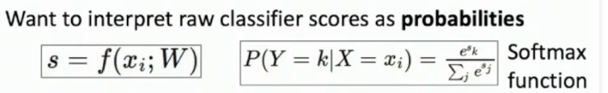

# UMich EECS 498-007 / 598-005: Deep Learning for Computer Vision

**计算机视觉中的深度学习**  
计算机视觉教机器去看，深度学习教机器去学习  

***

## Lec01: Introduction 介绍

### 开始之前

#### 解开术语

**Computer Vision / CV**:  
*Building artificial systems that process, perceive, and reason about visual data.*  
*建立能够处理、感知和推理视觉数据的人工系统*  

+ **process**、**perceive**、**reason**  
+ **visual data**:可能是videos、medical scans医学扫描、（几乎）任何类型的连续值信号continuously valued signal，相当广泛  
	
#### 为什么CV重要

**它无处不在！**  
人们分享、讨论的**视觉数据**，如Ins、ytb等产生**海量**的照片、视频，人是无法处理、分析的 ，所以研究感知、推理和处理图像信息的算法，构建出能够**处理这些数据的自动化系统**，就是计算机视觉  
视觉传感器数量激增，自动驾驶汽车、VR、无人机等，CV只会**越来越重要**。  

#### CV使用的技术：Deep Learning 深度学习

+ **What‘s Learning？**  
**学习**是*构建可以从数据和经验中学习的人工智能系统的过程*  
不同于CV只想要理解视觉数据，不关心怎么实现  
后来人们发现构建基于学习的系统在构建cv、ai甚至整个cs都很重要  

+ **Deep Learning**：
*Hierarchical learning algorithms with many "layers", (very) loosely inspired by the brain*  
*非常粗略的受大脑启发的多层分层学习算法*，（loosely说明只是大体上受到人脑结构，但实际并不一样）  

#### 课程内容
**深度学习**是机器学习的**子集**，CV、机器学习和其他研究**都是AI的子集**，韦氏图如下：  
  
这门课程就关于**计算机视觉**与**深度学习**的交集。  

### 视觉与深度学习简史

#### 计算机视觉

+ **1959, H&W**：两个神经生物学家研究猫脑神经元与视觉的关系，发现**定向边缘oriented edges**是最基本的视觉处理，进而得到了**视觉系统的层次表示**（从简单单元构建起越来越复杂的组合与响应），这两点意味着**计算机视觉的开端**  
+ **1963,R**：发表计算机视觉博士论文，基于“发现边缘是基本的视觉处理”，建立了一个可以**检测图片边缘**、**提取特征点**来理解物体与图像的**几何结构**的系统。值得一提的是，后来他成为了万维网的创始人。~~~视觉与计网大神~~  
+ **1970s,D**：提出**视觉的全过程**，输入图像-->获取图像边缘-->根据边缘提取深度信息->根据深度信息区分不同对象->考虑不同对象相对深度->推理三维场景  
+ **1979,G**：提出**部分认知**(**Recognition via Parts**)，要根据物体的不同部分，而不再只聚焦与边缘感知与简单几何物体。譬如通过识别不同圆柱体的组合来识别人  
+ ***以上部分受限于数码相机、算力等，都只算是没有实践的理论研究的“玩具”，从下面的80年代后，性能更好的相机与算力之下才研究更真实的图像，算是进入实践***  
+ **1986,C**：通过**边缘检测**来识别物体和图像，提出高效边缘算法与模板匹配算法  
+ ***AI winter***
+ **1997,N**：提出**分组认知**(**Recognition via Grouping**)，通过分组识别对象，对输入图像进行分割，得到语义上有意义的块chunks，在此之上进行识别  
+ **1999,SIFT**：提出**匹配认知**(**Recognition via Matching**)，检测输入图像中所有独特的不变特征关键点，然后匹配、对应另一张图像上的点  
+ **2001,V&J**：开发出一个强大的图像**人脸识别算法**，称为**增强决策树 boosted decision trees**，这是深度学习用于视觉的最早成功案例之一，很快实现从学术界到工业界的转变  
+ ***V&J打开了使用深度学习、应用大量数据来提高视觉表现的“魔盒”，从此机器学习有越来越多的用途、使用越来越多的数据来改进视觉识别系统***
+ **2001,PASCAL**：**pascal Visual Object Challenge**，互联网上下载更多图片，构建更大数据集更方便，让研究生打上标签，进行训练，从而性能在05-11年逐渐提高  
+ **2009,ImageNet**：**large scale visual recognition challenge**，采取众包打标签，发给所有人而不是牛马烟酒僧，因而过程中建立了非常大规模的数据集，已经成为CV的主要基准之一；还举办比赛，识别错误率逐年降低  
+ **2012,alex kachafski**：alex开创性的论文，提出**深度卷积神经网络**，错误率粉碎其他算法，视觉新时代。  

#### 深度学习

+ **1958,Perceptron**：一项算不上算法的研究，叫做**感知器**，是最早的可以进行学习的计算机系统之一，当时作为**硬件**实现，十分复杂，但确实可以以某种方式从数据中学习，能够在20x20画幅中识别字母。在**现代视角**看，称其为**线性分类器 linear classifier**  
+ **1969,M&P**：出版《**Perceptrons/感知器**》一书，提出感知器**不是**一种神奇的**硬件设备**，**而是**一种特殊的**学习算法**，有一些特定的函数能学习表示，而其他类型的函数无法学习表示，预示了学习不是万能的，人们失去兴趣；但书中还说明了算法有一个**潜在版本**，称为**多层感知器**，可以实现学习许多类型的函数，却无人问津  
+ **1980,N**：论文提出名为"**neocogmatron**"的系统，计算实现视觉到感知的过程，其中提到的两个操作，类似现代术语中的**卷积convolution**与**池化pooling**，这与2012年alex的整体结构**十分类似**，只是遗憾的**没有实用的训练算法**  
+ **1985,B**：论文提出**反向传播 Backprop 算法**，用于训练多层感知器，是**第一次**通过多层计算成功且有效地训练更深层次的模型  
+ ***AI Winter***  
+ **1998,L**：提出**卷积神经网络 Convolutional Networks**，使用了卷积、池化、视觉类似的多层系统、反向传播等，也获得了学术界与工业界的成功  
+ **2006,D**：**Deep Learning**出现，deep指神经网络算法是多层，蓬勃发展  
+ **2012,alexNet**：ALEX！自此以后，无处不在，各种识别、匹配、分类、预测  

#### 2012的AlexNet

**历史上**要五十年以后才能做出定论  
但老师个人理解是，其**伟大**在将三个重要组成部分一起组合：  
	1. 在深度学习、神经网络、机器学习的潮流中开发的**强大学习算法集**，**Algorithms**  
	2. 随着相机、互联网兴起，得到了空前**庞大的数据量**，用于训练系统，**Data**  
	3. 贯穿整个历史的**算力提升**，GPU计算能力呈指数增长，**Computation**  
2018年图灵奖，2024年诺贝尔物理学奖，建立真正的计算机视觉，未来还有很长的路要走。  

***

## Lec02: Image Classification：KNN

### 综述

**图像分类**，是本课第一个学习算法，是计算机视觉的**核心任务 core task**。  
**流程**：输入图像-->图像分类算法-->输出类别标签，因此算法需要预先知道有哪些标签  
**用途**：可以用来处理医学影像、天文分类、珍稀动物识别等，应用十分广泛且强大  
	还有一个更有趣、容易被忽略的角度：**图像分类本身也是计算机视觉不同算法内部的基本组成部分**，譬如对象检测、图像字幕(image captioning)、围棋算法等。  
**思想**：也许针对特定的物体识别，利用人类思想，硬编码出所有边界条件，可一旦切换需要识别的物体，算法的一切努力将白费。所以更需要的是**更健壮、更有拓展性、不用依靠人类知识硬编码的算法**，这就是**机器学习**

### 遇到的问题 Challenges

语义鸿沟是算法有无的问题，剩余的是算法是否具有鲁棒性的问题  

+ **语义鸿沟 semantic gap**  
人可以一眼辨认出图像的类别：光子打在视网膜，神经传到大脑，一系列的复杂处理，最后产生了直觉；但机器得到的只有巨大的数字网格，没有这种直觉，这个问题称为**语义鸿沟 semantic gap**。
+ **类内变异 intraclass variation**  
以判断猫猫为例，不同品种的猫形状一致，但毛色、细节不同，因此图像上像素颜色也不同，需要构建一个足够健壮（**鲁棒robust**）的系统，能够处理同一个类别中巨大的**个体差异**  
+ **精细分类 fine-grained categories**  
进一步的，我们不只想判断猫，更想判断猫的具体品种，尽管它们彼此相似，仍然要有足够健壮的算法来完成。  
+ **背景杂波 background clutter**  
有时需要识别的主体会以某种方式融入背景，因此算法对背景杂波也要有良好的鲁棒性，足够健壮，抗干扰  
+ **光照变化 illumination changes**  
当场景中的光源发生变化时，图像像素的颜色发生巨大变化，但图像的基本语义不会变化。因此算法对光照变化应该具有鲁棒性  
+ **变形 deformation**  
有时我们要判断的对象可能以不同的姿势出现，就像猫能变成任意形状，因此算法要能处理变形  
+ **遮挡 occlusion**  
算法需要能够处理遮挡，也就是对象可能只有部分能够看到  

### Machine Learning:Data-Driven Approach 数据驱动

真的是完全不同的编程方式。  
以往的算法都是基于自己的人类知识，告诉电脑具体应该如何做才能产生理想的输出；  
而数据驱动的机器学习，只是通过输入的数据集来对计算机进行编程。  

#### 实现方法

1. 首先收集大量的**图像数据集**(dataset)，并用想要识别的分类标签**标记**(label)它们  
2. 然后部署一种机器学习算法，用收集到的数据集与分类标签训练，算法会提取**统计依赖性**(statistical dependencies)  
3. 在新的图像上评估得到的分类器  

#### 编码方式

**不是**编写一个单一的、名为"classified_image()"的整体函数，  
**而是**两个API："train(images, labels)"与"predict(model, test_images)"，  
	前者输入数据集与标签进行训练，返回训练好的模型；  
	后者输入训练好的模型与新数据集，返回其对新数据集分类的标签。  

#### 数据集来源

**MNIST**：一个灰度图手写数字数据集，比较轻量化，就像生物学家的果蝇，有任何机器学习的新想法都在其上试验  
**CIFAR10**：彩色10类数据集，相比真正的大数据集是很小的，但依然很有挑战，作业基本使用此数据集  
**CIFAR100**：彩色100类数据集，cifar10的兄弟  
**ImageNet**：1000类，非常庞大，图像分类数据集的**黄金标准**，是benchmark。  
**MIT Places**：偏向各类场景的数据集  
**Omniglot**：不同于越多训练数据越好，每个分类的训练用例只有20个，力求效率最高、鲁棒性最好  

### First classifier：Nearest Neighbor

最简单的图像分类算法，甚至都不能称为"算法"，其能算得上“学习”的部分只有记忆了所有训练数据。  

#### 思路与复杂度

+ 对于**train()**，不对输入的数据集与标签进行处理，而是单纯的**记住所有的训练数据**  
+ 对于**predict()**，使用某种比较或相似函数，将需要判断的新图像与训练集中所有图片进行**对比**，追踪训练集中**最接近的相似图像**，返回其标签  

因此为了实现这个算法，需要实现可以计算两个图像相似度的函数，称为**Distance Metric 距离度量**。   
+ **L1距离**（**曼哈顿距离**），即为**将两个图像逐像素相减，取绝对值，再求和**;  
+ **L2距离**（**欧几里得距离**），即为**将两个图像逐像素相减，求平方和，再开根**。  

在有N个训练用例的情况下，**训练**的时间复杂度（这里只关心测试用例数量，不深入到像素）：  
	**O**(**1**)，因为**只需要存储**输入的图像与标签就能完成训练  
**测试/预测**的时间复杂度：  
	A：**O**(**N**)，因为认为匹配两图像的大小、并计算其L1距离的过程耗费为常数 

这实在是**极其不好**的，因为*我们想让机器尽可能从训练数据中提取某种特征，哪怕花费很长时间在训练上，但最终用来预测时运行得很快*——这是**“学习”的意义所在**，但nearest neighbor与其**背道而驰**（尽管其还有升级过后的加速算法）。  

#### 可视化分析与L1、L2距离对比

**可视化表示**：    
	  
	**坐标空间**是某种方法表示的所有训练图像  
	**每一个点**都是一个训练图像，其颜色为其类别标签  
	**底色**是类别标签，根据训练图像扩大，若预测的图像落在某处，即可按照对应的颜色判断标签（其实就是**nearest neighbor**的字面意思，很直观了）  
	**决策边界 Decision Boundary**是不同底色的交界处  
	在决策边界上，可以发现这些决策区域非常嘈杂，互相交错，还有异常值成为的"飞地"，可能会对图像分类**造成干扰**。  

**K-nearest neighbor**：  
	为了消除决策边界上的锯齿，得到一个更健壮的分类器，可以用K-nearest neighbors进行优化，如下图：  
	  
	原理是**不再只根据最近的“邻居”**进行判断，而是采用**获取多数票**的思路，找到离其最近的k个邻居，根据邻居最多的种类来判断。
	**作用**使得决策边界变得更平滑，同时减少异常值（飞地）对分类的影响；但可能出现一些无法判断的区域，需要加上额外规则来打破。  

采用L2距离、K=1时：  
  
会发现决策边界可以向任意角度延伸，而L1的边界只能横、竖、45度。  

#### 超参数hyperparameters

由此可见**距离度量**与**k值**的选取十分重要，那么应该如何选择？  
这个问题就属于**hyperparameters 超参数**：指一些算法中某些参数有多种可选，但我们**无法直接**根据训练数据做出最优选择，只能在训练程序开始时**手动设置**，多次尝试，观察结果来判断。下面是超参数的设置方法：  

**错误思想**：  
+ ~~选择在整个数据集上表现最好的超参数~~  
**错因**：其可能导致过拟合，让机器在新的数据上不再有估计与想法  	
+ ~~将训练数据集分成train与test两部分，用train训练，选在test上表现最好的超参数~~  
   **错因**：会退化到整个数据集上，因为相当于查看了test的答案，测试集不再是看不见的数据，**这是机器学习模型中一个根本性错误** 
   

**正确方法**：  
将数据集分为三部分：**train训练集**，**validation验证集**，**test测试集**  
+ train：用于训练算法模型  
+ validation：用于修改超参数  
+ test：验证集上的超参数设置完全后，在最后的最后使用一次测试集来评估效果  
这样实现了验证算法在真正看不见的数据上的表现，尽管**恐怖**（最终测试机上的表现可能让项目功亏一篑），但是唯一正确的机器学习数据处理方式。  

**更优化方法：交叉验证**：  
继续细分数据集：除**test测试集**以外，划分为**若干fold集**  
然后开始训练，令每一个fold都当一次验证集，其余fold为训练集。最后将每一次的超参数平均起来获得结果。  
这是**最稳健**的机器学习训练方法，但也很**昂贵**，要反复训练多次，所以在实践中通常不这么做，尤其是deep learning。如果数据集小，算力充足，还是推荐这样训练。  

#### 一些性质

+ nearest neighbor几乎可以适用于任何不同的数据类型，只要选择好距离度量，其相当健壮。  
+ 当数据集趋于无穷大时可以表示任意函数，但是有**维度的诅咒 curse of dimensionality**，我们若想用它来实现高维数据的精确预测，所需要的数据永远无法收集完全。  

#### 总结

**K-Nearest Neighbor**因为足够简单，很容易理解，因此对于任何数据类型都很鲁棒；  
但因为运行缓慢、要求大量训练数据、没有真正的学习过程导致其“距离度量”在语义上没有很大意义与在图像上不直观（譬如背景由黑到白，距离度量会极大变化，而图片语义并没有变化），所以在**原始图像分类处理上很少使用**  
但是在**特征向量计算的深度卷积神经网络上**有着奇效，在后面会学习。  
（*在这里我根据CG中对卷积、信号等的了解，在此猜测原因：原始图像上只有原始数据，不包含语义，最邻近的也只是“形似”，所以没用；但卷积神经网络处理后的图像变成了语义数据，这时利用最邻近就相当于在语义上寻找，是“神似”了，希望我的想法是正确的*）  

***

## Lec03 Liner Classifiers

学完总结：03、04节从**线性分类器**出发，提到**损失函数**，最后再到**梯度下降**一整套，如图：  
  

**线性分类器**：听起来很简单，但对构建**神经网络**很重要，有很多相似之处。  

### 简单的参数化方法：线性

其利用了**参数化方法**，即构建一个函数，有变量**x**与**W**，其中x为输入的图像数据，W为一些用于在训练中学习的权重，最后输出对于属于每种类别的概率大小。  
**线性分类器**的构造十分简单，为**f(x,W) = Wx**的形式，有时还会加上**偏移量b**以抵消误差，十分**线性**。  

根据其**线性特征**，可以有**f(cx,W) = W(cx) = c\*f(x,W)**，这说明如果将原图像进行某些**放缩**后（比如将每个像素的值减半），分类器仍然能够正常工作，“*so this is maybe a bug maybe a feature*”，从某种意义上，**与人类相似**，尽管图像整体变化，也不影响判断。  

### 理解角度

有三种理解线性分类器的角度，如下图：  
  

#### 代数角度

**具体**的，如果图像采用**CIFAR10**数据(32x32x3)，则有：  
+ **x**为(3072,)，就像作业1中，将图像的多维张量数据**矢量化、扁平化**  
+ **W**为(10,3072)，为**权重矩阵**  
+ **b**为(10,)，用来消误差  
+ **f(x,W)**为(10,)  

**Bias Trick**（但并不常用）：  
在构建出的**f(x,W) = Wx + b**中，为了使输入与运算更简洁，可以将**偏移项b**整合在W与x中，具体的，以CIFAR10为例，可以将b放在W后面，成为新的**W'**(10,3072+1)，同时在x底部增加一维，值为1，变为**x'**(3072+1,)，这样就有了**f(x,W) = W'x'**，结果是一样的。  
（**这里有点图形学里面的齐次坐标的感觉**）  
**BUT**在计算机视觉的实践上**并不经常使用**，因为不便于后续的**卷积操作**，同时在模型训练中，将偏移与权重分开**更利于初始化等操作**。

  

#### 视觉视角

还可以采用**将权重矩阵按类别拆开**，重塑为原图像的形状，进行一个点乘（对应元素相乘求和）再加上拆开的偏移，称为**视觉视角**，见上图右。  

之所以称为“**视觉视角**”，是因为我们如果将重塑的每一类权重矩阵**可视化**表示出来，就得到了**一个类别的图像模板template**，求内积实际是判断模板向量与图像向量的接近程度，也就是**权重**（*图形学学到的*），是一种**模板匹配**，说明了其更依赖于**图像上下文context**，即识别飞机不光飞机，还有蓝天；识别鹿不光是鹿，还有森林。所以，若**物体不寻常的出现在情景**，会导致严重的**误判**，比如森林里的汽车。  

此外，其还有**缺陷**，是其会用一个模板覆盖所有可能的模式，做不到类内细分。  

#### 几何视角

比较**抽象**。  
在一个二维空间中，x轴为图像某个像素的取值（假设其他像素值不变），y轴为不同分类的分数，由于**线性性质**，不同分类器的分数与像素取值的关系也是**线性**的，因此能够根据像素值来对应分数。  
  

在二维基础上**拓展**，增加一个像素，想象x轴为像素1的取值，y轴为像素2的取值，z轴为在对应点上不同分类的分数值，我们可知不同的分类值会**形成一个平面**（两个方向都是线性的，组合起来也是一个线性平面），根据高低来对应分数。  
或者先找到某条直线使得某类得分为定值，沿正交的方向即变化方向，类似等高线  

尽管人类的想象力到此，但也不妨继续抽象。设在由图像所有像素不同取值组成的**高维空间**中，存在着不同的**超平面**，就像三维中的那样，切割整个高维空间，根据某种映射关系，就可以从几何上得出各个类别的分数。  
  
这也可以用于解释线性分类器无法识别一个类别的多个模式，因为这多个模式可能实际对应不同的独立区域，无法用线性来分开。  

#### 感知器即线性分类器

在机器学习历史中，提到过的**感知器Perceptron**就是一个线性分类器，提到有的函数能够学习，而有的不能学习，就是因为有的函数无法通过一条直线来分开。  
譬如**异或函数XOR**，x、y、f(x,y)无法用一条直线分开。  

### 训练思路：损失/目标/成本(loss/objective/cost)函数

在实际训练中，需要使用**损失函数 loss function**，使用令损失函数最小的W。  

损失函数是一个用于展现当前分类器在已有数据上的表现的函数，高损失意味分类器性能不好，低损失为性能好。  
在数学的表示上，为下图所示：  
  
依次是**数据集**、**单个类型的损失**、**整个数据集的损失**。  

#### Multiclass SVM Loss 多类SVM损失

**核心思想**为**正确类别的得分**应该比其他类别的得分**更高**，基于此来分布**损失函数**。  

需要追踪**正确类别的得分**与**其他类别中的最高得分**，使得正确类别得分对应的**损失函数为0**，而从正确类别到其他类别最高分的**损失函数**开始**线性增长**。  
在损失--得分图像上，会形成一个**线性区域**与**0区域**，由于形状像门上的铰链，因此称为**铰链损失 Hinge Loss**。  
  

在**数学描述**上，也可以表示出这个损失函数，见上图右。  
**某一类损失**可以通过求所有max(其他类别得分与真正类别得分之**差**再加一，0)之和来计算（也就是说，当真正类别得分**大于**其他类别时，损失就为0）  
则整个**数据集总损失**为所有类损失的均值。  

一些点：  
+ 如果某一类别的损失为0，其中图像改变一点，仍然会0损失。这是**多类SVM损失**的一个特性，当已经正确分类后，对数据进行很小的修改，不会影响损失。  
+ 单个类别的损失**最小值**为0，**最大值**为无限，如果正确类别得分十分低。  
+ 当刚初始化权重矩阵时，并**没有进行训练**，其值为随机的小值，期望的**某一类损失**大约为**类别-1**，由于高斯分布等原因，这有助于调试  
+ 如果某一类损失求和时**算上该类**，只会为损失增加1，但并**不会改变**权重矩阵，因为绝对的大小值没有发生变化  
+ 如果某一类的损失使用**平均值**而不是总和，**不会改变**，因为绝对大小依然不变  
+ 使用**其他方式**来求得某一类的损失（譬如求和改成平方和），这会以**非线性**方式改变所有分数，导致权重矩阵发生变化，**不再是多类SVM损失**  
+ 如果存在某个权重矩阵，使得数据集总损失为0，其**并不唯一**，因为权重矩阵的倍数也有相同效果  
这就需要我们**引入**损失函数之外的**额外机制**，来表达对不同分类器的偏好，这就是**正则化 Regularization**的想法。  

#### Cross-Entropy Loss / Multinomial Logistic Regression 交叉熵损失/多元逻辑回归

是训练神经网络时最常使用的损失。  
上面提到的多类SVM损失并没有对损失做出**实际的解释**，而单纯是出于“正确类型得分应大于其他类型”的目的而构建，而**交叉熵损失**要做的就是尝试找到一种方法来**解释模型预测的分数**，即将**分数向量**解释为**概率分布**。  

使用**Softmax**函数，如下图：  
  
之所以是叫softmax，是因为其实现了最大函数的可微逼近（*？*）  

进行损失计算的过程是：  
1. 先获取初始的预测分数，是分类器对输入样例属于不同类型的得分，称其为“**未正则化对数概率分布**”，由于概率分布需要为正数，所以需要进行指数化处理(e^x)  
2. 获得指数化后的分数，称为“**未正则化概率分布**”，接下来则对其进行正则化，即分配这些数使得其和为1  
3. 获得正则化后的分数，称为“**概率分布**”，这样获得了一个向量，每个元素非零且总和为1，这个向量就解释为我们想识别的各类的概率分布。以上就实现了**softmax**  
4. 然后我们取输入样例的**正确类型的负对数(-log)作为损失**（这实际实现了对观测数据权重概率的最大似然估计，证明略）  
	其正确性可以通过**信息论**来证明，现在得到的是**实际概率分布向量**，但实际上**理想概率分布**应该为一个只在正确分类维度上为1、其余维度为0，可以通过信息论来做（关于P、Q，信息论中将P看作真实分布，Q看作非真实分布，即我们的理想分布与真实分布，此真实非彼真实）：  
	+ **Kullback-Leibler KL散度**，用来衡量两概率分布之间的差异，如下图：  
	  
	最后化简后得到的“差异”就是正确类别概率的负对数。  
	+ **Cross Entropy 交叉熵**，是另一种测量概率分布之间差距的方式，如下图：  
	  
	**在定义上**，概率分布差距与交叉熵单调相关，而交叉熵的**代数定义**可以推导得到上方所示与熵和KL散度的关系（推导过程如下图）,实际得到的还是负对数  
	  

一些点：  
+ 损失的**最大、最小值**：最小值仍然为0，最大值仍然为无穷，但这里最小值不同于多类SVM可以真的到0，但交叉熵损失只有在纯粹的理想情况下才能到0。  
+ 当刚初始化，所有值都是随机的小值，某一类的损失期望为**log(类数)**，因为可以认为随机的初始值大小都相近，因此最终的概率分布每一维都是**1/c**，所以损失应为-log(1/c)=log(c)（这里也捉视频里的虫，没有加负号！！！）。  
这在同样**有助于我们的调试**，当刚初始化时的损失大于预测，说明模型有一个错误以至于优化的还不如随机值，同样也适用于多类SVM。  

#### Regularization 正则化

在上面完成损失函数后，我们还可以在模型总损失后加上一个**正则化**的部分来拓展损失函数，如下:  
  
第二项就称为**正则化项**，其**不涉及**训练数据，是为为了控制模型而增加的额外参数。  
其往往带有一个**超参数 hyperparameter**，即*lambda*项，用来**控制**总损失与人为偏好的**比重**。  

**正则化目的**：  
1. 能够让模型除“最小化训练错误/模型损失”**之外**，还能表达对**不同类型模型的偏好**(出于主观目的、人类先验知识、想要学习的分类器类型、想要把训练重心放在某个功能中)  
2. 避免**过拟合 overfitting**，让模型牺牲一些在当前数据的表现，换取对未知数据的更合适的表现  
3. 添加**额外的曲率**，这有助于优化过程（**？**）  

**线性分类器**常用正则化项类型为：  
+ **l2正则化**：**R(W)=∑∑W^2**(权重矩阵各项平方和)；  
+ **l1距离**：**R(W)=∑∑|W|**；  
+ **Elastic net(L1+L2)**：**∑∑(βW^2+|W|)**，通常用于神经网络(但通常神经网络还用其他正则化)  

#### 总结：两类损失（SVM、交叉熵）与正则化

**多类SVM损失**的最小单元是**一个类别**，其性质（损失可以达到0，并且此后数据点微调不再会产生影响）说明了其模型效果到某一点后就不再会变化；  
而**交叉熵损失**的最小单元是**每个样本**，性质（损失不可能达到0，数据点微调也会持续产生影响）则注定了**有交叉熵，就可以永远训练**。  

两类损失都可以**对权重集施加不同的偏好**，正则化也能实现这一点，从而两者组成更加泛化的**损失函数**来训练模型。  

***

## Lec04 Optimization 优化

前面提到的线性分类器，如今已经有了数据集、损失函数等部件，就剩下最重要的部分：**如何确定、优化权重矩阵W**的值。  

可以理解成在高维空间中，蒙着眼睛，去寻找最低（L最小）的位置。  

### Random Search（bad！）

采用完全随机的方法，**随机生成**权重矩阵，然后分别评估损失值，追踪最低损失值。  

这在**算法**层面，**随机搜索**无疑是**愚蠢**的；但实际测试效果还说得过去，**not bad**。

实际上我们还是需要用梯度下降法来解决。  

### 梯度计算方法

而**梯度gradient**告诉我们函数**最大增加**的方向，所以应该向着**负梯度**的方向前进。  

1. **Numeric数值**:  
	+ 认为权重矩阵是一个高维向量，最终梯度与其同维度。在当前W下使用**损失函数**求出**损失Loss**
	+ 略微改变W中一维度，获取整体新的Loss，继续用导数定义求得**梯度dL/dW**中对应维度的值  
	+ 重复，从而得到在当前权重矩阵所对应损失的梯度  
	+ 因此，这个方法的**复杂度为O(ndim)**，还是比较**慢**的，当深度学习采用**维度很高**时。并且其精度不高，因为是近似替代。  
2. **Analytic解析**：  
	利用解析方法求出具体表达式，准确、快速、无误  
	一般会在实际数据上用**解析**进行计算，但用低纬度上的**数值**进行debug工具来验证。称为**gradient check**，在实际工作上也会常用  
3. **backprppagation反向传播**  
	在**实践**中，我们更多的用其来计算任意梯度，见***第六节***内容。  

#### (Full) Batch Gradient Descent (BGD)

名为**批量梯度下降**，**算法原理**很简单：  
**初始化**权重矩阵各值-->**迭代n次**(在**整个**数据集上根据损失函数等**计算当前梯度**-->根据**学习率**更新梯度)，其会自然的在接近最优解时放缓  

其中有三个**Hyperparameters超参数**：  
+ 权重矩阵**初始化**方法  
+ **迭代次数**：程序需要在有限时间内完成，受限于性能也要进行精度控制  
+ **学习率**：我们对计算出的梯度要有一定的信任度，因此其走的方向大小也要有一定的选择  

之所以为**批量batch**，甚至**full**，是因为在计算总损失时**遍历了整个数据集**，譬如SVM损失是以类为单位，交叉熵是以每个样本为单位，计算出了**模型总损失**，当样本量太大时**开销会非常大**；而计算梯度又是另一层大开销。这样**每一步**都会非常**缓慢**，并不可行。  

#### Stochastic Gradient Descent (SGD/mini batch)

名为**随机梯度下降**，在实践中比较**常用**。这里的**思路**发生了变化：  
+ 用整个训练集的**子集**来计算**近似**损失函数与梯度，而不是计算**整个训练集**上的损失，这个子集的大小**通常为32/64/128**
+ **初始化**权重矩阵各值-->**迭代n次**(从训练集选择**minibatch**-->在minibatch上根据损失函数等**计算当前梯度**-->根据**学习率**更新梯度)  

**超参数**依然还是那些之前的，只是相应的增加了**minibatch**的两项：  
+ **mb的size**，但是效果其实并不敏感，因此尽可能的选择大的size直至显存用光  
+ **mb的采样方法**，在分类器作业中采用洗牌打乱-->按序读取-->再次打乱的方式，在其他应用上就需要仔细考虑研究了。  

名为**stochastic随机**是因为相当于完整的数据集进行蒙特卡罗样本估计。  

尽管SGD很有效，但也有一些潜在的问题：  
+ 当模型下降速度的极值相差太大（大值太大，小值太小）时，会因为学习率步长太大而产生**zig zag曲折**，或者学习率步长太短而**收敛缓慢**，这个问题称为**high condition number**，与任意点的哈希矩阵奇异值有关，不讨论。  
+ 当存在**local minimum局部最优解**或者**saddle point鞍点**（一个方向增加，另一个方向减小，在**高维优化**中常见），都是因为梯度为0,我们可能会卡在那里。
+ 随机的部分噪声太大，以至于梯度方向性很弱，效率很低  

#### SGD + Momentum（动量随机梯度下降）

为了解决上述SGD的问题，采取一种更为**智能化**的方法：Momentum。其是一种结合**物理直觉**的优化方法，之前的仅仅是沿着梯度的方向前进，而这个方法是赋予了**“速度”**。  

**具体做法**：  
引入一个**速度**向量v，每次计算先计算**v**的大小，通过`v_t+1 = rho*v_t + dw`来结合**上一位置速度**与当前位置**梯度**（rho通常取0.9或0.99来模拟**摩擦**），从而得到当前位置速度，然后再`x_t+1 = x_t - α*v_t+1`来计算。  
在实际应用上，还有多种实现方式，但道理都一样。  

这样在**梯度下降**的过程中，在局部最优点、鞍点都可以继续进行了。  
并且由于下降过程中的**动量**，噪声实现了一定程度的消除，比较好的解决了问题。  

另一种动量思路：**Nesterov Momentum**：  
速度不止考虑当前，更考虑下一时刻，更加平滑：`v_t+1 = rho*v_t - α*d(w + rho*v_t)`，如此便可以同步考虑到未来。  
但由于在计算时更倾向于使用当前所在位置的梯度，所以可以进行**变量替换**，进而重新组织成便于计算的形式：  
  

#### AdaGrad

**不同于**之前BGD、SGD那“持续跟踪**梯度**的历史**平均值**”的思路，AdaGrad将跟踪历史**梯度平方**，然后依靠平方来限制步长（方法为`w -= learningrate * dw / (squaresum.sqrt() + 1e-7)`），从而步长可以随着实际情况递减，最终在底部平稳降落，称作**二阶动量**。  

但是缺点为平方和只会越积越大，遇到特殊情况下容易卡死不动。  

#### RMSProp：leak AdaGrad

是为了解决AdaGrad的问题而改进的，类似于动量下降中的**摩擦**，让平方和不断**泄漏**，以防卡死。  

**具体实现**：  
`squresum = decay_rate*grad_squared + (1 - decay_rate)*dw*dw`，控制衰减率即可  

#### 梯度下降综合：Adam

以上几种方法实际是两类方法：SGD与Ada，两种各有**微妙特点**，如图：  
  
**SGD类**(blue)会“横冲直撞”，下降过头，然后再调头，伴有轻微震荡（超调）；  
**AdaGrad类**(red)则十分流畅的下降到最低点，不会有不断的调整过程，一路向着正确的方向弯曲  
（尽管真实工作中，会接触到高阶得多的数据，但是基于二维投影的直观表示也有些用）  

**那么，为什么不把这两类综合起来？**  
于是有了**Adam：RMSProp + Momentum**的方法：  
  
完美的综合了两种方法，在梯度下降的过程中，既有累积的动量，又有自适应的步长。  

**注意**，这里还有**偏差矫正**的部分，这一部分是由于RMSProp部分引入的：  
当**t=1**，也就是在**起点**时，如果**beta**的值都很近似1(0.999)，就会出现由于值过小而阻塞在起点无法开始。  
因此，就引入如图所示的**偏差矫正**项，在起点时可以避免走不动；在步数多了之后也会自行消失。  

在**实践**中，也总结了Adam的常用参数组合，有很不错的鲁棒性，几乎对所有模型很不错：  
+ beta1 = 0.9, beta2 = 0.999
+ learning_rate = 1e-3 - 5e-4 - 1e-4的范围内

***Adam是老师推荐的最常用的默认方法***  

#### 二阶优化：

前面所提到的方法都是**一阶优化**，因为都是用**梯度**来获取函数的线性近似，再走向最小值；   
那么可以拓展到**二阶优化**，使用梯度与Hessian获取函数的局部二阶近似，再走向局部最小值，这能够帮助自己精确选择合适的步长，当曲率大时，自然会走小步；曲率小时走大步。  

其具体实现较为麻烦，要对**损失函数**求二阶泰勒展开（应该是线代或计方讲过带矩阵的），然后求解。解很复杂，尤其是二阶Hession矩阵开销为O(N^2)，再加上转置开销O(N^3)，在数据量大时难以接受。  
同时二阶优化也不能处理**随机**梯度下降，只能Full Batch。  
**因此在高维度数据与随机梯度并不适用**，但是当数据低维与可以负担BGD时可以考虑。  

***