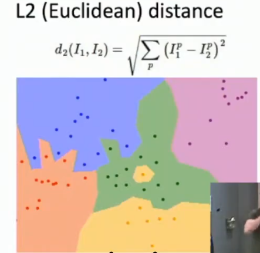

# UMich EECS 498-007 / 598-005: Deep Learning for Computer Vision

**计算机视觉中的深度学习**  
计算机视觉教机器去看，深度学习教机器去学习  

***

## Lec01: Introduction 介绍

### 开始之前

#### 解开术语

**Computer Vision / CV**:  
*Building artificial systems that process, perceive, and reason about visual data.*  
*建立能够处理、感知和推理视觉数据的人工系统*  

+ **process**、**perceive**、**reason**  
+ **visual data**:可能是videos、medical scans医学扫描、（几乎）任何类型的连续值信号continuously valued signal，相当广泛  
	
#### 为什么CV重要

**它无处不在！**  
人们分享、讨论的**视觉数据**，如Ins、ytb等产生**海量**的照片、视频，人是无法处理、分析的 ，所以研究感知、推理和处理图像信息的算法，构建出能够**处理这些数据的自动化系统**，就是计算机视觉  
视觉传感器数量激增，自动驾驶汽车、VR、无人机等，CV只会**越来越重要**。  

#### CV使用的技术：Deep Learning 深度学习

+ **What‘s Learning？**  
**学习**是*构建可以从数据和经验中学习的人工智能系统的过程*  
不同于CV只想要理解视觉数据，不关心怎么实现  
后来人们发现构建基于学习的系统在构建cv、ai甚至整个cs都很重要  

+ **Deep Learning**：
*Hierarchical learning algorithms with many "layers", (very) loosely inspired by the brain*  
*非常粗略的受大脑启发的多层分层学习算法*，（loosely说明只是大体上受到人脑结构，但实际并不一样）  

#### 课程内容
**深度学习**是机器学习的**子集**，CV、机器学习和其他研究**都是AI的子集**，韦氏图如下：  
  
这门课程就关于**计算机视觉**与**深度学习**的交集。  

### 视觉与深度学习简史

#### 计算机视觉

+ **1959, H&W**：两个神经生物学家研究猫脑神经元与视觉的关系，发现**定向边缘oriented edges**是最基本的视觉处理，进而得到了**视觉系统的层次表示**（从简单单元构建起越来越复杂的组合与响应），这两点意味着**计算机视觉的开端**  
+ **1963,R**：发表计算机视觉博士论文，基于“发现边缘是基本的视觉处理”，建立了一个可以**检测图片边缘**、**提取特征点**来理解物体与图像的**几何结构**的系统。值得一提的是，后来他成为了万维网的创始人。~~~视觉与计网大神~~  
+ **1970s,D**：提出**视觉的全过程**，输入图像-->获取图像边缘-->根据边缘提取深度信息->根据深度信息区分不同对象->考虑不同对象相对深度->推理三维场景  
+ **1979,G**：提出**部分认知**(**Recognition via Parts**)，要根据物体的不同部分，而不再只聚焦与边缘感知与简单几何物体。譬如通过识别不同圆柱体的组合来识别人  
+ ***以上部分受限于数码相机、算力等，都只算是没有实践的理论研究的“玩具”，从下面的80年代后，性能更好的相机与算力之下才研究更真实的图像，算是进入实践***  
+ **1986,C**：通过**边缘检测**来识别物体和图像，提出高效边缘算法与模板匹配算法  
+ ***AI winter***
+ **1997,N**：提出**分组认知**(**Recognition via Grouping**)，通过分组识别对象，对输入图像进行分割，得到语义上有意义的块chunks，在此之上进行识别  
+ **1999,SIFT**：提出**匹配认知**(**Recognition via Matching**)，检测输入图像中所有独特的不变特征关键点，然后匹配、对应另一张图像上的点  
+ **2001,V&J**：开发出一个强大的图像**人脸识别算法**，称为**增强决策树 boosted decision trees**，这是深度学习用于视觉的最早成功案例之一，很快实现从学术界到工业界的转变  
+ ***V&J打开了使用深度学习、应用大量数据来提高视觉表现的“魔盒”，从此机器学习有越来越多的用途、使用越来越多的数据来改进视觉识别系统***
+ **2001,PASCAL**：**pascal Visual Object Challenge**，互联网上下载更多图片，构建更大数据集更方便，让研究生打上标签，进行训练，从而性能在05-11年逐渐提高  
+ **2009,ImageNet**：**large scale visual recognition challenge**，采取众包打标签，发给所有人而不是牛马烟酒僧，因而过程中建立了非常大规模的数据集，已经成为CV的主要基准之一；还举办比赛，识别错误率逐年降低  
+ **2012,alex kachafski**：alex开创性的论文，提出**深度卷积神经网络**，错误率粉碎其他算法，视觉新时代。  

#### 深度学习

+ **1958,Perceptron**：一项算不上算法的研究，叫做**感知器**，是最早的可以进行学习的计算机系统之一，当时作为**硬件**实现，十分复杂，但确实可以以某种方式从数据中学习，能够在20x20画幅中识别字母。在**现代视角**看，称其为**线性分类器 linear classifier**  
+ **1969,M&P**：出版《**Perceptrons/感知器**》一书，提出感知器**不是**一种神奇的**硬件设备**，**而是**一种特殊的**学习算法**，有一些特定的函数能学习表示，而其他类型的函数无法学习表示，预示了学习不是万能的，人们失去兴趣；但书中还说明了算法有一个**潜在版本**，称为**多层感知器**，可以实现学习许多类型的函数，却无人问津  
+ **1980,N**：论文提出名为"**neocogmatron**"的系统，计算实现视觉到感知的过程，其中提到的两个操作，类似现代术语中的**卷积convolution**与**池化pooling**，这与2012年alex的整体结构**十分类似**，只是遗憾的**没有实用的训练算法**  
+ **1985,B**：论文提出**反向传播 Backprop 算法**，用于训练多层感知器，是**第一次**通过多层计算成功且有效地训练更深层次的模型  
+ ***AI Winter***  
+ **1998,L**：提出**卷积神经网络 Convolutional Networks**，使用了卷积、池化、视觉类似的多层系统、反向传播等，也获得了学术界与工业界的成功  
+ **2006,D**：**Deep Learning**出现，deep指神经网络算法是多层，蓬勃发展  
+ **2012,alexNet**：ALEX！自此以后，无处不在，各种识别、匹配、分类、预测  

#### 2012的AlexNet

**历史上**要五十年以后才能做出定论  
但老师个人理解是，其**伟大**在将三个重要组成部分一起组合：  
	1. 在深度学习、神经网络、机器学习的潮流中开发的**强大学习算法集**，**Algorithms**  
	2. 随着相机、互联网兴起，得到了空前**庞大的数据量**，用于训练系统，**Data**  
	3. 贯穿整个历史的**算力提升**，GPU计算能力呈指数增长，**Computation**  
2018年图灵奖，2024年诺贝尔物理学奖，建立真正的计算机视觉，未来还有很长的路要走。  

***

## Lec02: Image Classification

### 综述

**图像分类**，是本课第一个学习算法，是计算机视觉的**核心任务 core task**。  
**流程**：输入图像-->图像分类算法-->输出类别标签，因此算法需要预先知道有哪些标签  
**用途**：可以用来处理医学影像、天文分类、珍稀动物识别等，应用十分广泛且强大  
	还有一个更有趣、容易被忽略的角度：**图像分类本身也是计算机视觉不同算法内部的基本组成部分**，譬如对象检测、图像字幕(image captioning)、围棋算法等。  
**思想**：也许针对特定的物体识别，利用人类思想，硬编码出所有边界条件，可一旦切换需要识别的物体，算法的一切努力将白费。所以更需要的是**更健壮、更有拓展性、不用依靠人类知识硬编码的算法**，这就是**机器学习**

### 遇到的问题 Challenges

语义鸿沟是算法有无的问题，剩余的是算法是否具有鲁棒性的问题  

+ **语义鸿沟 semantic gap**  
人可以一眼辨认出图像的类别：光子打在视网膜，神经传到大脑，一系列的复杂处理，最后产生了直觉；但机器得到的只有巨大的数字网格，没有这种直觉，这个问题称为**语义鸿沟 semantic gap**。
+ **类内变异 intraclass variation**  
以判断猫猫为例，不同品种的猫形状一致，但毛色、细节不同，因此图像上像素颜色也不同，需要构建一个足够健壮（**鲁棒robust**）的系统，能够处理同一个类别中巨大的**个体差异**  
+ **精细分类 fine-grained categories**  
进一步的，我们不只想判断猫，更想判断猫的具体品种，尽管它们彼此相似，仍然要有足够健壮的算法来完成。  
+ **背景杂波 background clutter**  
有时需要识别的主体会以某种方式融入背景，因此算法对背景杂波也要有良好的鲁棒性，足够健壮，抗干扰  
+ **光照变化 illumination changes**  
当场景中的光源发生变化时，图像像素的颜色发生巨大变化，但图像的基本语义不会变化。因此算法对光照变化应该具有鲁棒性  
+ **变形 deformation**  
有时我们要判断的对象可能以不同的姿势出现，就像猫能变成任意形状，因此算法要能处理变形  
+ **遮挡 occlusion**  
算法需要能够处理遮挡，也就是对象可能只有部分能够看到  

### Machine Learning:Data-Driven Approach 数据驱动

真的是完全不同的编程方式。  
以往的算法都是基于自己的人类知识，告诉电脑具体应该如何做才能产生理想的输出；  
而数据驱动的机器学习，只是通过输入的数据集来对计算机进行编程。  

#### 实现方法

1. 首先收集大量的**图像数据集**(dataset)，并用想要识别的分类标签**标记**(label)它们  
2. 然后部署一种机器学习算法，用收集到的数据集与分类标签训练，算法会提取**统计依赖性**(statistical dependencies)  
3. 在新的图像上评估得到的分类器  

#### 编码方式

**不是**编写一个单一的、名为"classified_image()"的整体函数，  
**而是**两个API："train(images, labels)"与"predict(model, test_images)"，  
	前者输入数据集与标签进行训练，返回训练好的模型；  
	后者输入训练好的模型与新数据集，返回其对新数据集分类的标签。  

#### 数据集来源

**MNIST**：一个灰度图手写数字数据集，比较轻量化，就像生物学家的果蝇，有任何机器学习的新想法都在其上试验  
**CIFAR10**：彩色10类数据集，相比真正的大数据集是很小的，但依然很有挑战，作业基本使用此数据集  
**CIFAR100**：彩色100类数据集，cifar10的兄弟  
**ImageNet**：1000类，非常庞大，图像分类数据集的**黄金标准**，是benchmark。  
**MIT Places**：偏向各类场景的数据集  
**Omniglot**：不同于越多训练数据越好，每个分类的训练用例只有20个，力求效率最高、鲁棒性最好  

### First classifier：Nearest Neighbor

最简单的图像分类算法，甚至都不能称为"算法"，其能算得上“学习”的部分只有记忆了所有训练数据。  

#### 思路与复杂度

+ 对于**train()**，不对输入的数据集与标签进行处理，而是单纯的**记住所有的训练数据**  
+ 对于**predict()**，使用某种比较或相似函数，将需要判断的新图像与训练集中所有图片进行**对比**，追踪训练集中**最接近的相似图像**，返回其标签  

因此为了实现这个算法，需要实现可以计算两个图像相似度的函数，称为**Distance Metric 距离度量**。   
+ **L1距离**（**曼哈顿距离**），即为**将两个图像逐像素相减，取绝对值，再求和**;  
+ **L2距离**（**欧几里得距离**），即为**将两个图像逐像素相减，求平方和，再开根**。  

在有N个训练用例的情况下，**训练**的时间复杂度（这里只关心测试用例数量，不深入到像素）：  
	**O**(**1**)，因为**只需要存储**输入的图像与标签就能完成训练  
**测试/预测**的时间复杂度：  
	A：**O**(**N**)，因为认为匹配两图像的大小、并计算其L1距离的过程耗费为常数 

这实在是**极其不好**的，因为*我们想让机器尽可能从训练数据中提取某种特征，哪怕花费很长时间在训练上，但最终用来预测时运行得很快*——这是**“学习”的意义所在**，但nearest neighbor与其**背道而驰**（尽管其还有升级过后的加速算法）。  

#### 可视化分析与L1、L2距离对比

**可视化表示**：    
	  
	**坐标空间**是某种方法表示的所有训练图像  
	**每一个点**都是一个训练图像，其颜色为其类别标签  
	**底色**是类别标签，根据训练图像扩大，若预测的图像落在某处，即可按照对应的颜色判断标签（其实就是**nearest neighbor**的字面意思，很直观了）  
	**决策边界 Decision Boundary**是不同底色的交界处  
	在决策边界上，可以发现这些决策区域非常嘈杂，互相交错，还有异常值成为的"飞地"，可能会对图像分类**造成干扰**。  

**K-nearest neighbor**：  
	为了消除决策边界上的锯齿，得到一个更健壮的分类器，可以用K-nearest neighbors进行优化，如下图：  
	  
	原理是**不再只根据最近的“邻居”**进行判断，而是采用**获取多数票**的思路，找到离其最近的k个邻居，根据邻居最多的种类来判断。
	**作用**使得决策边界变得更平滑，同时减少异常值（飞地）对分类的影响；但可能出现一些无法判断的区域，需要加上额外规则来打破。  

采用L2距离、K=1时：  
  
会发现决策边界可以向任意角度延伸，而L1的边界只能横、竖、45度。  

#### 超参数hyperparameters

由此可见**距离度量**与**k值**的选取十分重要，那么应该如何选择？  
这个问题就属于**hyperparameters 超参数**：指一些算法中某些参数有多种可选，但我们**无法直接**根据训练数据做出最优选择，只能在训练程序开始时**手动设置**，多次尝试，观察结果来判断。下面是超参数的设置方法：  

**错误思想**：  
+ ~~选择在整个数据集上表现最好的超参数~~  
**错因**：其可能导致过拟合，让机器在新的数据上不再有估计与想法  	
+ ~~将训练数据集分成train与test两部分，用train训练，选在test上表现最好的超参数~~  
   **错因**：会退化到整个数据集上，因为相当于查看了test的答案，测试集不再是看不见的数据，**这是机器学习模型中一个根本性错误** 
   

**正确方法**：  
将数据集分为三部分：**train训练集**，**validation验证集**，**test测试集**  
+ train：用于训练算法模型  
+ validation：用于修改超参数  
+ test：验证集上的超参数设置完全后，在最后的最后使用一次测试集来评估效果  
这样实现了验证算法在真正看不见的数据上的表现，尽管**恐怖**（最终测试机上的表现可能让项目功亏一篑），但是唯一正确的机器学习数据处理方式。  

**更优化方法：交叉验证**：  
继续细分数据集：除**test测试集**以外，划分为**若干fold集**  
然后开始训练，令每一个fold都当一次验证集，其余fold为训练集。最后将每一次的超参数平均起来获得结果。  
这是**最稳健**的机器学习训练方法，但也很**昂贵**，要反复训练多次，所以在实践中通常不这么做，尤其是deep learning。如果数据集小，算力充足，还是推荐这样训练。  

#### 一些性质

+ nearest neighbor几乎可以适用于任何不同的数据类型，只要选择好距离度量，其相当健壮。  
+ 当数据集趋于无穷大时可以表示任意函数，但是有**维度的诅咒 curse of dimensionality**，我们若想用它来实现高维数据的精确预测，所需要的数据永远无法收集完全。  

#### 总结

**K-Nearest Neighbor**因为足够简单，很容易理解，因此对于任何数据类型都很鲁棒；  
但因为运行缓慢、要求大量训练数据、没有真正的学习过程导致其“距离度量”在语义上没有很大意义与在图像上不直观（譬如背景由黑到白，距离度量会极大变化，而图片语义并没有变化），所以在**原始图像分类处理上很少使用**  
但是在**特征向量计算的深度卷积神经网络上**有着奇效，在后面会学习。  
（*在这里我根据CG中对卷积、信号等的了解，在此猜测原因：原始图像上只有原始数据，不包含语义，最邻近的也只是“形似”，所以没用；但卷积神经网络处理后的图像变成了语义数据，这时利用最邻近就相当于在语义上寻找，是“神似”了，希望我的想法是正确的*）  