**GAMES104：现代游戏引擎理论与实践**

# lec1:游戏引擎导论

游戏引擎集结了**现代计算机科学所有门类的前沿**，是皇冠上的钻石、明珠。  
从research到工业界，有了算法、发了paper，到做出现代的大型软件系统，中间相隔了什么。  

## 为什么需要学习游戏引擎

虚拟现实，影视行业，军事模拟，数字孪生。  
未来越来越多的人需要了解。  

## 游戏引擎历史

**早期视频游戏**并没有引擎的概念，如马里奥，魂斗罗等，重要的能力在于如何把复杂的概念在最小的内存中表达。  

**游戏引擎之父：John Carmack**，在制作不同游戏的过程中发现会有许多共同的部分，将其抽出、重用，公认为是第一个游戏引擎。  

**早期现代游戏引擎**从Quake，系统性的研究了网络对战下的同步问题、利用显卡硬件加速实现实时3d渲染等。这也关联另一个核心：硬件的发展，使得相关的软件也变得复杂。  

**现代游戏引擎庞大**：  
直接可用的引擎有：  
+ 商业引擎：ur，unity
+ 私有引擎：寒霜、source
+ 开源引擎  

在游戏引擎中负责特定功能的组件称为**middlewares（中间件）**：
+ 物理/动画：PhysX
+ 声音：wwise、fmod
+ 植被表现：speedtree
+ 其他等

## 什么是游戏引擎

### 定义

直接搜索出的定义往往空洞或繁杂。  
老师给出的定义：  
+ 构建**Matrix**世界的底层技术框架
+ 生产力的工具（在此之前往往是通过写故事、画画、拍电影）
+ 复杂性系统的艺术，系统复杂之美

### 会渲染会算法!=会游戏引擎

游戏引擎远远不止图形学。  

### 引擎的难点：realtime

上帝有无限的算力去进行实时计算，而人类所拥有的一切是很有限的。  
因此即使有精细的方法去模拟，但实时的要求严苛。  

### 引擎是一套工具链

使用引擎的人不只是程序员，而是从事任何专业的人，因此引擎必须要提供一整套工具链。  

**做引擎首先要学做工具**，并且使用者不只是程序员，还有艺术家、设计师，以及包括所有人的studio  
（程序员能基于现有引擎进行二次开发，拓展新类型，所以**对二次开发的支持能力**也是评估引擎的一环）  
（游戏工作室有会代码的程序员，也有不懂的设计师，设计师里又分贴图、建模、环境搭建等等，引擎要帮助工作室里的各部分更平滑的协作）  

### 引擎要升级

引擎相关的各种技术会随着时间升级，因此在设计之初就要预留好对应接口。  
**像是在一台飞起来的飞机上换掉老旧的零部件**。  

### 方法论

无论未来从事引擎开发、客户端开发、甚至不从事游戏行业，但培养的面对一个极其复杂的系统的方法论是很重要的。  

## 如何学习游戏引擎

**GAMES104的策略：只沿着主干道前进**，建立起对游戏引擎的基本知识体系框架。  
轻技巧。  

## 课程目录

## 课程流程

***

# lec2：游戏引擎架构分层

## 层级一瞥——5+1

初识海量的代码与逻辑，不要慌张，先浮光掠影的简单一瞥。  

### 编辑器链条：tool layer

一般下载来的游戏引擎，打开直接看到的不是直接的代码，而是一系列的编辑器，用于编辑角色、创建场景等。简单的拖拖拽拽，有模有样。  

这就是**引擎的最上面层：工具层**。  

### 场景可见、角色可动、可玩性、人机交互：functional layer

场景需要能够渲染，角色的动作系统需要流畅，世界的物理引擎需要真实，游戏不是静止而是动态的可玩，这些都是需要不同的组件来实现。  

这构成了**功能层**，让游戏世界看得见、动起来、有可玩性。  

### 数据与文件：resource layer

引擎归根结底还是一堆代码，真正看得见摸得着的还得是艺术家创作的各种资源，图片、视频、建模、文本等复杂的数据，这些资源就由**资源层**来进行加载、管理。  

### 瑞士军刀：core layer

以上三个层次就已经能够进行引擎开发了，但是仔细观察会发现在这些层级的逻辑中，会频繁调用一些更底层的实现，如数据结构、内存分配、线程管理、数学运算等。  

这就是引擎的**核心层**，所有上面层都建立在这个内核层之上。  

### 容易忽略：platform layer

以上这些的确能够开发出引擎与游戏，但是还隐藏着更底层的东西：平台层。  
研发出的游戏最终是要跑在玩家的设备之上的，这些设备各不相同，操作系统、文件系统、图形API、开发SDK、设备硬件、外设、游戏发行平台等。  
这就是**平台层**。  

### 中间件

第一节课提到的一系列中间件，要么作为SDK直接嵌入，要么成为三方库，十分多样，但都能够在各个层级使用。  

## 充实内容

现在已经了解了引擎的五层架构，但离写出一个引擎还很远很远。练习是学习东西最好的路径，所以从一个例子开始思考：如何让一个角色动起来？  

### 资源层

#### importing：resources to assets

好不容易美术那边给出了这个角色的一系列设定：贴图、建模、动画等，但第一个问题是**如何加载这些资源文件**？  

小软件把这些数据全部都读进来是很省心的方法，可是游戏引擎不能。  
首先是涉及的资源类型有很多，并且来自不同的专业软件，这些格式内部中也会含有引擎并不需要的额外信息。  

所以要进行一个转换，称为**importing**，将这些数据全部转换为引擎可以直接使用的**高效数据**，称为**assets（资产）**。  

> example：资源与资产的区别。贴图一般有png、jpg等各种格式，其使用的压缩算法各不相同，直接交给GPU解算会很慢。引擎的importing会把这些格式的贴图都转换为dds格式，这个格式里所有数据按16Bytes对齐，能够直接放进GPU里作为纹理使用。  

#### 组织起来

**现代游戏引擎最重要的功能之一是处理各类数据的关系**。  
现在所有单个的资源都已经读进引擎，成为资产。  
但是对于一个角色，会涉及到许多类型的资产，需要把这些资产组合起来成为另一种资产。  

这就涉及到一个**GUID**（全局唯一编号）唯一识别号，每一个资产都需要有一个唯一识别号来访问，而不是使用文件路径。  

#### 实时资产管理器

这些资产不是仅仅静态的存放在资源系统中的，还需要能进行实时的管理。  
游戏引擎会经常使用**handle系统**，访问这么一个handle就能知晓对应资产的状态。  
实时资产管理就是用于**管理所有资产的整个生命周期**，随着玩家进度，资产会不断的加载、卸载，这涉及**jc（垃圾回收）**、**延迟加载**。  

因此**resource layer**是一个引擎中很核心的部分。  

### 功能层

#### 最basic：tick

如何让角色动起来？**tick**。  
在游戏中，每过tick时间，系统会更新一切：读输入输出、动相机、绘制一帧画面等等。  

因此每个引擎里最重要的就是两个大逻辑：**tickLogic**与**tickRender**，首先按照预设的规则设定一切，然后再把计算的结果渲染出来。  

> “科班”的游戏引擎，要注意把逻辑与渲染区分开。那么如何区分Logic与Render？一个事情的发生，无论相机有没有观察到，都会发生，那就是逻辑部分

#### 功能层极其庞大

在所有教材中，功能层部分最为庞大。  

功能层中有与游戏部分本身冲突的部分，譬如相机模块是引擎提供还是游戏内部自己实现？这类情况往往就在功能层起冲突。  
但功能层的绘制模块就是十分清晰的属于引擎来实现的部分。  

#### 多线程

随着cpu技术的发展，多核多线程是必然趋势。而这有关的任务分配也是一个问题。  

+ 基础的方法是把渲染、逻辑、仿真等大逻辑简单的分为几个线程；
+ 现代的商业引擎更进一步，引入了线程的fork与join，把各个任务中易于并行化的部分（如物理计算、动画）摘出，执行到时fork出来分散在多核内；
+ 未来引擎将会是基于**job**的，每个事件都拆分成原子的job，运行时将这些job分在各核心内，能保证每个核都吃满。  

在验证游戏引擎线程调度能力时，可以简单的在运行游戏时查看cpu的运行状态，都吃满/有的满有的空，就能看出。  

但是想要实现基于job的调度，实际上是十分困难的，因为各个模块之间通常都有复杂依赖关系（dependence），要想实现这一功能，是一个困难的课程；但这是未来必然的趋势。  

### 核心层

#### math library

核心层最关键的是**数学库**，但也不是很高深，重点在与线代。  

为何数学库重要，甚至要单独创建一个数学库？**游戏引擎始终要为效率服务**，因此使用数学库时对其效率是异常敏感的。  

+ 例如经典的**quake III**中的magic number来计算1/sqrt(x)，其效率远高于标准库算法；
+ 现代环境下，更要注意的是**SIMD**，利用CPU的并行向量化来加速计算  

#### 数据结构与容器

数学库很重要，但除数学库之外，其还为所有上层逻辑提供一些基础服务，其中就有**数据结构**与**容器实现**。  

同样的，常用的数据结构标准库中也有实现，但是游戏引擎中往往也将这些**重写**。  
原因在于标准库的实现中，频繁进行读写会在内存中创造大量的空洞，对内存使用是不受控制的（譬如vector）。  

#### 内存管理

内存管理同样是重中之重，我们知道操作系统负责高效管理内存，而在游戏引擎的实现中，引擎向操作系统申请一大块内存，这一大块内存将由自己来负责管理（因为**要追求最高效率**）。  

要实现高效率，从**图灵**老祖的图灵机中就能得到关键要素：  
+ 把数据放在一起
+ 按照顺序访问
+ 申请与释放以比较大的单位来  

### 平台层

不同平台之间各种性质差别很大，甚至于连文件路径都不同。这种各不相同的属性肯定不能够通过把引擎从头到尾重写来搞定。  
这时候**平台层**就十分重要。其让游戏引擎只需要注重于核心逻辑的实现，而不需要考虑各个平台之间的差异（**平台无关性**）。  

文件路径还都是小问题，还有更麻烦的，譬如图形学API，DX、OpenGL、Vulkan等十分繁杂，各个写法不同，对搞图形学、写shader的人极其崩溃。  
这就牵扯出**RHI：Render Hardware Interface**，其是在不同的图形学API之上重新定义、再次封装出一套API，再上层直接使用这些api即可，具体根据平台不同再制作其他分支。  

还有更更麻烦的：**硬件体系架构**，其更是花样繁多。  
譬如ps3上在除了CPU（PPU）之外，还有一系列协处理器（SPU），能直接往显存里写数据，用好协处理器能够加速资源处理、AI运算等。但是相关的适配就难度逆天，按照这些规律写出逻辑，在转xbox、pc、mac、arm端时还要再弄出一系列设计。  

### 工具层

做完上述这些部分，runtime就结束了，接下来的就剩下工具层了，其在于保证让每个人都能够做出游戏。  

这里就灵活许多，不再严格要求cpp来实现。  

工具层还要注意**DCC：Digital Content Creation**（也就是其他资产创建工具）通往引擎的一个pipeline，可以理解为各种各样的导出器、导入器。  

## 为何要分层

+ **Decoupling and Reducing Complexity**，世界无疑是极其复杂的，而游戏引擎是用来复刻世界的，因此会面临极高的复杂度。为了减低复杂度，采用分层的做法，下层为上层提供不可见的基础服务，这也是现代系统科学中很重要的**封装**的概念。下层绝对不可以调用上层！
+ **Response for Evolving Demands**，越往上越灵活，越往下越稳定。  

## Mini Engine：POLIT

麻雀虽小，五脏俱全。初步开放的引擎仅有基础组件，会随着课程逐渐开放、完善。  

***

# Lec3：如何构建游戏世界

现在我们了解了游戏引擎的5+1分层的基本结构，但是这些层级是如何work起来的，我们还不知道。  
因此要来研究如何构建起游戏世界。  

## Game Object

假如要造一款战地系列竞品的引擎，那么就要先拆解，看看到底都有哪些部分。  
+ **Dynamic Game Objects**：游戏里的载具、无人机、火炮乃至角色，这些**可动**、**可交互**的部分，称为**动态物**；
+ **Static game object**：瞭望塔、掩体、房子等部分，不能与其交互，但也是游玩中的重要元素，称为**静态物**（这里有个问题，众所周知《战地》系列的房屋破坏效果做得很好，这种类型算是“交互”吗？那么这种元素还能称为静态物吗）；
+ **environments**：譬如地形系统，使环境蔓延不断，是动态物、静态物的底层托盘；天空系统，游戏内昼夜交替的变化过程也需要有专门系统实现；植被系统，确实可以算作静态物，但是本身会风吹草动，也能被破坏，并且数量极大，也能算是环境内的一个系统；
+ **other game objects**：游戏内还需要有一些与玩法相关的物体，譬如Trigger Area，走进区域夺旗；有空气墙；游戏玩法/规则本身也可以抽象成一个物体，比如不能离开war zone等。  

因此无论静态、动态、实体、抽象等，所有元素都可以统一抽象为**Game Object**，简称**GO**。  
这就是一套**方法论**。  

## 如何描述GO

继续举例，假如现在有一个无人机作为GO，要让其有一个巡逻、检测的功能，该如何描述？  
可以列出一些：外形、坐标位置、血量（电量）、AI移动逻辑等。  
可以发现能够**分为两类**：**Property（属性）**与**Behavior（行为）**，有这两类就能描述出GO。  

这就能够在面向对象类型中很自然的按照这个构建出一个类对象，属性对应类变量，行为对应方法。  
这样还有一个好处，能够用继承、派生在旧GO基础上增加新功能，比如无人机变成武装无人机等。  

但是面向对象有一个**弊端**，那就是复杂的游戏世界中并没有完美的分类方法（复杂对象之间没有绝对的父子关系），不光在游戏引擎，现代编程中也面临这一问题。  
现代的一个经典解决方法是**component base（组件化）**，把对象按其行为拆分成许多模块，这也契合现代游戏的**自定义**趋势，譬如游戏里面改装车辆、改枪等。  
因此在游戏引擎的实践中，很早也按照这种思想对GO进行封装，所有组件都来源于一个共同的基类，定义好共同的接口，再次之上进行组件化的实现。  

这也是现代引擎的一个共识，UNREAL（所有类都派生自*UObject*基类）与unity（都派生自*Object*）都有这种组件化的实现，但是它们的Object并不是我们这里学到的GO，其是一些生命周期控制、垃圾回收、内存释放所需要的句柄，真正的GO还要再往下走几代。  
（这些现代游戏引擎实际上大大扩展了组件化，几乎所有的模块都拆成组件，成为引擎的一系列基础结构）  

但总之，作为初学者，完全可以认为游戏世界中几乎所有的东西都被我们抽象为**GO**，而每个GO都由不同的组件构成，因此是把游戏世界拆成GO，又把GO拆成一个个组件，这是基础逻辑。  

## Object-based Tick

***Make the World Alive***  

依然是最核心的函数——tick，就像世界里的每一个普朗克时间，或者仿真软件里的仿真步长。  
那么就需要建立起**tick驱动GO**的逻辑，很简单，每次tick时轮流为每一个GO的组件施加一次tick判断。  

譬如有一个飞机、坦克对象，每次就对其引擎组件、控制器组件、动画组件等tick一次，就可以更新其位置、方向行为、模型动画等。  

就这样对游戏世界里的每一个GOtick一次，世界就动起来了。当然，实际的引擎还会更复杂，还涉及pretick、posttick等。  

### 更现代：Component-based Tick

**现代的游戏引擎**不是按照每一个GO进行遍历tick的，而是**按照不同的系统**进行tick遍历，譬如先把飞机坦克等等的motor模块统一tick，再统一遍历controller。  

与挨个GO遍历的Object-based相比，这样似乎有些反直觉。但这样是因为Object-based虽易于理解，但是并不高效。还是得实现各司其职的**pipeline**；对计算机而言，批处理也更高效、减小cache miss，这在ECS等架构中也会提到。  

## how to Explode an Ammo

现在的游戏世界已经能动起来了，但还缺少交互，譬如角色跳上并进入坦克、向敌人开炮、炮弹击中敌人等。现在仅仅是每一个GO都在按照自己的逻辑去tick，对这种GO之间的相互作用并没有支持。  

这就需要GO之间彼此能够“告诉”彼此，这就有相应的一些机制。  
以玩家操控坦克、打出一发炮弹为例，这时系统会生成一个炮弹GO，按照其预设的初速度，每一个tick向前运行，直到某一个tick检测到命中。  

### Hardcode

命中后炮弹就要进行爆炸事件的判定，不光是有那么个动画特效，更重要的是伤害判定等。  
那么就在爆炸的逻辑里来一个`switch(go_type)`的硬编码判断，根据GO的类型不同（比如人物角色、载具、环境等）来施加不同的影响。  

这样的写法就是hardcode，早期游戏很多采用，但随着游戏世界的扩充，这样会导致代码十分臃肿、低效。  
其相当于在事件判定时，要知道交互的GO都是谁、直接去访问对应的GO。  

### Events

现代游戏引擎采用**event机制**，相当于每个GO都放置一个邮箱，发送邮件就是设置事件，并不需要知道收件人是谁、什么状态，而收件人在tick是检查邮箱，针对邮件做出自己的判定，进行事件响应。  

这样就把原来导致代码臃肿、逻辑复杂的hardcode机制转化成简单的event机制，清晰、明确。  
这也就是**解耦合**，把各个GO之间的通信简化了。之前需要提前预设好GO之间、GO内部各组件之间的行为，现在直接交给GO自己去解决。  

unity与unreal都遵循这种event的机制，但是unreal更复杂，是使native c++实现一种反射机制等。  
但是原理是一致的，因此游戏引擎一个核心工作就是**建立一个可拓展的消息系统，让游戏开发者可以在现有游戏引擎之上不断定制新的component，对消息、事件进行自定义的逻辑处理。**  

## How to Manage GO

游戏里有成千上万个GO，如何对它们进行管理也是一个重点话题。  
譬如上面提到的ammo爆炸会有一个范围，现在也有了event驱动的机制，那么如何判断范围内的go都是啥？  

### scene management

在场景中的GO，可以使用**UID+position**的方法来管理，用一个唯一编号，以及其在场景中的坐标，就可以进行场景管理了。  

在这里面也有一些说法，假如说是一个轻量级的游戏，GO并没有很多，这个判断就可以很暴力：遍历场景里所有的GO，根据其位置是否在爆炸半径内来投递爆炸事件——这对小体量游戏足够，但是规模一旦扩大就是灾难。  

> 游戏引擎中的N^2挑战：每一个GO都有可能与其他GO进行交互，若判定逻辑是与其他GO都进行一次计算，一旦规模扩大，复杂度就近似是N平方，开销飞速增长。  

暴力法行不通，可以按照**画格子**的方法来简化，将世界分为均匀的格子，按照格子进行大致判断，然后在确保有的格子里进行上述的暴力法。这样算是很简单的优化，但是一般来说效果也够用。  
但有一个问题，就是**GO的分布并不均匀**，现代游戏哪怕是开放大世界，实际上能走的地方也很受限，一定是有的地方GO密集，有的地方稀疏，这就会导致均匀画格子资源浪费、效率降低，有点像是退化成了暴力法。  

再进一步，用**Hierarchical**的方法来管理，具体就是四叉、八叉树，就像给每一个行政区划进行细分。  
当一个地方GO稀疏，其就不用进行细分；当GO密集时，就对其不断的细分，就构建出一个树状结构。  
当一个事件发生时，我们知道其发生位置位于四(八)叉树的节点，要访问周边，就只用沿着树往上下寻找就行。  

业界还有其他的做法：**二叉树BSP**、**八叉树Octree**、**层次包围盒BVH**、**scene graph**等。  
总之，在研究场景管理时，要根据游戏的实际情况进行细致的思考、配置。  

## 更复杂的情况

商业引擎中，还会遇到更复杂的情况，比如GO binding、Component Dependeneies、时序冲突等。  

**GO binding**，譬如在游戏里开车，开车前角色与车是两个独立的GO，但是开车时人与车就要进行一个绑定，这时车与角色就要共享一致的位移等属性。  
这时就要研究两个绑定的GO之间如何进行联动。  tick时要有一个先后顺序，父GO要先tick，然后挂在上面的子GO再tick，从此来进行更新。  

**Component Dependeneies**，通常tick时是不会回头的，但是要做的更精细，会发现逻辑组件的结果交给物理组件、动画组件等时会反过来影响，这就是各组件之间产生的冲突。  

**时序冲突 immediate**，在现代多进程多CPU并行的tick下，GO之间的event机制会导致一些逻辑上的冲突，难以确定逻辑上的先后，并且也不能保证相同的输入会有相同的相应与输出。  

比如游戏的回放功能，这也算是引擎能提供的一个核心功能。回放并非是录像（会占用大量资源），而只是记录各个角色的输入，然后根据这些输入再跑一遍游戏，这样就有可能在多核并行的tick中导致不一致的输出。  

从这里有一个解决方法，引入一个第三方的“邮局”，之前的event机制是GO之间能够直接发送“邮件”，从此导致这一冲突；现在让第三方邮局来统一管理这些信息、再进行分发，邮局就能按照时间戳、冲突处理机制等策略来保证有相同的输出。  
实际的处理还要更复杂，譬如pretick、posttick也就是用来解决时序问题的。  

## QA

### tick时间过长

很常见的挑战，有时计算过于复杂，会超过预设的一帧时长。  
+ tick计算时输入一个步长，当超时发生，针对步长进行补偿
+ 直接tick两帧，也就是跳过
+ 优化引擎、游戏设计，如分帧处理，把原本一帧内处理的分到几帧内，能骗过人眼

### tick时，逻辑线程与逻辑线程如何同步

逻辑tick时处理各component的逻辑部分，渲染tick时会进行数据准备（如粒子系统），并且现在一个tick会多线程。  
实际引擎有一个指标，就是手柄操作到游戏显示之间的延迟，现代引擎有许多trick来减小这一延迟的做法。  
总的来说，**逻辑tick会比渲染tick要稍早一些**，并且是分成两或多个线程。  

### 空间划分如何处理动态对象

+ 依旧暴力法，每帧先按照GO位置实时建立一下四叉/八叉树，开销大，不现实
+ 根据具体游戏类型，选择好的数据结构与节点插入方法  

因此引擎需要实现多种策略，交给游戏来自己选择

### 组件模式 Component-based缺点

+ 效率低于class
+ 组件之间也要有通信机制，譬如AI组件要向血量组件获取信息，从而制订策略；但是高频的询问也会拖慢性能

***

# Lec4：游戏引擎中的渲染实践

Rendering on Game Engine  
游戏引擎的**绘制系统**是极为重要的一环。  
GAMES101中的内容就是绘制系统的基础，但游戏中的绘制系统还是有些区别的。  

## 游戏绘制系统中的挑战

+ 游戏中物体对象类型极其复杂，是一个all in one的复杂系统
+ 需要针对现代计算机硬件进行深度适配
+ 美术相关对帧率、分辨率的高要求与固定性能分配之间矛盾
+ 绘制系统不能吃满硬件性能（尤其是CPU，一般只留20%给绘制，剩余部分留给其他系统）  

因此，现代游戏引擎中绘制系统与计算机图形学是有一定差别的。  
因此接下来讲的绘制部分，并**不是理论模型**，而是整个游戏行业经过三十多年工程实践迭代优化而成的**复杂软件工程系统**，practise software system，是实践科学。  

## Building Blocks of Rendering

Rendering究竟由哪些要素组成？这来自101的内容。  

+ 渲染管线与数据结构，顶点、三角形、材质信息、纹理、像素，一步步从原始数据投射到屏幕
+ 计算，投影、光栅化、着色、纹理采样

## GPU

独立显卡的发展是绘制系统发展的根本推动。  

### SIMD & SIMT

+ SIMD：单指令多数据，在多个数据上按同一套逻辑指令进行处理
+ SIMT：单指令多线程，是在SIMD之上的再升级，使用多线程、多核技术并行在多数据上执行同一套逻辑  

### GPU架构

+ GPC：Graphics Processing Cluster，图形处理集群
+ SM：Streaming Multiprocessor
+ Texture Units
+ CUDA Core
+ Warp  

### 从CPU到GPU的数据流

现代计算机的基础架构是冯诺依曼架构，数据与运算分开，因此数据的流动会有成本。  
CPU与内存、CPU与GPU、GPU与显存的传输速度各不相同，但都远慢于cache，不处理好就会导致等待数据时间远大于计算时间。  

**尽可能减少CPU与GPU之间数据交换，尽量做到单向传输。**  

### 注意缓存效率Cache Efficiency

减少cache miss，增加cache hit  

## Renderable

游戏世界里每一个物体都是GO，但这是一个逻辑上的描述，而不是我们真实要绘制的东西。  
因此组件里有一个Mesh Component，在这个组件里放置renderable，也就是可渲染物体，这时物体才能够被绘制出。  

Renderable也是由一系列部分构成的：  
+ **Mesh Primitive**，就是顶点数据（坐标、颜色、法向）/三角形信息（Vertex Data、Index Data）
+ **Material**，材质系统，Phong Model、PBR Model等，内含Textures，材质的重要表达方式，以及补全顶点数据不够丰富；还有Shader Code
+ **坐标系统与变换系统**
+ **Submesh**，把一个对象按材质分为不同的子mesh去处理，通常就是一个offset描述
+ **Resource Pool**，游戏中大场面有许多对象，把每个对象都按上面的mesh、submesh等来存放信息会占用大量内存。通常不同对象会共用某一部分资源，把这部分提出来共享就能降低开销。因此就建立一系列的mesh pool、shader pool、texture pool——这就是游戏引擎非常重要的**Instance实例化**思想，把物体分为定义、实例两部分来管理，不光在绘制，其他部分也广泛使用，这也就是面向对象里的类、对象之分
+ **Sort by Matrials**，绘制是在GPU上的，GPU比较“懒”，其参数要尽量少变，因此逐个对象绘制时在不同submesh间切换会更改一系列GPU参数，切换次数多，开销大；而按照材质来绘制就能极大减少切换次数，类似局部性原理，有用的运算是相同的，但节省了调度、等待开销
+ **Batch/GPU Instance**，现代游戏引擎要最大限度的把绘制都放在GPU上，减少CPU占用、发送指令。现代游戏里很多对象是完全相同的，传统方法要调用多次绘制指令才能都绘制完毕，而采用Batch方法，一条绘制指令就能把所有相同对象都创建出来  

> 为何法向信息要per-Vertex的存储？在一般情况下，一个顶点的法线信息可以很自然的用周围的三个/多个三角形的法线求平均得到——当然，三角形的法线可以用三顶点的法线得到，这是同一个事实的不同描述。但这样的情况是在“连续”之下的，一旦表面有硬表面（也就是折线）时，用三角形计算出的法线是一个中值，实际上绘制时就会变圆润，没有折线。因此不连续会强制被修正为连续。而逐顶点记录法线，在折线处一个顶点有两个法线——实际上就是位置相同、法线不同的两个顶点了。  

## Visibility Culling 可见性裁剪

现在的绘制还不是很高效，视线能看到的物体只占到整个世界很小一部分，没看到的地方完全不必进行渲染，这就要进行可见性裁剪。  

### bbox

这里的基本思想就用到包围盒与视锥相交的判断。  
包围盒的性能、精细程度排名可以这样概括：  
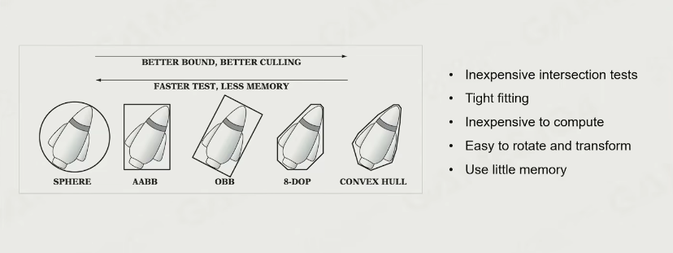  

现代游戏引擎用BVH多，因为其做到了裁剪、重建都比较快，尤其是动态对象特别多的。  

### 经典：pvs

有一个经典算法**PVS：Potential Visibility Set**，来自DOOM时代，其思想就类似于在建筑群中，站在一栋房子里，通过固定的门窗能看到其他房间是固定的，那渲染就在这一部分进行。利用BSP-tree，细节略。  
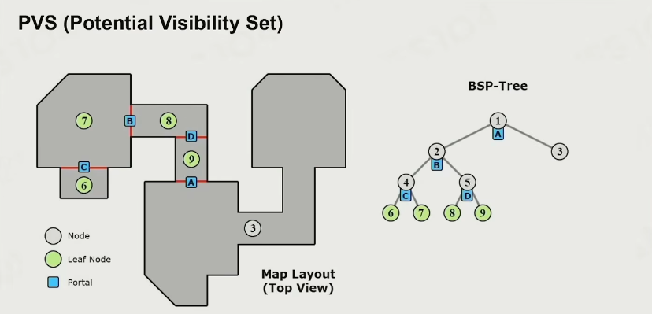  
现在已经很少直接用PVS，但思想依旧是广泛流传，譬如设计的游戏场景虽然是开放世界，但仍能够分为不同的zone，zone之间的可见性就可以用这种思想。  
不仅是渲染，更在于资源预加载等方面。  

### GPU-based Culling

现代GPU算力充足，可以直接用暴力算法计算包围盒与视锥的相交情况、再还给CPU。  
这也给了一个启发：不要被老的算法限制，与硬件配合紧密的算法才是好算法。  

**Hi-z/Early-z**，也就是深度测试，先跑一遍只算深度的，然后根据深度剔除掉看不到的。  

## Texture Compression 纹理压缩

游戏引擎绘制系统使用的纹理并不适合JPG、PNG等传统的图片压缩算法，因为其对随机访问不友好，计算复杂度大，在绘制过程中会降低性能。  
绘制系统更多使用的是Block-base压缩方式，是把图片切成一个个小块（经典的是4x4）然后进行压缩。  

在dxt类型纹理中，有经典算法，其思想是找出4x4色块里最亮与最暗的两点，然后认为其余点是这两点的插值，因为图片相邻像素之间是有关联的，从而用最大值最小值之间的比例关系来计算。  
这一算法压缩与解压缩效率都非常高，在PC上有BC7、DXTC；在移动端，有ASTC、ETC/PVRTC格式都是基于这个思想。  

## Authoring Tools of Modeling

建模工具，传统的是增材式，MAX、MAYA、Blender；  
现代流行减材雕刻式（Sculpting）工具；  
得益于三维重建方向的进步，3d扫描也是广泛应用；  
还有更强大的，用算法/人工智能生成地形、植被以及一些细节，将艺术家从繁琐细节解放，专注于创意。  

## 现代引擎的pipeline：Cluster-Based Mesh Pipeline

细节越来越多、地图越来越大，渲染过程中的数据量越来越大，对传统的绘制系统产生了非常大的冲击，好在其并非是静态的，而是能够与时俱进。  
现在一个方向就是Cluster-Based Mesh Pipeline。  

其基本思想在2015年被提出，随着硬件成熟，逐渐完善。  
首先是基于曲面细分，输入数据，曲面细分算法会自动生成细节，这样也能根据摄像机远近自动切换；
然后是把一个整体复杂的模型划分为许多meshlet或cluster，每一块由固定数量的三角形组成，在数据处理上与GPU的多核同步批处理相配，每一块的计算都是高效、一致的，并且在裁剪方面不再是一个个object为单位，更精细的裁剪出要渲染的cluster。  

虚幻的**Nanite**是更进一步，更加工业化、更多细节的实现，能实现像素级别的网格密度。  
这也正是GPU并行计算潜能激发的产物，GPU-Driven。  

***

# Lec5：渲染中光和材质的数学魔法

渲染.2  

## The Rendering Equation

真正意义的渲染开端：James Kaiiya提出的渲染方程，GAMES101中的光追有讲。  

渲染方程是符合物理规律的，无疑能解决渲染中的各种现象，但是在游戏引擎上的问题是**实时渲染的复杂性**。  

### 光本身的挑战

**1a Visibility to Lights**：也就是阴影相关的问题，在一点处可见光计算是困难的；  
**1b Light Source Complexity**：光源的种类极多，点光源、太阳等还好说，但面光源这种情况就很难处理，这体现在渲染方程中的入射光计算。  

### 积分性能挑战

**How to do Integral Efficiently on Hardware**  
渲染方程中要对BRDF与入射光进行半球面积分，为了实时性，需要考虑如何在硬件上迅速完成积分的过程。  

### 光源递归的挑战

由于物理中的光可能会弹射极多次才进入眼睛，这就导致每一个物体都有可能发光，是一个复杂的递归算法。  

## 基础光照渲染解决方案

从最简单的渲染开始。  

### 光照模型的简单实现

+ 用最简单的光源形态，定义一个主光（domain light），其可以是点光源、太阳平行光等。；
+ 对于表面上的复杂光场，把主光去除，剩下的则为环境光，称为ambient light，从而替代环境光；
+ 为了更好的体现环境光，增加Environment Map Reflection 环境光贴图，特别是物体表面是光滑材质，处理其反光时有用。  

如此，就把反射方程中半球面射来的光照分为了三个部分：  
+ 均匀的环境光，即**ambient light**
+ 突出的**domain light**
+ 把环境光中高频的部分用**environment map**来表示，用于处理BRDF中对specular材质敏感的地方  

最早期的光照模型就这样实现。  

### 材质模型的简单实现

不研究物理空间中究竟发生了什么，而是凭借观察现实所得出的经验，把材质的现象分为三种叠加。  

这就是著名的Blinn-Phong Materials：  
漫反射项、高光项、环境光，这也体现了光的线性性质。  
这样把BRDF给简化了。  

其问题有：  
**能量不守恒**，在多次反射后腔体内比外部亮；  
**真实感缺失**，其不能表达所有材质的特点，做出来的都有塑料感  

### 阴影/光可见的实现

经典的**shadow map**，从光源得到一个深度图，从相机出发，计算、比较。  

这样做当然会有一些问题。  
首先是**采样率**，这通常体现在一些复杂模型的自遮挡上，由于深度图的精度限制，会有一系列的非线性跳变。解决方法就是增大容差（不等式的判断）等。  
这里老师没有说，应该还有一个问题是只有直接光照能够体现出来，但是前面的光照模型与材质模型都有环境项，也差不多能弥补，毕竟能够work就够了。  
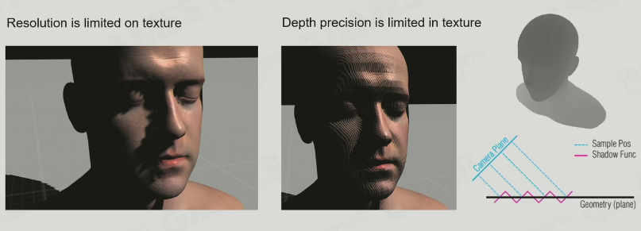  

这里就解决了光线递归的问题，虽然是逃避的方法。  

## 基于预计算的全局光照

上面的基础三件套之上，还有更进一步的光照实现方法。  
这一部分的技术广泛应用在10-15年前的3A游戏中。  

**Pre-computed Global Illumination**，空间换时间，假设关卡中绝大多数的物品都不会移动，就可以提前计算好光照，直接应用。  

### Why 全局光照

其对真实感的刻画是前面的ambient不能比的，后者平面感很强。  

### Light Map

这一技术实际上是预先计算好场景内物体表面的光照，然后制作成纹理，把光照当作纹理取用。  

**好处**：实时效率高；烘培进很细节的光照；把游戏参数映射成一个二维texture；  
**缺点**：预计算时间长；只能处理静态物体、静态光照；空间换时间导致体积大。  

### 如何表达间接光照

假设现在已经计算好了全局光照，其是一个球面空间的采样，上面存满了场景的光照。  

首先是存储问题，球面上的光照多，完全记录下来耗费空间；  
其次是对给定材质，计算全局光照与材质的作用，这依然是一个积分的问题，如何能快速的与球面光照进行积分？  

首先思考傅里叶变换，其把时域/空间域转换为频域，而时域里的卷积在频域里可以一步完成；  
这就引入了**Spherical Harmonics 球面调和函数**，把球面按球面坐标系进行分解，得到的结果具有诸多优良性质。  

实际上还是一个采样、滤波的问题，球面调和函数就相当于对整个球面的光照信息进行滤波，虽然模糊，但保留了大多数信息、减小了信息量，应用上一阶两阶就足够。  

### Light Probe

**空间体素化**思想  

直接在空间中放置许多Light Probe，采样每一个Light Probe的球面光照（使用球面调和函数）并记录下来，这样物体在移动时插值即可得到光照。  

通常要配备一套Probe的自动生成工具，能减轻负担。  

为了反射效果好，通常还需要低密度的抛洒上**Reflection Probe**，需要记录高频的光照信息以满足反射需要。  

**好处**：runtime效果好，效率高并且可以实时更新  
**缺点**：没有Light Map精细，因为采样太稀疏  

## 基于物理的材质

**Physical-Based Material**  

**微表面理论**，关键思想在于物体表面光滑或粗糙，是与其微表面法线的聚集度有关的。  
光打到物体表面，首先会反射，强度与法线的聚集度有关，然后若是金属，其电子会捕获光能，若非金属则不会捕获，散射形成diffuse，为Lambert项；还有一部分是CookTorrance项描述specular。  

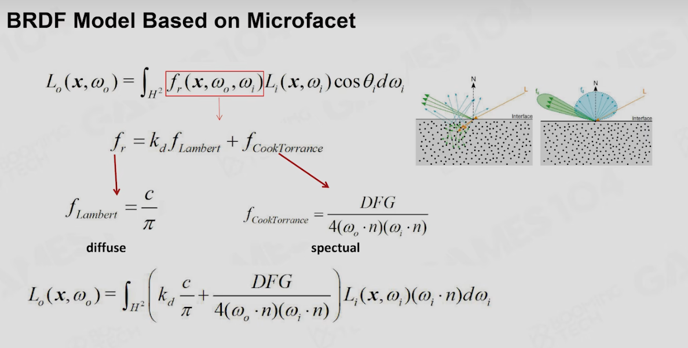  

D项就是法线分布方程，更多使用GGX模型，高频部分更尖锐，低频部分延伸更多，过渡比较柔和；  
G项就是几何项，能表述模型内部相互遮挡。GGX模型会计算眼睛看过去遮挡多少，再算光照过来遮挡多少，两者结合；  
F项为Fresnel方程，决定了折射、反射的能量占比。  

如此就能得到非常符合物理的材质。  

这里也提到了BRDF的测量。  

### Disney Principled BRDF

**Disney的大佬Brent Burley**：  
+ 任何参数必须符合艺术家的直觉，不能太抽象
+ 尽可能少的参数
+ 所有参数值的范围应为0-1；但也能在一定范围内超出，但应有一定的意义，满足创作弹性
+ 参数之间的随机组合都应是有意义的  

引擎毕竟不是一个仿真软件，而是一个工具，尽可能的满足使用者的逻辑与需求。  

### PBR Specular Glossiness

最广泛使用的PBR模型，其特点是参数量很少，更多用图像表示。  
SG模型非常完整、经典，还符合Disney的原则。  

其有一个缺点，就是太过灵活，需要艺术家精细控制。  

### PBR Metallic Roughness

由**base_color**、**normal**、**roughness**、**metallic**四项组成。  

MR相当于在SG外包装了一层，减少了参数量，但保证了正确性。  
其坏处是在金属与非金属材料过渡态下会出现白边。  

## 基于图像的光照 IBL

**Image-Based Lighting**  

光照来自一个球面，那么为了表达，直接上一个cube来表示，就得到了**cubemap**来表达四面八方的光照。  

IBL考虑的就是如果能对环境的真实光照做一些预处理，使光照与材质的卷积运算能够快速完成？前面讲到的球面调和函数做到了，但是比较粗糙，达不到所需的细节感。  

上面的BRDF已经把材质分为了两部分，分别是diffuse与specular。  
diffuse部分本质就是一个cosine函数在球面上的分布，对于任何一个法线的朝向点，其值是可以提前算好的，因此提前计算好得到Diffuse Irradiance Map。  
对于specular部分，则做了一些假设与简化，最重要的想法是利用mipmap的不同层级来存放不同粗糙度的高光，但这里的mipmap是需要一层一层真实计算的；另一个假设的结果是得到了一个表，分别是入射的cosine与粗糙度，从而快速得到数值。  

IBL层次清晰，真实感强。  

## 经典阴影技术

### Cascade Shadow

游戏世界越做越开阔，但从光源采的shadow map精度并不够，由远及近怎么调都不对。  

做法是把shadow分为几个层级，对于近处的物体，用高精度的shadow map；这样再向远处不断减小精度，最后再合在一起。  
近处物体采样率高，那就用高精度的；远处采样率低，自然用低精度的。  

这样在不同精度层级之间需要做插值处理，否则就会有明显的边缘。  

缺点是空间换时间，并且开销高，要绘制多次、裁剪多次。  

### PCF - Percentage Closer Filter（PCSS）

用滤波的方法做软阴影。  
在实战中就是PCSS。  

### VSSM - Variance Soft Shadow Map

使用Chebyshev‘s 不等式，用数理统计方法。

## 当下技术总结

+ 对于光照，使用Lightmap + Lightprobe
+ 对于材质，PBR + IBL
+ 对于阴影，Cascade Shadow + VSSM  

这些技术搞通，10年前的3A引擎就做成了。  

## 前沿技术

### Quick Evolving of GPU

GPU的发展几乎改变了渲染的通识，算力解放了思想。  

**Real-Time Ray-Tracing on GPU**  
**Real-Time Global Illumination**  

### More Complex Material Model

BSDF、BSSRDF描述的精细材质，比如头发。  

### Virtual Shadow Maps

先计算出需要生成Shadow Map的区域，然后在一个巨大的、空的虚拟Shadow Map上生成，在渲染时就可以根据命中的区域对应虚拟shadow map的区域。  

## Shader的管理

现代引擎由于艺术家的精细、硬编码的所有分支（Uber），会生成许多shader。  

跨平台编译器的实现也是一个优化方向。  

***

# Lec6：游戏中地形大气和云的渲染

**The challenges and Fun of Rendering the Beautiful Mother Nature**  

## Terrain Rendering 地形渲染概述

地形相关的技术不光是描述地球，不像地球的地貌也能绘制，譬如无人深空。  

### 地形的几何描述

依旧从简单到复杂。  

#### HeightField

最简单的思路就是HeightField高程图，人类早就用等高线图来描述世界了。  
无论Height Map还是Contour Map，从图像上看其都有着**分型几何**的特征，因此分型在用计算机生成地貌中十分重要。  

尽管HeightField是一个古老技术，但其直至如今也是地形生成的主要方法。  

拿到HeightField后，就要着手进行**渲染**，方法是创建一个Mesh Grids，按照一个固定的步长进行划分。在每个顶点处根据高程图进行位移，同时apply上高度、属性等。  
这一方法足够简单易懂，但是仅限于较小的范围内，若是一个开放世界，这么存其Mesh的存储开销会不可接受。  

这一问题也很好找到**优化的方法**：我们观察世界，永远是近处的细节多、远处的细节少，所以根据LOD思想，就需要找到一个像是把普通GO从高精度切换成低精度的方法，技术难点在于地形与普通GO不同，从近及远是连续的，因此地形的LOD需要精心设计（T-Junctions）。  
> **重要思想：LOD——level of detail**，根据观察时在屏幕占据的像素、远近、对其的敏感度来设置不同的细节精度  

#### 网格细分/简化

先了解一下**Mesh Tessellation 网格细分**。在游戏中，相机所看到的只是一个锥体，用FOV来描述。因此我们实际关心的就是FOV内部的细节，而外部的细节则可以粗放。  
所以做到FOV内部的近处的网格密集，FOV外部以及内部远处的网格稀疏就可以，如下图：  
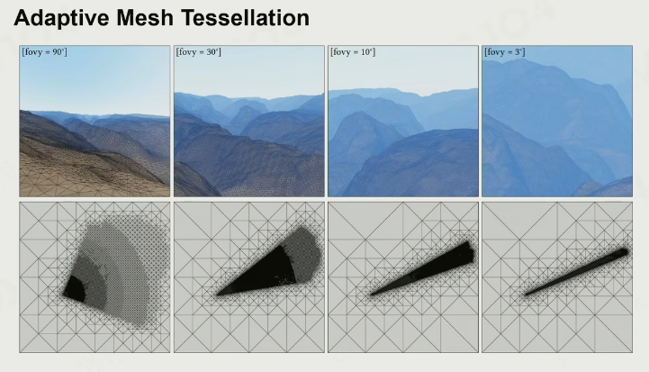  
实现时会保证做到屏幕上每隔一定数量的像素观察到的三角形密度是一致的，所以FOV越小，看到的场景越精细，射击游戏中的倍镜就是这个原理。（因此FOV也是一个重要变量，忽略就容易搞出BUG）  

现在就可以**对网格进行简化**了。但做简化时要注意一个原则：**Error Bound**，在对网格进行简化/合并时，由于采样点减少，要保证在**视空间**内的地形高地差相比预计算得到的原始数据，不超过某个阈值（也就是不用绝对的长度来作为阈值，而是屏幕上的像素相差），这样才能保证准确。  

简化网格有一个经典方法：**Triangle-Based Subdivision**，在需要细化的等腰三角形的最长边切一刀，变为两个小等腰直角三角形，这样递归下去即可。  
由于一分为二的性质，形成了二叉树的结构，所以也称为Binary Triangle-Based Subdivision。  
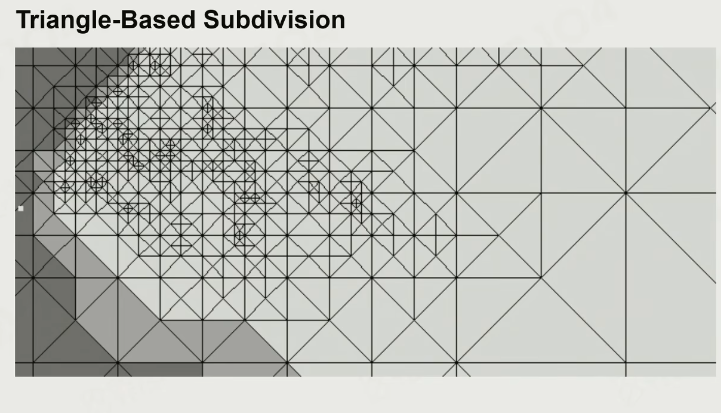  
（图中高亮部分为view内，暗处为view之外）  

这样做就会产生**T-Junction**现象，假设两个三角形共享一条边，其中一个又在内部不断细分，在共享边上多出一个采样点。如此，没有细分的那个三角形在共享边上是一条均匀插值变化的直线，而细分过的三角形在共享边上是一条折线（插值与实际采样间总会有些误差），绘制出来就会产生明显的缝隙。这就会导致整体上地形的走向大致是对的，但细节上充满缝隙，如下图：  
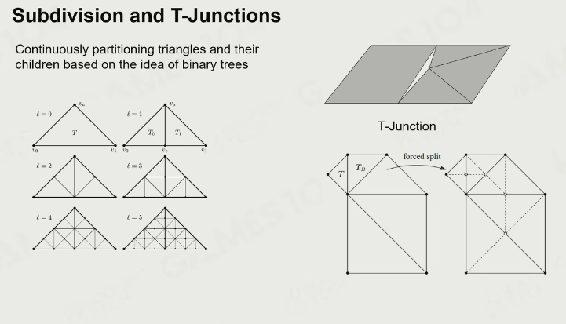  
解决方法也算是比较无奈：如果发现邻居对共享边的切分比自己密集，那就也对这条边进行切分，直到与邻居的切分数一样为止。  

尽管上述的这个经典方法在效率与绘制都没有问题，但实际工程中并没有广泛使用，因为其对地形数据的管理、中间执行的简化算法都**不符合对游戏地形系统的直觉**——我们更希望地形是等大的豆腐块，而不是大小不一的七巧板。  

实际工程中，更多使用的是**QuadTree-Based Subdivision 基于四叉树的细分**：  
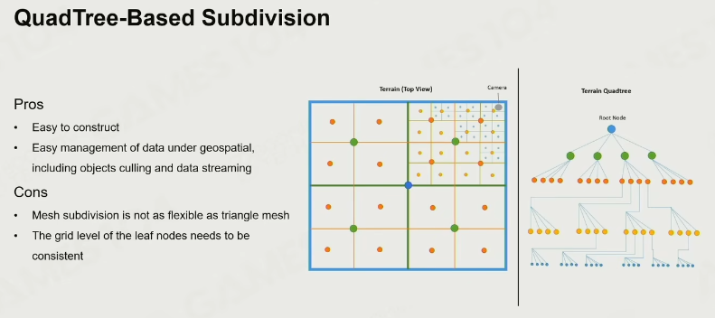  
这样的划分就十分规整、易于构建，同时也与纹理等其他数据的存储规范类似，暗含了资源管理的思想。  

但也不可避免的遇到T-Junctions，但其解决方法与基于三角形的不同，名为**Stitching 吸附**：  
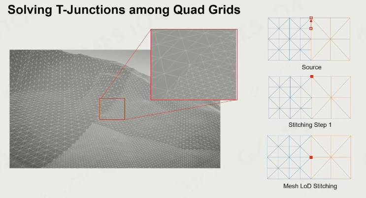  
其在遇到邻居正方形与自己的细分程度不一致时，不再砍自己，而是把其在共享边上切分的采样点吸附到自己的顶点上，相当于制作了一个退化三角形，其面积为0。  
（老师提示在做图形学管线时，要特别针对这种面积为0的三角形，指定其是给一个像素或什么都不做）  

在现代的前沿游戏引擎技术中，还存在一种用不规则的三角形来表达地形的方法：**TIN：Triangulated Irregular Network**。其考虑到在HeightField下，若有许多面是平的，四叉树细分仍会不可避免的浪费许多三角形，索性用面片简化的方法把不必要的顶点全部简化，并且能做到数据点在信息密集的地方自然多。  
这一方法就有预处理的意思了，提前花时间计算好这些复杂的简化，在runtime时修改困难，但做到了在很多情况下划分的三角形要远小于前两种方法的划分。  

#### Hardware Tessellation

算法原理了解后，就自然引入极其重要的GPU。  

老师讲到之前的地形生成不得不用DX10/11很困惑的管线，但现在DX12使用**Mesh Shader Pipeline**的概念极大简化了这一系列心智负担。  
但要搞引擎，老管线与新管线最好还是都学学，道理理解透。  

当所有顶点的位置都能够自动的在shader中runtime实时调整时，就可以实现**Real-Time Deformable Terrain**，动态的地形，车辙、脚印等都可以实现，要想实现个人引擎，这一效果加上也好。  

#### Non-Heightfield Terrain

我们的地形并不总是一个单值函数，在一个地方只有一个数值，譬如悬崖有反向的峭壁、山谷有拱桥形状的洞，这些特征用Heightfield并不好描述。  

一个最无脑的方法：把多出的部分不当作地形，而是物体，加在原地形之上。  

一个巧妙的方法，在网格划分处动一些手脚，譬如要在山体上挖一个隧道，把隧道出入口对应的部分都给变成退化三角形，从而消除掉，这样得到的就是None，可以穿过。对于边缘的zigzag，套一个隧道模型即可。  
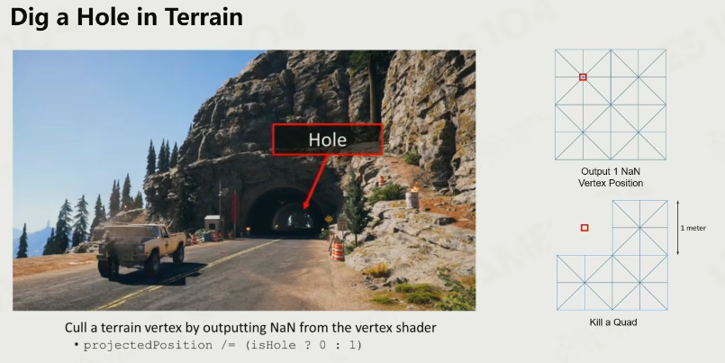  

Crazy Idea：**Volumetric Representation 体素化表达地形**，直接把地形变成体素化，在体素存放物质与密度，想有什么就有什么。  
这就是著名的**Marching Cubes**算法，其给出了如何从立方体的点映射为一个面片的方式，也就是把各种场给转换为可见的形式。体素化+Marching Cubes，在其他许多领域也有用处，比如CT、流体仿真等。  
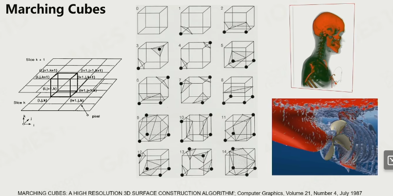  
当然，实际使用也是要再做一些工程化的trick，譬如网格也有密集和稀疏之处，精度不同，要有更多的情况去讨论。现有的工作是把这些情况分为百余种，用时显卡直接查表即可。  

尽管当前硬件、算法尚不足以支持这一idea，但也是未来的一个有前途的方向。  

### 地形的材质

#### Texture Splatting 材质混合

最直接、简单的思路。  

地形也无非就是不同材质的混合，因此选取一个材质模型，按照一定的规则将其混合即可。  
比如使用PBR-MR模型，存每一种材质的Base Color、法向、Roughness以及额外的Height；  
此外还需要**Splatting Map 混合贴图**，其每一个channel都对应一种材质的权重，artist通过笔刷即可混合出材质。  

这样很直接，但有问题。在真实世界中，每一种材质、材质之间都是有清晰的逻辑关系的，譬如沙子与石头的衔接处，用直接混合的方法会有一种强行渐变、蒙了一层沙的感觉；但实际并不如此。  
其实还是因为混合方式太直接，要自然、真实，就要用上额外存的Height了：  
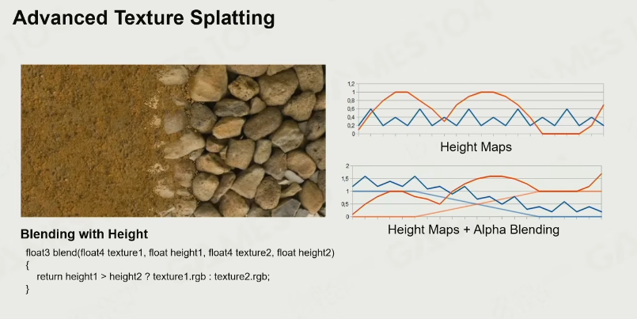  
直接比较高度，谁高谁在上面，通过一个简单的01判断实现混合效果。  
但这样有一个问题，在材质交界处的信息很高频，相机移动时就会出现抖动。  
解决方法是增加一个biased：对于两种材质高度相近的时候，也不必要非你即我，用两者的高度作为权重来插值，就很自然了：  
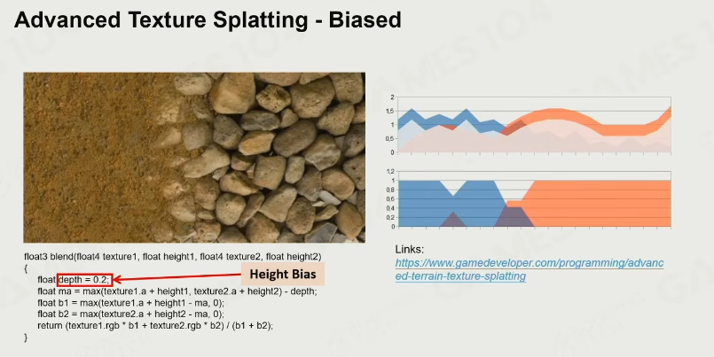  

#### Sampling from Material Texture Array

实际上我们会用到远超三四种的材质进行混合，动辄几十种上百种。  
解决方法就是**Texture Array**，把不同材质的相同类型纹理（比如颜色纹理）pack成一个array。  

这样就能准确描述出多种材质混合时的层间的逻辑关系，在进行混合时Splatting Map存放**权重**与**材质的index**，按照index选取array中的材质，再用对应权重混合。  

#### Parallax and Displacement Mapping

上述是一些最基本的渲染，对于绘制的表达，现代游戏引擎常用一些更高级的贴图技术。  

常用的**bump mapping 凹凸贴图**增加了法线表达，能形成一些简单的凹凸感，但在此之上还有**parallax mapping 视差贴图**。  
假设我们观察的是点A，由于地表的几何特征，实际上应该观察到的点应该是另一点B，应用上这一特征得到的视差贴图就能够形成更明显的凹凸感。  
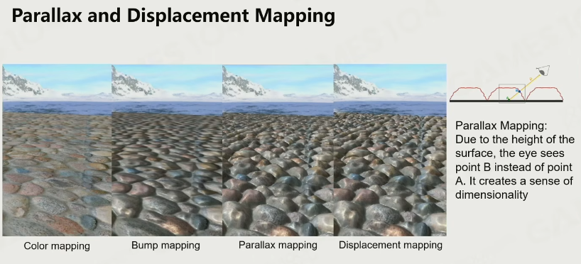  
其缺点是每一个像素的计算会更昂贵，并且只能在视觉上产生凹凸感，不够彻底，譬如在远处的边界上还是平滑的。  

更彻底的方法是**Displacement mapping**，直接在几何上根据height修改，就像使用硬件细分一样。  

#### Expensive Material Blending

上述纹理混合的原理是易于理解的，但其有一个明显的缺点：**Texture sampling is expensive**，在2D纹理上纹理采样一次需要取8个点、进行7次插值，在多种材质混合时会重复多次，相机看到的每一个像素都要如此开销。  

事实上，相机能看到的地形只是一部分，太远的部分可以cut、或简化的表达。  
所以，自然有更巧妙的方法。  

#### Virtual Texture

是现代游戏引擎中最主流的地形绘制方法。  

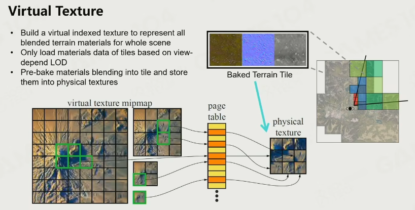  
virtual texture做了类似mipmap的操作，把每一层都按照固定大小分为若干个tile，同时把对应的材质都烘培进tile中。  
这样在渲染地形时，不必把整个地形纹理放进物理内存/显存，而是根据fov内远近的不同LOD建立对应的tile映射，需要哪一块就从vt中取到物理内存中。  
这样即使是渲染到无限远，也会因为级数的收敛而占用有限的内存。  
只要内存中的tile没有被覆盖，就会一直显示。  

这样有一个问题：在将一个个tile搬进显存的过程中，要先通过总线从硬盘读到内存，再从内存移动到显存。这其中的内存并没有直接关联，因此可以对这一部分做出技术优化。  
+ **DirectStorage**，可以让数据以压缩的状态经过内存，进入显存后再解压，能极大的增大效率；
+ **DMA**，直接抛弃从内存中走一圈的过程，让显存直接从硬盘中读取。  

#### Floating-point Precision Error

随着游戏地形越来越大，浮点数的精度会逐渐不够用，从而逐渐崩坏。  

有一个很简单的解决方法：**Camera-Relative Rendering**。  
上面精度不够用导致画面崩坏是建立在世界坐标系中坐标相差无几时冲突，而渲染时不再按照世界坐标系，而是把相机当作原点（也就是做了一个相机变换），在近处的画面就会稳定。  

### 植被、道路

地形除了基本的起伏形状与纹理，还需要植被等的覆盖。  

#### Tree Rendering

树的绘制比较复杂，基本是一条专门的技术：在近处看，是真实密集的mesh；逐渐拉远，会切换成叉片表达，并且叉片也会逐渐变稀疏，最后变成billboard，并能够大批量自动生成。  

#### Decorator

在环境中的一些草、灌木丛、小碎石，都称为Decorator。  

最初级的Decorator方法是插面片，这会在近处观察时会跟随镜头移动；  
更高级的更复杂，略。  

#### Road and Decals Rendering

道路是游戏引擎中十分重要的系统，复杂之处在于道路会相互交叉，在交叉处不能简单的用blender texture，需要一系列情况处理。  

道路系统的常见做法是**Spline 样条曲线**，通过拉拽一系列控制点形成预期道路；而程序上就要在渲染道路之外，还得对地形高度场进行切割、腐蚀。  

**Decal**就是一种小的贴片，射击游戏中在墙上留下的弹孔就属于Decal，有时还会加上法向的效果。而在环境中，artist也会泼洒一些Decal来充实。  

既然道路、环境decal一般都是静态的，那么干脆在生成texture时就把它们bake进去——这也是vt的一个强大之处，在runtime中高效渲染。  

## 天空 Sky and Atmosphere

大地就到此为止，天上的东西也有的研究。  
天空中有两个元素：Sky与Cloud，需要分开讨论  

### 大气散射理论

#### Analytic Atmosphere Appearance Model

首先看一个最基础的模型。  
这一方法就类似bp模型，是对实际观察的拟合，只需要填入对应的参数就能拟合出相近的天空颜色：  
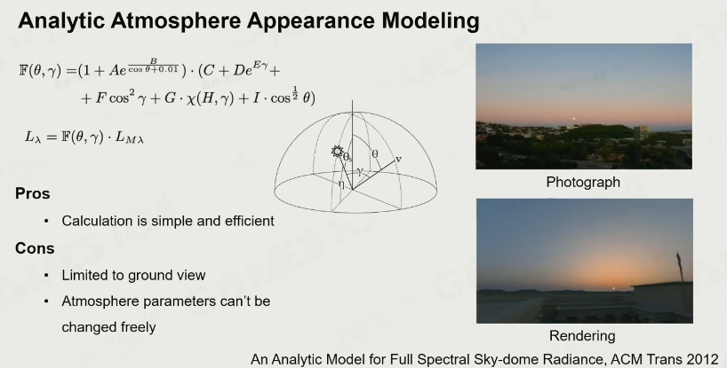  

这一算法简洁、高效；但是只限于在地表观察，并且参数是写死的，不能自由更换。  

#### Participating Media & RTE

大气中有许多粒子，可分为两种：气体分子（氮氢氧等）与气溶胶Aerosol，其会对光进行反射、折射，这些粒子构成了Participating，形成了各种光的效应。  

那么光具体是如何与参与介质作用？  
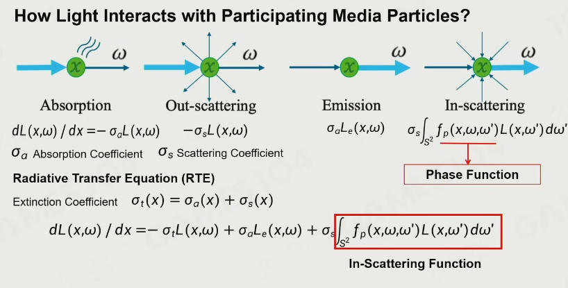  
吸收、散射、Emission、In-scattering四种效果合在一起，就得到了**Radiative Transfer Equation (RTE) 辐射传递方程**。  
图中的RTE是一个一维的方程，在实际的三维世界中，其会变成一个梯度方程，求解麻烦，涉及高数中的一系列方法。  

#### Volume Rendering Equation (VRE)

当相机在点P处望向远处一个点M，接收到的光是如何构成？这一现象的描述也很复杂。  

直观的方法就是从M点出发，对途中经过的每一个点都计算光被吸收、散射、接收、Emission的部分，就能得到准确的结果。  
这一过程中涉及两个关键值：  
+ **Transmittance 通透度**：描述M点原本的颜色（或直射回来的光）到达P点时还保留多少，是一个路径积分的结果
+ **Scattering Funcion**：光线在传播过程中，又叠加了沿途所有粒子通过自发光、散射等的光，这也需要路径积分  

有了以上两个元素，在知晓M点上的原本光场，就能知晓在P点处收到的光线。这就是VRE：  
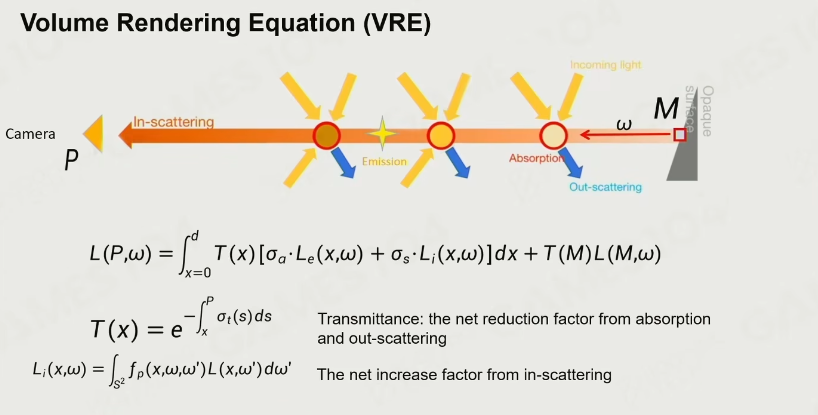  

对作为梯度方程的RTE进行积分，得到的就是VRE。（实际应用中会把相关参数都预计算好）  

#### Real Physics in Atmosphere

真实的大气物理学，其中有两个主要参与者：
+ **太阳**，事实上是由大量不同波长的光组合而成，呈现白色
+ **大气中的气体分子与气溶胶**，气体分子直径远小于光的波长，而气溶胶分子直径接近光的波长，从而性质完全不同。  

基于上面的大气物理，有两种**散射Scattering模型**。  
还有一种**吸收模型**。  

##### Rayleigh Scattering 瑞利散射

当空气中的介质尺寸远小于光的波长时，散射形式是向各个方向发出几乎均匀的散射，几乎没有方向性。波长越短，散射越强，反之则弱，如下图中的红光散射弱，蓝光散射强：  
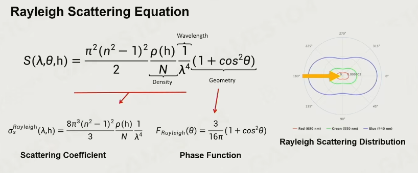  

描述其的**Rayleigh Scattering Equation**由两部分组成：  
+ **Phase Function**：描述几何形状，也就是右边描述方向性的腰果状。结合1/λ^4，就有波长越小，散射越强的描述了；同时把入射角度θ考虑进
+ **Scattering Coefficient**：h代表海拔高度，用于描述大气密度ρ(h)与海拔的关系，N表示标准单位体积内的空气密度，两者作比就能把海拔的影响加入考虑  

应用瑞利散射，就可以描述、解释一些真实的现象，比如天空是蓝色的，是因为太阳直射大气时，大量蓝光被强烈散射在大气中反复弹射到眼里，红光直接打在地上，最后天空就是蓝色的；傍晚天空是红的，是因为阳光斜射到大气，蓝光同样剧烈散射，但大部分被散射到大气层之外，从而蓝色减少、红色变多。  

##### Mie Scattering 米氏散射

当介质尺寸与波长相近或大于时，光的散射就会有一定的方向性，但是对波长不敏感，可由下图看出其散射像是一个大章鱼：  
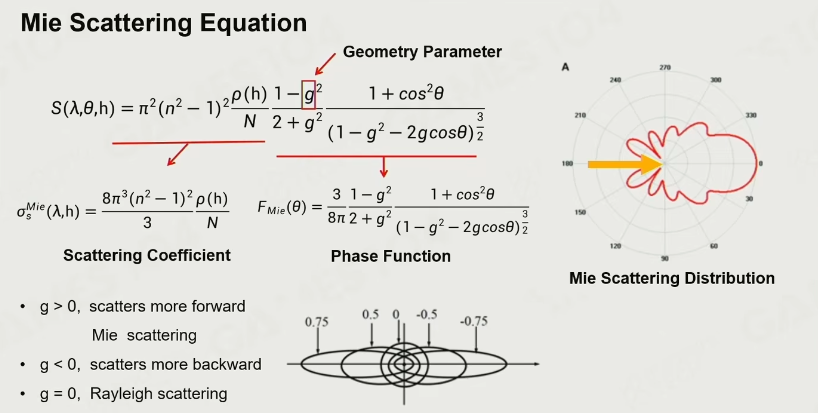  
**注意图中Phase Function的分母是错误的，应为1+g^2-2gcosθ！**  

描述这一现象的**Mie Scattering Equation**就更加复杂了，但依旧可以分为两部分：  
+ **Scattering Coefficient**：依旧是考虑的海拔修正项，当作一个常数
+ **Phase Function**：描述形状，其中有一个变量g，当g为0，会退化为瑞利散射；当g大于0时表示向前散射，小于0时向后散射，交给artist调试  

Mie散射同样能解释一系列的现象。譬如雾呈现白色，是因为雾是气溶胶，阳光照进雾里，各个波长的光都无差别散射，因此是白茫茫一片；傍晚太阳的光晕halo也是因为如此，雨天路灯也是。  

##### Variant Air Molecules Absorption

吸收现象同样与大气成分密切相关。  

对于大气中的臭氧、甲烷，吸收长波的能力强，如红光就会被吸收。因此海王星表面有大量甲烷，呈现蓝色。  

这里有一个假设，假设这些气体都均匀分布在大气中。  

#### Single Scattering & Multi Scattering

我们想象的路径积分还是简单的，只考虑到一个路径；实际的物理更加复杂，最终路径是由更多粒子的散射光路集合的：  
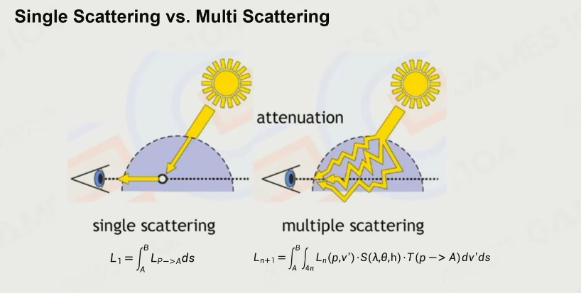  

用上Multi Scattering会更漂亮、真实，如下图：  
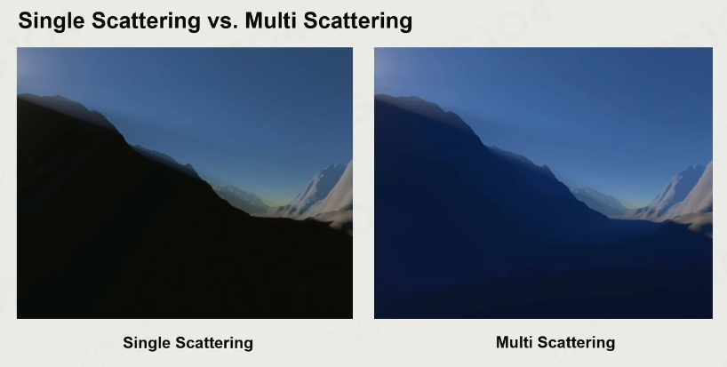  

> 这里山的暗面也呈现出蓝色，更多的就是因为multi scattering，虽然其挡住了直接射入周围空气的光，但是由于scattering的效果，最终还是有了颜色。区别于全局光照，这里更强调大气现象，而非山的暗面被简介光照亮。  

#### Ray Marching

自然是要做效果更好的那个。  
用到的算法就是**Ray Marching**，沿着一条视线，把沿途的效果一步一步的加起来：  
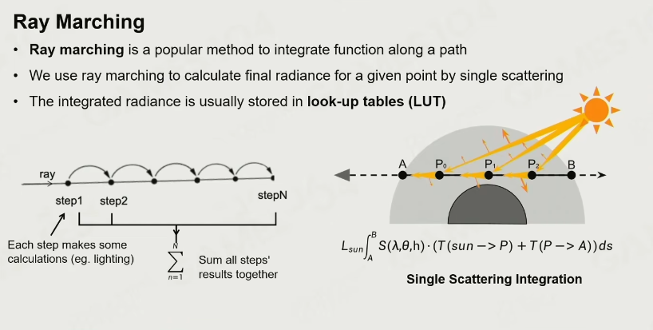  

#### Precomputed Atmosphere Scattering

有了RayMarching的算法，但是想要实时性还是有些捉襟见肘，这时就沿用**空间换时间**的思路，用**预计算大气折射**，提前把这些信息都记录成表，渲染时根据视线方向、太阳角度查表即可。  
大气最重要的两个参数分别是**通透度**与**散射度**。  

对于通透度的计算，使用一个非常经典的算法：LUT
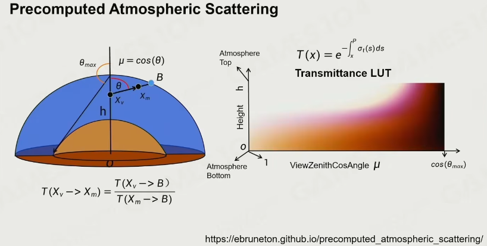  
这一算法在地表任何一点，按照海拔高度h，存放视线与天顶的夹角θ的cos值

这一算法用二维的函数（高度，角度）实现了四维函数（）  


## 云 Cloud

云有三种类型：层云、层积云、卷云。  

### Mesh-Based Cloud Modeling

描述云最简单的方法就是用Mesh强行表达，用一些基本形状搭出形状，再用一些噪声、腐蚀算法，就能够有云的形状。  

但这一方法基本从没有人用过。  

### Billboard Cloud

在早期游戏经常使用这种方法，用大量的叉片各种混合，像一大块棉花糖，差点意思。  

### Volumetric Cloud Modeling

现代主流游戏最常用的方式。  
和上面地形谈到的体素化方法一样，用体积去表达空间。  

这样生成的云是全动态，在GPU上实时生成，能表现出很多种的变化；  
缺点是算法复杂，优化做不好就十分低效、昂贵。  

其主要思想见下：  

#### Weather Texture

使用**weather texture**，其由两部分组成：  
+ 云在空间中随机的分布
+ 在0-1的值，代表云的厚度  

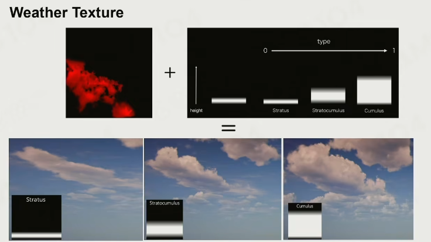  

这一texture十分有用，譬如想要让云飘起来，就对其进行平移；  
想要让云多样变化，就可以对其增加一些扰动、变化从而使云变化。  

#### Noise Function

有两个著名的噪声方程。  
+ **Perlin Noise 柏林噪声**，在多项式时间内生成棉絮似的噪声图像；  
+ **Worley Noise**，类似空间Voronoi化，给定一系列点，把空间划分为若干以这些点最近的cell，就像在显微镜观察细胞一样，泡泡状。  
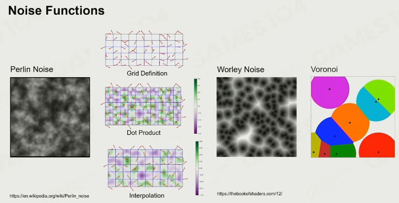  

#### Cloud Density Model

有了Weather Texture与Noise Function，结合两者就可以让云变得更加真实：  
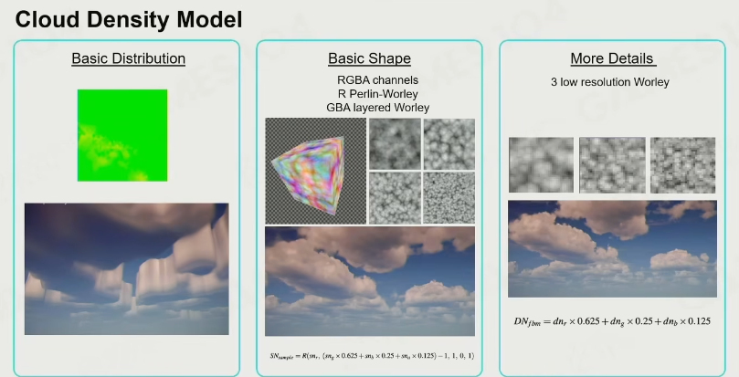  

根据Weather Texture生成的云是很规整、无聊的柱形，看着并不像云，只是一个几何大概形状；  
然后使用噪声对其进行腐蚀，先用一系列低频noise减去一些体积，再用高频噪声补全细节，在数学上形成分型的效果。  

### Rendering Cloud by Ray Marching

现在已经有了云的几何，用传统渲染方法，由于其几何极其复杂，应该考虑高效的渲染算法。  
所以用到Ray Marching算法。  

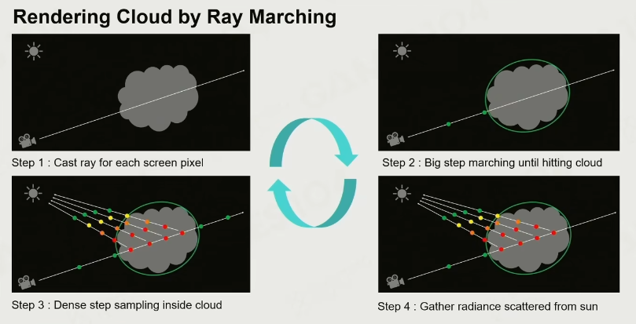  

+ 相机看向天空任意位置时，检测视线是否能击中生成的体积云
+ 若能击中，则用大步长沿着光线走，直到击中云
+ 击中后，采用小步长采样，在每一个采样点计算通透、散射，直到出云（云这里的计算会简化许多，由于云的一些物理特性）
+ 最后把radiance合并，就是从太阳散射来的光  

***

# Lec7-9  

从感觉上来说，渲染这方面在未来的生涯中是没有什么希望作为主业了；  
如今想实现的方式是以引擎的物理方面作为切入口去入行具身：我有预感这是某种共通的技术路线。  

因此有些迷茫中就先去看引擎的物理方面。  

***

# Lec10：物理系统基础理论与算法  

Physic System  

## 物理对象与形状  

Actors and Shapes，是两个很接近的概念，通常是发生在逻辑part中的。  

### Actor  

+ 静态Static Actor，在大部分游戏中占绝大部分的，无法摧毁；
+ 动态Dynamic Actor，行为符合动力学原理；
+ Trigger，与游戏逻辑高度相关；
+ Kinematic Actor，本质是反物理的，交互时可能会把反物理的部分传播给别的Actor  

### Actor Shapes  

复杂形状几何体之间求交是极其困难的，因此会尽量把这些Actor的Shape都视作几种简单的shape。  

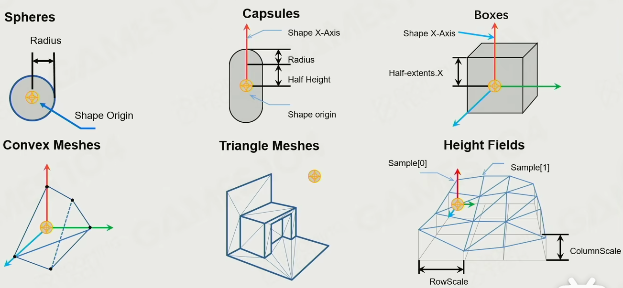  

+ Spheres：球，由原点与半径定义
+ Capsules：胶囊，两个半球中间夹圆柱，很多游戏对角色的表达都是Capsules
+ Boxes：正方体、长方体
+ Convex Meshes（凸包）/Triangle Meshes（三角网络）/Height Fields（高程图）：更贵、限制更多，但能表达的形状更为多样  

shape只是一个估计，不需要也不必要完美的包裹；  
同时能用简单的包裹，就不要用复杂的方法。  

**Shape的重要属性**：  
+ 质量or密度，我们把shape视作均匀的，举了一个Gomboc例子，只有一个稳定点
+ 质心，在一般情况下影响不大，但在载具系统中很重要
+ 摩擦与弹性，属于物理材质Physic Material，截然不同  

## 力与运动  

### 力  

Force，常见的拉力、重力、摩擦力，冲量Imapulse；  

### 运动

Movement，牛顿定律。  
在引擎中使用很数学的方法去表达运动，是一种统一的形式化表达。  

比如在牛一牛二下的直线运动：  
```
v(t+△t)=v(t)
x(t+△t)=x(t)+v(t)△t

v(t+△t)=v(t)+a(t)△t
x(t+△t)=x(t)+v(t)△t+0.5a(t)△t^2
```

实际力是不均匀变化的，实际上就要变成积分运算，自然变得复杂，嵌套、步进积分，而积分在计算中是每个tick的计算。  

由此引入几种数学计算方法。  
+ **显式欧拉积分**，用当前v与当前F算出下一v，用当前x与当前v计算下一x。直观来说是用矩形替代曲边梯形，造成能量不守恒（朝着增长方向），会很容易跑飞。
+ **隐式欧拉积分**，用当前v与下一F算出下一v，用当前x与下一v计算下一x。问题就在于当前时刻要用到下一时刻，但不在乎，假定有解析方法。能量仍不守恒，但是是收敛的（朝着减小方向）。衰减的好处是稳定，而且会认定有摩擦等现象。即允许世界静下来，但不能变成永动机。
+ **半隐式欧拉积分**，折中，用当前v与当前F算出下一v，用当前x与下一v计算下一x。非常好操作，容易迭代，尽管实际上是不符合物理定律，很神奇的是还比较稳定。  

## 刚体动力学  

Rigid Body Dynamics  
在质点运动学之外增加姿态、角速度、角加速度、转动惯量、角动量、力矩的概念。  

### 概念表示  

+ 姿态 Orientation：可以用一个3x3的旋转矩阵表示姿态，或者四元数
+ 角速度 Angular Velocity：最原始的就是用d_theta/d_t，能得到大小；但要想同时获取方向就要用叉积，找一个非转轴的点，其速度与转轴垂线叉积就是角速度方向，再除以模长平方就是大小（`v cross r / mod_r^2`）
+ 角加速度 Angular Acceleration：dw/dt是最简单的定义，还可以在角速度的定义上变成`a cross r / mod_r^2`
+ 转动惯量 Rotational Inertia：其实就是在旋转层面上的“质量”体现，旋转时除转轴之外的每一个点都有对应的能量驱动旋转。实际上也是很复杂的一个3x3矩阵。虽然复杂，但引擎都内置好了
+ 角动量 Angular Momentum：是一个守恒量，`L=Iw`，角动量=转动惯量x角速度
+ 力矩 Torque：定义为`r cross F`，力臂方向叉乘力的方向，也可以是`dL/dt`  

## 碰撞检测  

Collision Detection  

### Broad phase  

两种常用快速判断能否碰撞：  
+ BVH Tree，渲染中有过这个概念
+ Sorting Stage，把所有box排开，若是{AABBCC}说明这个轴没有碰撞；若是{ABBACC}，则这个轴有碰撞可能，遍历所有轴即可。还有一个优良性质是初始排好序后绝大部分物体不会动了，只需要快速判断在动的物体  

### Narrow phase  

接下来是精细的计算碰撞的交点、交深、法线等碰撞信息。  

#### 基础形体算法  

+ Sphere-Sphere Test：球心连接、判断是否小于r1+r2等
+ Sphere-Capsule Test：连接球心作圆柱中心线垂线，判断距离；也有一些边界条件
+ Capsule-Capsule Test：大同小异  

#### 凸包之间：Minkowski  

在点集合上定义**Minkowski Sum**（明可夫和）：  
+ 点集A与点集B可以明可夫sum，得到的也是一个点集
+ A={a1,a2,a3}, B={b1,b2}
+ A minkowSUM B={a1+b1,a2+b1,a3+b1,a1+b2,a2+b2,a3+b2}  

但实际上，凸包几何体都是无穷点的点集，可以可视化一下理解，依次是凸包与点、凸包与线、凸包与凸包：  
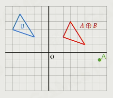  
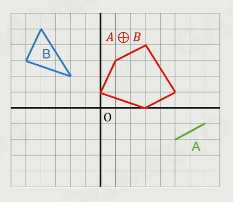  
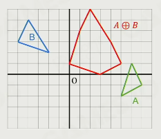  

无穷的点集自然不好计算，但是有数学证明，两个凸包的minkowski sum就等于两个凸包顶点集合的minkowski sum组成的凸包（橡皮筋原理），如下图：  
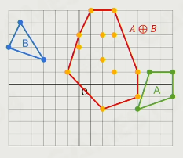  

接下来定义**Minkowski Defference**（明可夫差）。  
这倒不复杂，A minkowski Difference B = A minkowski sum (-B)，-B就是对B进行中心对称（或者说把每个轴上的坐标都取反）。  

最后就有一个**核心结论**：**如果凸包A与B有交集，那么A与B的Minkowski Difference过原点**。  

#### 基于Minkowski：GJK Walkthrough  

尽管Minkowski可以直接计算出一个大凸包，用于判断是否覆盖原点，但是复杂度高。而GJK算法可以步进的在线性时间内高效计算判断。  

可以直观理解成朝着原点方向迅速靠近。  

#### Separating Axis Theorem（SAT）  

分离轴定理  
对于在空间上的两个凸多面体，一定能在多面体上找到一根轴，这根轴能把两个物体分离开。  

在三维上，这个轴就是面了，但是还要额外判断，只用面来判断不准确。  

## 碰撞解决  

Collision Resolution  

### Penalty Force  

在早期物理引擎中很常用，直接给一个很大的力把物体分开。  

### Solving constraints  

现代引擎中会把物理问题变成拉格朗日力学中的约束问题来解决，实际上是不断小冲量迭代。  
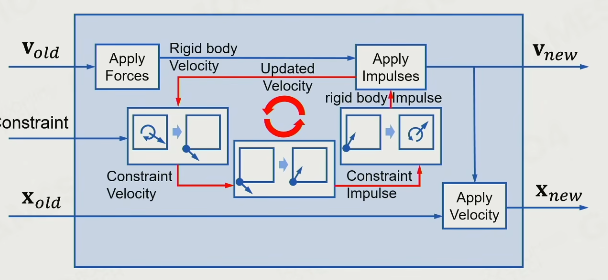  
是游戏引擎中物理世界能稳定的一个重要机制。  

## 场景请求  

Scene Query  

### Raycast  

FPS中子弹射出后，查询是否击中物体，就是一个典型的Raycast类Scene Query。  

分为三类：  
+ Mutiple hits：一根射线出去，所有交点都返回来
+ Closest hit：只返回最近的那个
+ Any hit：速度最快，不在意顺序，只要交了就返回  

### Sweep  

比如一个角色在移动时，会碰上屋檐、石头等障碍，这个时候就要用capsule去横扫得到结果  

### Overlap  

给定一个形状，判断是否与物理世界的其他物体覆盖。  
比如炸弹检测。  

## 效率，准确性与确定性  

Efficiency, Accuracy, and Determinism  

### Island&sleep  

物理引擎中需要计算的物体散布在整个世界，如果每一个tick都全量检测会很贵。  
因此实际上会对这些物体进行分组，分成不同的Island。  

当一个Island没有外力输入时，就认为其在sleeping，不进行计算，节省算力。  

### Continuos Collision Detection（CCD）  

连续碰撞检测。  

物体移动速度过快时，两帧之间可能会直接穿过物体，就像隧穿一样。  

粗暴解法是把墙、地面做厚；  
精细解法是把关键区域周围的步长调的细密。  

### Deterministic Simulation  

确定性很重要，在做物理模拟时希望能够同步。  

在不同设备上帧率、迭代算法顺序、步长等都一致。  
浮点数也很重要。  

***

# Lec14：