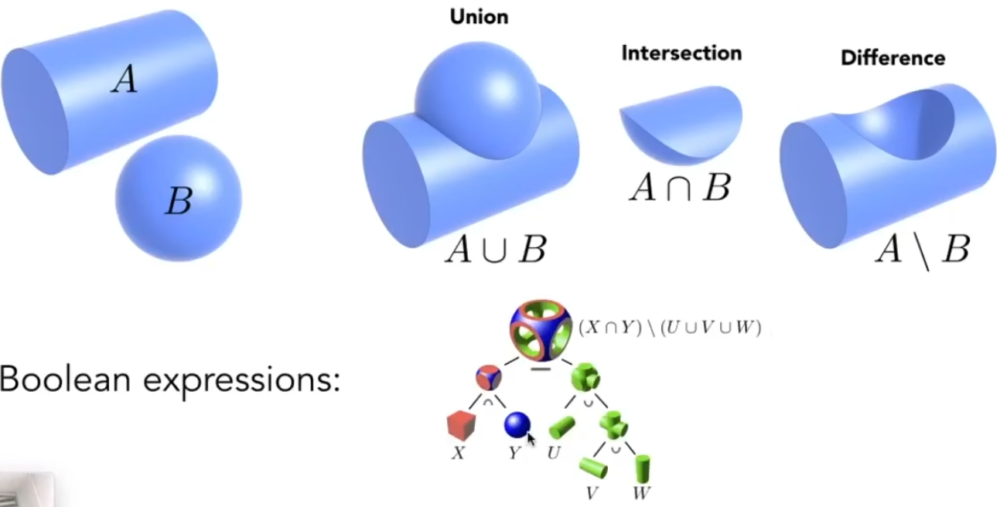
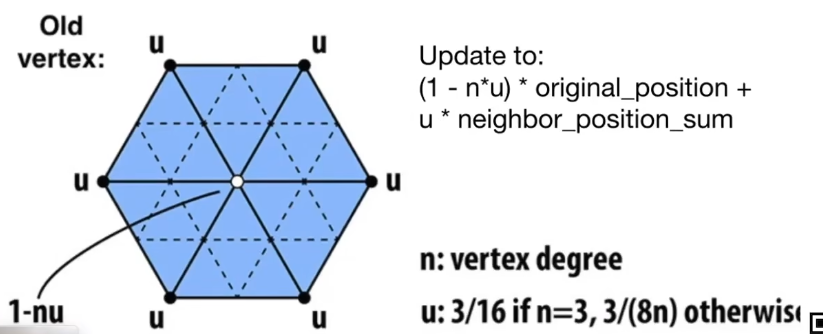

# 现代计算机图形学

+ We learn graphics, not graphics APIs(GAMES101)  
+ 与**计算机视觉**不同，视觉是***一切需要理解、猜测有关的内容***  
+ 图形学：Model-->Image，视觉：Image-->Model  
+ 建议使用VSC，不建议文本编辑器，因为大工程  
+ 路线：**图形**层面（**MVP**变换-\>**视口**ViewPort变换）---\>**图像**层面（**Rasterization**光栅化-\>**着色**Shading）  

***

## Lec1 Intro

### 环境搭建

GAMES101中的虚拟磁盘是VB的voi，但是习惯VMware的vmdk，使用diskgenius可以转换虚拟硬盘，但转换后无法进入系统，不得不用vb，又用了两次后VB崩溃，放弃虚拟机路线；在Udeb与x1c上自己搭建。详见**实验作业**中的环境搭建部分。  

### 应用领域

游戏，电影特效，动作捕捉，渲染，设计，可视化，VR，AR，仿真，GUI图形用户接口，字体设计（the quick brown fox jump over the lazy dog）  

### 关于游戏画面体现的图形学

简单的结论：越亮越好。因为越亮说明渲染用的全局光照越足。  

### 光栅化

就是把三维对象显示在屏幕上，在**实时计算机图形学**中有广泛应用。  
***实时计算机图形学***：每秒能生成30帧画面。否则就叫***离线计算机图形学***    

***

## Lec2 Review Linear Algebra

***a swift and brutal introduction***

### 图形学学科基础

1. **基础数学**：线代、统计、微积分  
2. **物理**：光学、力学等以及高等物理，如波动光学  
3. **其他**：信号处理、数值分析  
4. **美学**；~~美是难的~~  

**本课线代主要内容**：向量（点乘、叉乘），矩阵（矩阵间、矩阵与向量间乘法）。例如表示空间一个点，用三个坐标，是向量表示；平移、旋转等也可以表示成矩阵乘法。

### 向量 Vector

#### 点积：输入2*向量，输出1*常量

##### 先前熟悉的部分

方向、长度(||**a**||)、单位向量（归一化、表示方向）、向量求和（三角法则、平行四边形法则），向量直角坐标系表示，向量转置，向量点乘(**a**·**b**=||**a**||\*||**b**||\*cos，运算律)

##### 先前不熟悉的部分

+ 图形学默认向量是**列向量**  
+ **笛卡尔坐标系**中的向量点乘可以简化，只要对应相乘，最后相加  

##### 点乘在图形学中作用：

+ 计算两个向量间的***夹角***  
+ 计算***向量投影***（Projection）：单位向量\*投影系数（||**b**||cos\*a(^)），从而还可以***正交分解***向量  
+ 计算两个向量的***方向有多么接近***：两个方向向量点积越接近，乘积越接近1  
+ 判断***前与后（方向是否基本一致）***

#### 叉积：输入2*向量，输出1*向量

##### 熟悉

结果向量方向（右手螺旋法则，垂直于输入平面），大小(||**a**x**b**||=||**a**||\*||**b**||\*sin)，不可交换性（要加负号）

##### 不熟悉

+ 向量与自己叉乘，所得为零向量，而不是0  
+ 可以写出表达式，较为复杂，后面有专门的矩阵乘法形式

##### 作用

+ ***建立三维直角坐标系***（**右手坐标系**：x叉乘y所得为z的坐标系）  
**建立方法**：三个向量模均为1、两两点乘积均为0、其中一向量等于另外两叉乘  
**向量三维正交分解表示法**：**p**=(**p**·**u**)**u**+(**p**·**v**)**v**+(**p**·**w**)**w**
+ 判定***左与右、内与外***，例如判断**b**在**a**的左右，通过求叉乘，在左侧结果为正，右侧结果为负；例如判断点p是否在三角形abc内部，则满足**ab**x**ap**、**bc**x**bp**、**ca**x**cp**同号（说明在同一侧）说明在内，否则在外  

### 矩阵 Matrices

#### 熟悉

几行几列的数，数乘，矩阵乘积（条件：(M x N)(N x P)=(M x P)，运算顺序，运算性质：没有交换律、有结合律），矩阵*向量（积一定为列向量，关键），转置（(AB)T=BTAT），单位矩阵（I，对角阵，AA^-1=A^-1A=I）

#### 作用

点乘、叉乘都可以用矩阵\*向量来表示  

***

## Lec3 Transformation 变换：2D&3D

### Why 变换？变换做了什么？

**变换分为：**  
+ modeling 模型变换
+ viewing 视图变换

### 2D变换

***找到变换前后对应的规律：线性变换，写出矩阵***  
线性变换：满足输入向量->乘以矩阵->输出**同维**向量的关系  

#### Scale 缩放

依靠于**缩放矩阵**，是一个**对角阵**，更改对应的系数s即可  
  

#### Reflection 反射/对称

需要**反射矩阵**，如图，会对x进行反射，y不变  
  

#### Shear 切变

可以看作图像有弹性，被**拉扯变形**，依然能通过矩阵实现，**切变矩阵**  
可以想像在**x方向、最上端**进行切变：**水平上**发生了对应的偏移，**最上端**偏移最大，为**a**；**最下端**则没有移动。**竖直上**则没有发生变化。图形高为h，由此可以得到：  
  

#### Rotate 旋转

默认绕原点、逆时针旋转。  
推导**旋转矩阵**方式：**找特殊点、列方程**  
  
**补充**：设想旋转-θ角时，矩阵刚好是旋转θ时矩阵的**转置**，因此，**旋转-θ矩阵是旋转θ矩阵的逆**。

#### Translation 平移

见齐次坐标部分。  

#### Inverse 逆

**逆变换矩阵**是原变换矩阵的逆矩阵  

### Homogeneous coordinates 齐次坐标

#### 平移引发的问题

倘若进行x、y方向上的平移，式子可以轻松地写出来，但是却**不再能**写成“矩阵\*向量”的形式，而要加上平移量。因此，***平移操作不属于线性变换***。  
那么，有没有哪种通用的办法能够将上面这些方法都表示出来？那就是**齐次坐标**；那么代价呢？  

#### 二维坐标的第三维

尝试给二维的点与向量**增加一个维度**：  
+ 对于**点**，其第三维是**0**，即(x,y,0)^T  
+ 对于**向量**，其第三维是**1**，即(x,y,1)^T  

这样，**平移变换**就可以表示成：  
  
结合此式，可以明白点与向量第三维不一样的原因：**向量具有平移不变性**，向量乘以这个矩阵，仍然不变，能够体现。  

#### 第三维的好处

+ 能够将**平移**与**其他变换**统一起来  
+ 在平移时保持了**向量的平移不变性**  
+ 确保了进行的操作是**有意义的**，如“向-向”“点-点”“点+向”都能得到对应的，而“点+点”实际上没有意义，所得2也无法响应  
而根据下图定义，“点+点”可以拓展为两点间的**中点**。  
  

#### 正式的定义

我们可以将**线性变换+平移**的这种组合统一地用**仿射变换地齐次坐标**来表示，如下图：  
  
这个式子也说明了先线性变换，再平移。  

#### 那么代价是

引入了额外的维度，但是代价并没有很大，所以值得  

### 变换的组合

变换需要按一定的顺序。譬如先旋转再平移与先平移再旋转是不一样的，这正与**矩阵乘法没有交换律**相对应。  
同样的，在写时要把向量放在最右边，每一个操作依此**从右往左**写。  

**妙用：**  
+ 利用结合律将多个变化矩阵结合成一个  
+ 实现以任意一点为圆心的旋转，可以先将目标点**平移到原点**-->旋转-->平移回去  

### 3D变换

在2维变换的基础上进行**类比与延伸**  

+ 依然第四维是0为**向量**，剩下的标准化后为**点**  
+ 缩放、平移很简单  

#### 较为复杂：旋转

需要拆解为**绕固定轴旋转**，而且其中y相较于其他两轴，**是反的**，见下图：  
  
+ **原因**：从我们所得到的xyz坐标系的定义出发，x叉乘y得到z，y叉乘z得到x，而**z叉乘x得到y**（观察“xyzxyz……”的顺序）  
+ **拓展**：从绕轴旋转出发，如何得到任意旋转？**Rodrigues' Rotation Formula**就给出了方法：  
	
	+ **前提**：转轴都过原点（倘若是任意一向量可以先平移回原点）  
	+ **证明**：  
	+ **补充**：四元数相关  

***

## Lec4 MVP Transformation 变换：模型、视图、投影  

***this lecture will be difficult :)***  

**Viewing Transformation**：观测变换  
试想拍照的步骤：模特摆pose-->模型变换，相机找角度-->视图变换，茄子-->投影变换。  

### View/Vamera 视图/相机变换（模型视图变换）

#### 定义

以下三个向量**定义**后即可确定相机：  
+ 位置 Position，记作**e**  
+ 朝向 Look-at/Gaze，记作**g**  
+ 向上方向 Up，记作**t**，（若没有此向量，则相机自身的角度无法确定）  

#### 简化

在具体的实现上，我们可以想：只要相机与其他要素之间相对静止，那么整体在任何地方都能有一样的view。因此：  
+ 相机**Position**在**原点origin**(0,0,0)  
+ **Look-up**朝向-**z**方向  
+ **up**向**y**方向  
（约定俗成，**简化**计算）  

#### 基本思路

1. 将**e**平移到origin  
2. 将**g**旋转至-z  
3. 将**t**旋转至y  
4. 将(**g**×**t**)旋转至x  

#### 矩阵实现

1. **顺序**：根据**仿射变换**部分的思考，进行变换时是**先旋转，再平移**，因此回到原点的过程要反过来，即**先平移，再旋转**，因此最后的矩阵应该由**旋转×平移**得到（顺序是从右到左）  
2. **平移矩阵**：由**e**可以轻松得到：  
  
3. **旋转矩阵**：直接思考是很困难的，可以**反过来**研究如何从目标的x、y、-z轴旋转到现在的轴来，代入(1,0,0,0)(0,1,0,0)(0,0,1,0)可以得到对应的矩阵。  
这时，再利用**逆旋转矩阵是旋转矩阵的转置**，把上述矩阵求转置后就得到真正的旋转矩阵：  
  
4. 就这样，将相机与物体用同样的方法进行需要的变换。**因此，相机与模型是相似的，所以称为模型视图变换**  

### Projection 投影变换

#### 投影类别

**投影**分为：  
+ **Orthographic正交**：原本平行的线仍然平行。通常用于**工程制图**，但无法表示**近大远小**。  
认为相机**无限远**，因而原本的深度可以忽略。
+ **Perspective透视**：原本平行的线不在平行，更偏向于**人的感觉**，能够表示**近大远小**。  
认为摄像机是一个**点**，与空间中要投影的深度部分连成一个锥。（同样也解释了相机的焦距）  
  
  

#### Orthographic 正交投影

+ **简单理解**：
	1. 相机位于原点、lookat向-z、up向y（**公式化**放相机）  
	2. 这样能够**忽略**z轴  
	3. **平移、缩放**结果到一个\[-1,1\]\[-1,1\]的矩形里，约定俗成，便于后续计算  
	
+ **正式做法**：
	1. 定义一个空间立方体，通过**三组六个数**（x轴\[**l**(eft),**r**(ight)\]、y轴\[**b**(ottom),**t**(op)\]、z轴\[**f**(ar),**n**(ear)\]的范围）即可。其中左右、上下都是正常，而远近由于方向-z的缘故，越远值越小。  
	2. 将这个立方体**映射（缩放）**到一个体心位于原点的“**canonical cube(\[1,1,1\]^3)**”中，根据几何关系可以写出：  

  

#### Perspective 透视投影

最广泛使用、近大远小。欧氏几何是在同一平面内，而现实中是有着更多角度。  

##### 理解

1. 依然公式化放相机  
1. 假设需要的都在一个台形(**Frustum**)内  
2. 将其“**挤压**”成一个标准的立方体  
3. 对此立方体进行**正交投影**  
4. 规定：**近**平面**完全**不变；**远**平面z值不变，只进行放缩，**中心点**也完全不变  

##### 视锥(Frustum)的定义

1. 首先**定义两个基本数据**：  
	+ 定义**近平面n**的宽度、高度（即**宽高比Aspect ratio**），一般定义**左为-r(ight)**，**下为-t(op)**  
	+ 定义**视角(field of view)**，即**垂直可视角度(fovY)**，是相机与远平面上下边中点连线所成角（可与水平可视角度相互转化）  
2. 然后可以推出**fovY、l、r、b、t**之间的关系：  
	+ tan(fovY/2) = t/|n|  
	+ aspect = r/t  

##### 透视->正交推导

1. 保留z方向上的\[n,f\]，与**x平行**观察，发现Frustum中每一点与近平面组成**相似三角形**：*y prime = y\*n(ear)/z*，同理，*x prime = x\*n(ear)/z*  
2. 根据性质，在z≠0时，只要**比例相同，就是同一个点**，**同乘z**进行简化：  
  
3. 可以列出方程：  
  
根据矩阵乘法的定义，得到三行：  
  
4. 分别代入**近平面n上一点**与**远平面f中点**（因为根据定义其是不变的）：  
  
5. 联立求解，可得*C=n+f*、*D=-nf*，由此可以补完**透视->正交矩阵**：  
  

**思考**：在这样的*挤压*过程中，位于**正中心**的点会挤到哪里？经过自己的仿真计算，得到中间点是向**更近的方向**挤压的。  

***

## Lec5 Rasterization Triangles 三角形的光栅化

### What's after MVP? Screen!

接着Lec4完成MVP后，视锥内所有物品都投影在了\[-1,1\]^3内，接下来就是要将其显示在屏幕上。  

1. **屏幕**的定义：  
	+ 图形学中，对屏幕进行**抽象**，认为是一个**二维数组**，每个元素代表一个**像素(pixel)**  
	+ 数组的**大小**即为**分辨率(resolution)**，比如2560*1600等  
	+ 是一个**光栅成像(raster display)**设备  
2. **像素**的定义：  
	+ 认为一个像素不可再分，是最小单位，内部只能有一种状态  
	+ 当然上方并不是物理事实，也是我们抽象的结果  
	+ 用RGB表示法  
3. **屏幕空间**的定义  
	+ 相当于在屏幕上建立坐标系，认为左下角为**原点**，向右为x，向上为y  
	+ 像素的坐标（indices）都写成**整数坐标**(x,y)的形式  
	+ 所有像素的坐标都从(0,0)到(width-1,height-1)  
	+ 像素(x,y)的**中心**为(x+0.5,y+0.5)  
	+ 整个屏幕是从(0,0)到(width,height)  

### Canonical Cube到屏幕（视口变换Viewport）

+ 本阶段先忽略z轴  
+ 将xy平面映射到屏幕，可以轻松写出矩阵：  
  
（先线性，再平移）  

### 图形->图像：光栅化

示波器（及其art）、阴极射线管(CRT)显示器、平板显示设备(液晶显示LCD、OLED、墨水屏)  

#### 为什么选择三角形

+ 最**基础**的多边形，**任何图形**都可以拆成**三角形**  
+ 其内部一定为**平面**  
+ “内”与“外”定义清晰  
+ 定义了三点的某些性质，在内部可以做渐变  

#### 最简单的方法：采样

采样是把函数离散化的做法，是图形学中的**核心思想**。  

1. 定义一个*inside*函数：*inside*(*tri, x, y*)用于判断点(x,y)是否在三角形tri内部，返回逻辑值
2. ~~遍历屏幕上所有的像素~~，将其中心坐标输入*inside*函数  
**优化**：使用**包围盒Bounding Box**，只要算出三角形左右、上下的起点终点，遍历该区域即可
3. *inside*函数的判断逻辑用到**叉积结论**：▲ABC中，**AB**×**AP**、**BC**×**BP**、**CA**×**CP**都同号，则点P在三角形内部；否则在外部
4. **特殊情况**：点在边上，自己定义，算与不算都无所谓

***

## Lec6 光栅化：反走样(Antialiasing)、深度缓冲(Z-buffering)
**锯齿**(Jaggies)的学名是**走样**(Alias)。   

本节课思维路线：实践上直接采样有锯齿->理论上频域分析为什么有锯齿->理论上抗锯齿的思路->实践上抗锯齿的实现。  

### 采样理论(Sampling)

**采样是广泛存在的**：图片是对现实颜色的采样，视频是对时间的采样  
**采样的问题也是广泛存在的**：**Artifacts**(瑕疵，CG黑话)有锯齿、摩尔纹Moire、车轮倒转等  
Artifacts背后的**原因**是信号改变的太快，采样速度没有跟上导致。

### 频域(frequency domain)分析：why aliasing

**傅里叶分解 Fourier Transform**：将函数分解为多个三角函数的和的近似。这说明了任何一个函数都可以分解成**从低到高不同的频率**的部分，**信号**也一样。  

在采样频率不变的情况下，信号**低频部分**采样失真不明显，但**高频部分**会严重失真。  

可以得出一系列定义：  
+ **傅里叶变换**：时域信号->频域信号。（时域不一定是时间，也可以是空间），也有**逆傅里叶变换**。  
+ **走样Alias**：同样一个采样方法，采样两种不同频率的函数，会导致无法区分。  
+ **滤波Filtering**：去掉特定频率的信号。  

实地变换一张图片为频域，并将其**可视化**，中心低频，往外高频，亮度表示信息量，有下图：  
  
可以发现**低频携带了大量的信息，而高频携带较少信息**，基本所有图像都如此。

同样的，进行一下**高通滤波HighPassFilter**，再逆变换回去，可以得到下图：
  
保留下来的信息是**图像中内容的边界**，可以认为意义是在不同内容的边界处携带的信息在信号上属于**高频信号**。

继续进行**低通滤波LowPassFilter**，逆变换，得到下图：  
  
保留下来的**低频信息**显然失去了细节，从高通滤波的结论也可以理解为失去了边界。

同理，进行**不高不低通滤波**则可以得到可以解释的结论。  

#### 滤波=卷积(Convolution)=平均(Averaging)

##### 卷积Convolution

假设有**一排信号**，**滤波器**是一个横跨几个信号、可以左右移动的**窗口**，其与**相对齐**的信号进行**点乘**（对应相乘、求和），结果写进中间对齐的格子里，从而得到一个**新的信号**，如下图：  
  
以上就是图形学中简化的**卷积**定义，可以看到**滤波器**就是一个（加权）**平均**。

##### 卷积定理

+ **时域上**对两个信号进行卷积，相当于**频域上**两信号频域的乘积。  
+ 也就是说，在时域上对图像进行卷积（滤波）得到的结果，相当于将原图像与滤波盒(BoxFilter)分别进行傅里叶变换的结果相乘，再逆变换回去，二者是一样的。  

+ **滤波盒的大小**与傅里叶变换后的**频域范围关系**：Box越大，频域越小，留下的频率低；Box越小，频域越大，保留下的频率多。  

+ 卷积定理具有**对偶性**，也就是说对偶过来，**时域上的乘积**也等于**频域上的卷积**。

#### 采样=重复(Repeating)频谱

+ **采样的过程**可以理解为：连续的**原函数**乘以一个**采样函数**，这个采样函数由一系列的冲激函数构成，就只留下离散的数据点，就是**采样结果**了。  

+ 其中冲激函数经过傅里叶变换得到的频域形式**也是一系列的冲激函数**。  

+ 因此根据**对偶的卷积定理**，时域上的连续信号经采样后变为离散的信号，在频域上相当于对原信号的频谱进行许多重复，总结为**时域的离散化对应频域上的周期化**  

#### 走样Aliasing = 频谱混叠

根据上面所得，可知**走样的产生原因**：由于采样频率低，**时域上**数据点之间离**远**，对应在**频域上**频谱复制粘贴之间的距离**近**（**卷积盒**外又一个相反），产生了混叠，堆叠的部分即为**走样**

### 得知走样原因，进行反走样：do antialiasing

**方法**：  
1. **增加采样率**：增加频域上频谱之间的距离，可以通过*增加分辨率*等，但耗费高。  
2. **反走样**：**先做模糊再做采样**，这在频域上相当于先进行**低通滤波**，去除高频信息，这样原频谱覆盖的面积变小，这样后续采样时相同的间距，重复的部分变少。  

 **滤波操作**：一个像素取平均。实际上相当于原来是非0则1的二值函数，没有中间渐变的颜色，现在是一个多值函数。求得像素内颜色的比例换算成中间值的颜色。  
（*这里的一个疑问与自己的解：为何不是选取多个像素组成更大的box进行滤波，滤掉高频的波，而是依然选取最小的一个单位像素进行滤波？我的想法是：首先明确图形与图像之间的界限，图形是原原本本的几何图形，图像是光栅化后显示的离散数据，因此即便是一个像素，也可以根据像素的面积范围来计算图形在其中的占比，所以用一个并没有问题。然后为什么不用多个像素，这在分辨率超高下似乎是更自然的，但想想光栅化给出的例子，是一个分辨率与图形差不多的三角形，在那种情况下用多个像素进行卷积的确不如单个像素，因为多个的话box又有些太大了，过于模糊也不好，求面积某种意义上也就是看作一个大像素里面有小像素；并且即便是多么高分辨率显示器，在微观上也会有很小的三角形需要渲染，这个时候高分辨率与低分辨率的处境就是一样的了。*
所以，得出我的结论：***选取一个像素是一种接近问题通解的方法，多个像素成一个大box也就是一个像素思路的特殊情况***）

#### 反走样近似：MSAA（想的没错，但还有点差距）

认为一个像素由**若干小像素**（其实不是真的像素，而是叫采样点）组成，而不是上面理想情况的直接获得精确占比（那样相当于内部有无限个小像素，不实际）。  

计算像素内各个**小像素是否在三角形内部**，然后将占比给像素，譬如4x的话，一个像素就有0、25、50、75、100（%）这几档的中间颜色，其他8x、16x也是同理，这样就实现了**模糊**的操作。  

**注意**：  
+ MSAA是一种**先模糊**的方法，**后采样**可以认为是隐藏在其中，毕竟其执行完后直接一个像素就决定了。
+ MSAA不是通过提升分辨率实现。

**其做出的牺牲：开销提升**：  
x的越多开销越大。在工业界为了减小开销，并不会规整的对像素进行均分来取样，而是采取某种图案，并且样本复用，以实现放最少的采样点，达到最灵敏的效果，间接减小开销。

**其他抗锯齿**：  
+ FXAA(fast)，通过先获取有锯齿的图像进行后期处理，而与采样无关（十分快，找到锯齿边界进行替换）  
+ TAA(temporal，时间上，适合静态物体)，复用上一帧，在时间上进行抗锯齿，相当于延时摄影，直接时间上取平均，因此处理运动会有拖影  
+ 超分辨率（与抗锯齿不是一回事，但目的差不多）：拥有1k的显示器，却只有512的采样，与MSAA一样都是为了弥补采样率不足。方法：DLSS(DeepLearning)，图片放大后弥补锯齿，用‘猜’的方式，采用深度学习。  

### 不同物体之间可见性、遮挡

#### 画家算法（一般不用）

+ **原理**：很**直观**的思路：从远到近，这样就能达到正确的遮挡关系，这称为“**画家算法**(**Painter's Algorithm**)”。在某些情况下工作正常。  
+ **不足**：  
	1. 需要对**深度**（depth）进行精确的计算以确定渲染顺序，n个三角形的时间复杂度为O(nlogn)  
	2. 面对复杂图形（比如相互遮挡的情况）会宕机  
	

因此***一般不使用画家算法***。  

#### 深度缓冲（Z-Buffer）

+ **原理**：既然对于空间中三角形渲染顺序不好判断，那么直接**将渲染最小单元变为像素**，在每一个像素内记录其上几何物体**最浅的深度**。  
+ **形式**：在生成图像（存入framebuffer）的同时，**额外同步生成**一个图像，只存储各个像素所看到的物体最浅的深度，这个图像就叫**深度图/深度缓存**。  
+ **更新假设**：为了简化计算，我们这里认为Z值（深度）一直是正的，所以越小越近，越大越远。
+ **实践方式**：  
	1. 用**伪代码**表示如下  
	
	init all depth buffer = ∞  
	for(每一个三角形 T)  
	for(T内的每一个像素 p(x,y,z))  
	if(z < zbuffer\[x,y\])  
	framebuffer\[x,y\] = p.rgb;  
	zbuffer\[x,y\] = z;
	else ;

	2. **文字描述**：  
	首先将深度缓存中所有像素深度初始化为∞；  
	遍历每一个三角形中的每一个像素p，p具有(x,y,z)的坐标与rgb的待渲染颜色；  
	判断：如果当前像素p的深度更小（更近），则用其颜色更新framebuffer，同时用其深度更新zbuffer，否则什么都不做。  
+ **复杂度**：n个三角形为O(n)  
+ **优点**：与渲染顺序无关，都会得到一致的图像（忽略深度完全相同时候，因为基本都是浮点数，绝对相等很少；实际上也有绝对相等时候，也不做考虑）  
+ **拓展**：对深度zbuffer同样进行MSAA反走样，边界会更美观。  

***

## Lec7 Shading_1 着色_1

### 定义

引入明暗、颜色；在图形学中具体的定义是**对不同的物体应用不同的材质**。  

### 最简易的着色模型：B-P反射模型(1)

现实光照下有这几种着色特征：  
1. **高光**：特别亮的地方，称为高光，较为光滑的表面，发生镜面反射  
2. **漫反射**：颜色变化相对不剧烈的部分，较为粗糙表面，将光反射到四面八方  
3. **间接光照**：没有直接接收到光源光照，而是由环境中的反射光照亮，比较复杂，在**路径追踪**中再研究，这里简化。  

我们只要将上面三种表示出来，就可以实现**一种材质着色模型**。  

#### 基本参数定义

+ **ShadingPoint**：我们需要着色的点，在物体表面，在极小范围内认为是平面  
+ **法线n**：垂直于ShadingPoint所在平面的单位向量  
+ **观测方向v**：ShadingPoint与相机（观察点）的连线，是**单位向量**  
+ **光照方向l**：ShadingPoint与光源的连线，也是**单位向量**  
+ **表面参数**：ShadingPoint的颜色color、shiniess（并非亮度）  

**注意**：我们这里的着色是**局部(Local)**的，并不会考虑这个点是否在阴影内，也就是不考虑其他物体的存在。**Shading≠Shadow**  

#### Diffuse Reflection 漫反射项

+ **物理特性**：  
	1. 光照**均匀反射至各个方向**。因此表面颜色在**各个方向看都一样**（这里是光线与表面夹角不变，改变观测方向）；  
	2. 每一根光线（或每一单位光照）都**携带一定的能量**。因此物体自身旋转时，漫反射的亮度会改变（旋转时在光线上的投影面积变化，能量变化，光强变化）。  
	也就是根据**法线与光照方向l的夹角余弦**来确定强度，**cos = l·n**，称为Lambert's cosine law  
	3. 点光源能量球壳模型，高中有学，直接结论：如果认为在距离点光源单位距离上一点的强度为*I*，那么距离点光源r的点上强度就变为*I/r^2*  
	
+ 综合2、3特性，可以得到**漫反射强度**公式为：  
  
**L_d**为接收到的漫反射强度；  
**k_d**为**漫反射系数**，用来描述不同材料对光照能量的吸收程度（认为材料本身会吸收一定能量）以及物体自身颜色来；  
**I/r^2**为点光源能量球壳公式；  
**max**表示限定反射这一情景，以免出错。  

***

## Lec8 Shading_2 着色_2

### 最简易的着色模型：B-P反射模型(2)

#### Specular Term 高光/镜面反射项

+ **物理特性**：  
	物体表面**光滑**时，可以看作是一个（近似的）**镜面反射**，观察发现观测方向与反射光线**相接近**时，就会看到高光，因此需要追踪反射光线，较为麻烦  
	
	**B-P模型巧妙**：观察方向接近镜面反射方向\<\=\=\>**半程向量接近法线**。由于观测方向**v**与光照方向**l**均为**单位向量**，因此**半程向量h**十分好求，**法线n**也是已知项，大大简化问题。  
	
+ 由上述**几何分析**与前置知识，推出**镜面反射强度**公式为：  
  
**L_s**为接收到的镜面反射强度；  
**k_s**为**镜面反射系数**，控制整体亮度，这里bp模型为了**简化**，不考虑镜面反射的吸收；  
**max**限定反射情景；  
**h·n**(即**cos**)用点乘来描述方向接近程度，对于单位向量，越接近越趋近于1；  
**指数p**是用来限制高光，即使点乘能够反映接近程度，但容忍度太高，不符合实际，所以加上指数来降低**大角度的容忍度**，在BP模型中取100-200。  

#### Ambient Term 环境光照项

环境反射光**十分复杂**，由于我们的模型为**简化模型**，因此采用一个大胆的**错误假设**（物理上）：认为任何一个点接收到的环境光照永远是相同的。其表达式如下：  
  
**L_a**为接受到的环境光强度；  
**k_a**为**环境光系数**；  
**I_a**为**假设的不变的环境光**。  

其是一个**常数**：与入射方向**l**、观测方向**v**、法线方向**n**等均无关，其实就是**基本颜色**，其保证了**没有地方是完全黑的**。  

日后要提高模型精度，需要用到**全局光照**。  

#### 综合起来的Blinn-Phong反射模型

  
对每一个Shading Point进行一次操作，即可得出。  

### Shading Frequencies 着色频率

即在什么对象上应用着色：整个面、每一个顶点、每一个像素？  

#### Flat Shading：Shade each triangle 

认为三角形的面是**平**的，也就是**三角形**只有一个法向量与着色，整个三角形着色完全一致  

#### Gourand Shading：Shade each vertex

为三角形的**每一个顶点**求一次法向量并进行**着色**，再用**插值**求出三角形内的着色。  

#### Phong Shading：Shade each pixel

依然为三角形的**每一个顶点**求一次法向量，再通过**插值**求得三角形内部**每一个像素**的法向量，再对每一个像素进行**着色**。  

#### 联系

着色频率取决于面、顶点、像素本身出现的频率，**并不是**说flat一定更粗糙，phong一定更大开销，而是与模型的**具体面数**有关。  

#### 问题解决

1. **顶点的法向量怎么求？**  
	+ **理想情况**：知道模型要表现的原图形，直接使用原图形来求。但一般不知道。  
	+ **求平均**：发现一个顶点往往是被周围的其他三角形**所共用**，那么认为求平均即可：**顶点法向量** = **∑N_i / ||∑N_i||**  
	+ **进阶：加权平均**：面积越大，对法向量的贡献越大，把简单平均变为**按面积的加权平均**即可。  
2. **逐像素法线怎么求**  
通过重心坐标插值。见后。  

### 图形管线Graphics Pipeline/实时渲染管线Real-time Rendering Pipeline

#### Pipeline

**pipeline**就是从输入场景-->输出图像的全过程，基本都接触到了：  

**Input:3D vertices**-->*通过VertexProcessing*-->  
**2D vertices**-->*通过TriangleProcessing*-->  
**Triangles**-->*通过Rasterization*-->  
**Fragment**-->*通过FragmentProcessing*-->  
**Shaded Fragment**-->*通过FrameBuffer处理**-->  
**Output:image**  

MVP变换：对应VertexProcessing，对每一个顶点进行变换  
光栅化：即Rasterization  
深度测试：对应FragmentProcessing  
着色：对应VertexProcessing（顶点着色）或FragmentProcessing（逐像素着色）  
纹理：对应VertexProcessing或FragmentProcessing  

#### Shader

**现代GPU**里发生的也就是**pipeline**中的过程，其中有些部分是**可编程**的，比如**shader**（着色器），给予我们决定顶点或像素如何进行着色的权限。  

**shader**本身是一些能在**硬件上执行的语言**，可以使用openGL这一api进行shader的编写。shader是一个通用的程序，其会自己对每一个顶点/像素都进行一次判断，因此不用写for循环。  

如果是顶点操作，那么叫**VertexShader 顶点着色器**，如果对像素进行操作，那么叫**PixelShader/FragmentShader 像素/片段着色器**，其语法与cpp相似。  

[shadertoy](https://www.shadertoy.com/)是一个很好的网站，只需要关注shader的逻辑。  

### Texture Mapping 纹理映射

在着色时，我们不希望物体整体都是同一种颜色，因此需要在着色前为**不同位置的点**定义**不同的属性**，这种属性我们就称为纹理。   

#### Texture定义在哪里

尽管**物体本身**是三维的，但是其**表面**我们可以认为是二维。也就是说我们可以建立起**三维空间中的一点**与**二维图像的一点**之间的映射关系。这个二维图像就是**纹理Texture**。  

关于建立起这个关系的**过程**，我们并**不关心**，纹理本身是由艺术家设计，而生成最佳的对应关系需要几何学家的研究与优化（是一个研究方向）。我们只需要**在建立起来的映射关系上进行后续工作**。  

#### 纹理坐标系

纹理是一个**二维图像**，因此其也拥有自己的**坐标系**来对应纹理上的一点。**通常用**(**u,v**)来表示，并约定u、v均在0-1上，无论分辨率、长宽比。  

纹理可以**重复使用**，映射在多个地方，**好的纹理设计**是可以上下左右无限延伸，密铺的时候相邻两个映射同一块纹理的区域就不会有缝隙。有专门的算法进行这种纹理的生成（也是一个研究方向）。  

***

## Lec9 Shading_3 着色3：纹理的一些应用

### 重心坐标 Barycentric Coordinates：在三角形内部进行任何属性的插值

#### 插值的原因

我们往往只会在**三角形的顶点**处得到某些属性的**具体值**，而我们希望在**三角形内部**对这些值进行**平滑的过渡**，因此就要使用**插值**这一方法利用顶点值求得内部各点的值。  

#### 插值方法：重心坐标

+ **原理及定义**  
三角形ABC内的**任意**一点(x,y)，都可以通过三角形**三个顶点**坐标的**线性组合**来表示:  
(**x,y**) **= αA + βB + γC** (**α+β+γ=1且α、β、γ非负**)  
记(**α,β,γ**)为(x,y)的重心坐标  

+ **具体点的表示**  
	+ A、B、C点：直接对应的系数为1即可  
	+ **任意一点**：  
	用该点分别连接ABC三点，可以将三角形分为三个三角形，用与其对应的顶点标记，根据相关几何关系可以知道**重心坐标**与**小三角形面积**有如下关系：  
	  
	+ **重心**：  
	由上面的关系可以知道**重心的重心坐标**为(1/3,1/3,1/3)。  
	
+ **应用重心坐标**
	由重心坐标的定义，可以很自然的想到三角形内部一点的其他属性也可以使用这种线性组合的方式来定义出来：  
	V_(x,y) = αV_A + βV_B + γV_C (**α+β+γ=1且α、β、γ非负**)  
	其中，V可以是坐标、纹理坐标、颜色、法线、深度等，因此应用范围**十分广泛**。  

	**但是**，重心坐标在**投影变化**下不能保持不变，因此我们若想要插值**三维坐标**下的一些属性，就应该在三维状态下进行插值，而非投影后才进行插值。**尤其是深度！**  
	
### 纹理应用 Applying Texture

#### 伪代码

for 所有采样点(x,y):  
(u,v) = (x,y)使用重心坐标插值得到的纹理坐标;  
texcolor = 纹理坐标上(u,v)对应的值;  
set (x,y).color to texcolor;  

#### 问题及解决

##### 多pixel:单texel(纹理放大)与Bilinear解决

当**实际分辨率**大于**纹理分辨率**时会导致模糊不清，称为纹理放大。  

+ **原因**：  
	纹理放大时，在进行映射的过程中会导致映射成为小数，像素对应上**使用round**，导致渲染面上多个点共享纹理上的一个texel（纹理上的像素叫做texel）。  
	
+ **解决方法**：**双线性插值 Bilinear interpolation**    
	找到映射点对应纹理上周围的四个像素（纹理像素叫做texel）的中心，组成一个正方形，求出对应的水平、竖直单位距离(s,t)，再进行**双线性插值lerp**，见下图：  
	  
	这样就解决了纹理放大。  
	***注：***双线性插值没有很玄乎，就是一个线性函数y=kx+b的推导。见作业部分。  
	
##### 单pixel:多texel与mipmap、Anisotropic解决

当**实际分辨率**小于**纹理分辨率**时，也会产生问题：摩尔纹与锯齿。  

+ **原因**：  
	在这种情况下进行渲染面到纹理的映射时，由于分辨率差异，渲染面上的一个像素实际对应的是纹理上的一大片texel，而采样只使用对应过去的一个texel，造成了后果。  
	在**信号学**上进行分析，可以知道一个像素包含了一大块纹理，即采样数量很少，但信息频率很高，就会造成混淆  
	
+ **解决方法**：  
	1. **Mipmap**  
	首先会很自然地想到**超采样**来消除，但是花销太大，不考虑。  
	那么就换个角度想，**不采样**，直接找一种方法立刻**获得一片区域内的平均值**就好。（这里其实是点查询与范围查询的问题，我们这里只用到范围查寻中的平均值）   
		+ 使用**Mipmap**进行范围查询，其做的是**快速、近似、正方形**查询。*Mipmap在拉丁语意为“许多微小的小东西”*。*这个技术在计算机视觉领域称为“图像金字塔”*。  
		+ Mipmap会基于原区域生成**一系列的图层**，每层分辨率减小一半，在渲染前就会生成，以便渲染时直接调用，如下图：  
	  
	其额外造成的内存开销可以通过等比数列/级数求和，求的结果是4/3，因此**额外的存储量**占原图的**1/3**  
		+ **纹理区域的估计**：  
	取**需要渲染的像素以及其上方、右方的像素**，求其在**纹理上**所分别映射的三个点的坐标，计算之间的距离，选取其中**最大值**来近似区域的**边长L**，就可以确定出以对应点为中心、	边长为L的minimap正方形区域，如下图：  
	  
	这里使用微分式，实际就是上述表示  
		+ **区域的对应**  
	通过**D=log2L**，可以将对应的区域(L^2)在minimap的第D层对应成一个像素，譬如256\*256的原纹理，计算出L=4，以4texel为1texel的分辨率是64\*64，的确是D=2。  
	这里也可以使用**双线性插值**，倘若对应过去D层不是像素正中心，还可以使用双线性插值来获取颜色  
	（*然而这里其实我不太理解：如果说问题一是多个pixel对应一个texel，所以需要进行双线性插值，但是问题二是一个pixel对应多个texel，经过Mipmap映射已经实现了一个pixel对应一个texel，已经是理想状态了，为何还要再次进行双线性插值？*  
	我自己的解释是：*即使通过mipmap已经实现了pixel->texel的一对一，但毕竟这是一个近似变换，也是形状强行变成正方形，所以可能依然存在实际上多pixel对应一个texel的情况，因为这种非线性变换或许算是复变函数？可能会导致分布不均匀，相邻的一些块对应过去就是同一种。有了这种情况，就要用双线性插值来规避*）  
	如果D**不是整数**，那么就可以使用**插值**来计算出，这里叫**三线性插值 Trilinear Interpolation**，即对**D上**的双线性插值与**D+1上**的双线性插值结果**再进行一次线性插值**。三线性插值本身开销并不大。  
		+ **Mipmap的缺点：过度模糊 Overblur**  
		因为mipmap强行变成正方形，一些对应成矩形、细长斜放、不规律的纹理区域并不适合。  

	2. **各向异性过滤 Anisotropic**
		各向异性：在不同方向上性质不同。  
		+ Ripmaps：其相比于mipmap，多了一些矩形的存在，而不是强行变为正方形。因此能比mipmap强一些。但是依然无法解决细长斜放、不规律的问题。总共的开销最后收敛于变为原来3倍，一般打游戏开满，对性能没有太大影响，只要显存够用。  
		+ EWA filtering：基本思想是任何形状都可以被许多圆形覆盖，通过多次查询，但开销很大。  

### 纹理进阶

#### 纹理的再定义

在现代GPU中，**纹理**=一块**内存**，以及在这块内存上进行的**区域查询**（**滤波**）  
这极大拓展了对以往纹理只是一张图像的认识，其甚至还可以是**三维**的。  
无论如何，只要在着色器中对应的进行解释就可以。  

#### 环境光记录

可以将环境光直接**记录在物体表面**  
1. *Spherical Map*  
	**直接**将环境光信息记录在**球面**上；  
	缺点是画面**扭曲变形**严重。  
2. **cube map法**：  
	制作一个包围盒，然后连一条射线，从球心出发，经过球面与立方体表面，将球面上的环境光照信息记录在**对应的立方体表面**。这样就能通过六个面记录球面上的环境光照信息，并且画面比较**均匀**。  
	缺点是确定光照方向时要**解算**在哪个面上。  

####  纹理用于凹凸贴图/法线贴图 Bump Map

纹理**不一定**只能用来记录颜色（之前纹理是用来替换BP模型的漫反射项系数来记录颜色），还可以定义任何位置的任何属性。  

**凹凸贴图/法线贴图是什么？**  
凹凸贴图指定义物体表面上任意一点的**相对高度**的纹理（认为原本有一个基础表面，纹理定义沿着其法线的相对高度），在**不实际改变几何形体**、不令其变复杂的情况下，使得法线方向发生变化，相当于人为做一个假的法线、造成假的着色结果，从而欺骗人的眼睛。  

**法线/位移贴图 Normal/Bump map 到底做了什么？**  
通过法线贴图，给物体表面定义了**复杂的纹理**，但并不去改变**几何信息**，通过原本的法线信息与纹理外加的信息结合，实现将任何一个像素的**法线进行扰动**。  

**法线的重新计算方法**  
认为是在一个**局部坐标系下**，假设法线方向是(0,1)或(0,0,1)，这是由**真实坐标系**经过一个变换得到的这个局部坐标，后面再对计算出的法线进行逆变换即变回真实坐标系。  
+ **二维下**：  
	设在p点的**原平面法线**为**n**(**p**)**=**(**0,1**)（二维下便于理解）  
	新的凹凸平面高度数据为**h**(**p**)  
	求出p点的**梯度**以确定**切线**方向，在二维上为(**1,dp**)，计算机为**dp=c** \* [**h**(**p+1**)-**h**(**p**)]，其中c为一个**系数**，用于决定凹凸贴图的影响大小  
	有了切线(1,dp)，就可以根据规律求出**法线**为(**-dp,1**)（并进行**归一化**以满足法线模为1）  
+ **三维下**：  
	原法线为(**0,0,1**)  
	求两个方向的导数以得梯度:**dp/du =** **c_1** \* [**h**(**u+1**) **- h**(**u**)]以及**dp/dv =** **c_2** \* [**h**(**v+1**) **- h**(**v**)]  
	求得法线为(**-dp/du, -dp/dv, 1**)并归一化（推导略）  

#### 凹凸贴图之外更现代化的贴图：位移贴图 Displacement mapping

位移贴图与凹凸贴图的输入是完全**一致**的，而不同点在于位移贴图会真的改变物体的**几何形体**  
位移贴图**弥补**了凹凸贴图**边缘仍然平滑的“露馅”**、自己产生的阴影无法**投射自己**的缺点  
而其**代价**是要求**模型**三角形本身足够**精细**。（但人们都不愿意上去就让模型过于精细，会想到以一个粗糙的为底，同步检测是否需要再精细，这就是**Direct X的api**，动态曲面细分）  

#### 三维纹理与体积渲染VolumeRending

定义三维空间中的一个**噪声函数**，经过一系列**处理**，从而变成大理石、山脉起伏、海浪等，譬如有名的*Perlin noise*  
三维纹理可以用来对三维进行渲染，就像ct等一样。  

#### 纹理还可以存放之前算好的信息

对于一些需要高算力的实时解算（比如**环境光遮蔽 ambient occlusion**），有一种简化的方式：将其计算出来的结果存放在“阴影纹理图”中，调用时相乘即可得到效果不错的阴影。  
这也说明纹理当然不只能存颜色。只要在着色器中解释好就没问题。  

***

## Lec10 Geometry Intro 几何Intro

### 几何归类

***没有最好的表示方式。***  

+ **隐式表示几何 Implicit Geometry**  
	1. **意义**：  
	    不明确给出几何的各个点，而是给出几何点之间**满足的关系**  
	    例如球面的隐式表示：x^2+y^2+z^2=1，还有更通用的形式f(x,y,z)=0，满足条件的点在几何面上。  
	    计算机图形学中更多用隐式表示  
	
	2. **特性**：  
	    优点为确定“**点是否在表面上**”较为**简单**；表示起来简单；很容易进行光线求交；表达精确；拓扑结构准确  
	    缺点为理解“**什么点在表面上**”较为**困难**；难以表达过于复杂的几何  
	
	3. **不同的方法**：  
		+ **数学公式**表示法：易于表示**简单图形**，越复杂的图形表示越复杂  
		+ **CSG** ：通过基本几何图形的**布尔运算**来表示，例如并union、交intersection、差difference,从而表示出复杂的图形：  
		  
		得到了非常广泛的应用  
		+ **Distance Functions 距离函数**：对于任何一个几何，不去直接描述其表面，而是描述任何一个点到这个表面的最近距离  
		即**距离函数**：指空间中任意一点到想要表述的几何形体上任意一点最小距离，可以是正、负。通常用于几何之间**圆滑过渡**。  
		+ **Level Set Methods 水平集**，类似于等高线，可以定义在二维与三维，与距离函数类似。  
		+ **Fractals 分型**：分型即为自相似。其变化频率极高，易走样，不好控制  

+ **显式表示几何 Explict Geometry**  
	1. **定义**：  
	最简单的表示：直接给出面上的**点的坐标**  
	另一种显式表示：使用**参数映射**来定义，例如定义一个函数，其能实现输入(**u,v**)，输出(**x,y,z**)，只要遍历(u,v)就能得到映射的面的所有点，例如甜甜圈型：f(u,v)=((2+cos u) cos v, (2+cos u) sin v, sin u)  
	但总之要么直接给出，要么间接计算才得到  
	2. **特性**：  
	与隐式相反。  

## Lec11 Geometry: Curves and Surfaces 几何：曲线与曲面

### 几何显式表示（续）

1. **Point Cloud 点云**  
不考虑物体实际表面，直接上一堆点集，**list of points(x,y,z)**  
是最简单的表示法，理论上可以表示任何类型的几何。  

2. **Polygon Mesh 多边形面**  
也是比较常见的显式表示法，一般以三角形表示，很容易处理，但数据结构比较复杂。  
图形学常用来表达多边形面的文件类型：**The Wavefront Object File (.obj)**，是一个文本文件，分开存放顶点、发现、纹理坐标，最后再将其组织成不同三角形。  

### 曲线

#### 典型曲线：Bézier Curves

贝塞尔曲线形状优美，是用一系列的**控制点**所定义的，控制点会给予一些性质，以定义其起点、终点等。  

对应的算法称作**de Casteljau 算法**，其**原理**是假设贝塞尔曲线是与**时间相关**的函数，在t=0时在起点，t=1时在终点。  

##### 曲线算法

首先给出二次(quadratic)例子：  
  
三次(cubic)例子：  
  
假设目前时间为t，取b0-b1的t比例处点b1_0，再取b1-b2的t比例处点b1_1，这样得到**三点形成的两线段上的两点**，也就是**3点**-->**2点**；  
将新得到的两点连起来，再取b1_0与b1_1的t比例处点b2_0，这样得到**两点形成的一线段上的一点**，也就是**2点**-->**1点**；  
这样就结束了，点b2_0就是在时间t时贝塞尔曲线所在位置。  

这里也能说明**贝塞尔曲线**是**显式几何表示**，因为通过参数定义，间接求得。  

##### 代数形式 Algebraic Formula

由上述的推导过程，可知一定存在一种**代数表示**，能够从控制点得到贝塞尔曲线上的点。  

可以发现，整个推导过程其实就是不断的**线性插值**，以二次贝塞尔为例：  
+ **b1_0(t) = (1-t)b0 + tb1**与**b1_1(t) = (1-t)b1 + tb2**（注意这里的比重，前者是1-t）
+ **b2_0(t) = (1-t)b1_0 + tb1_1**
+ 结合上式，直接展开：**b2_0(t) = (1-t)^2 b0 + 2tb1 + t^2 b2**

由此拓展，可以得到规律：  
  
伯恩斯坦多项式第一项其实**不是向量**，而是**组合数**  
点不止限于2维，任何维度都可以。  

##### Properties 特性

+ 给定的起点、终点  
+ 起点处的切线与第一段同向，终点处的切线与最后一段同向
+ 对控制点进行**仿射变换**(其实就是齐次坐标那里的线性变换，旋转+平移)后求得的贝塞尔曲线，就相当于原贝塞尔曲线每一点进行**仿射变换**得到的新曲线  
**注意**，这里不包括**投影变换**后的贝塞尔曲线，投影不符合这个规律，这也与之前的相符。  
+ **凸包性质**：贝塞尔曲线一定在控制点所形成的**凸包 Convex Hull**内。  
（凸包是能包裹所有给定点的最小多边形；想象一块板子上钉满钉子，撑开橡皮筋，放手，如下图）  
  

##### 优化：Picewise Bezier Curves

当贝塞尔曲线的**阶数很高**时，由于递归性质开销会略微增大，但更大的问题是难以控制，与直观不符合。  
于是试图**分段Piecewise**绘制贝塞尔曲线，并且更习惯用**四段三次cubic**的分段。  

为了保证分段贝塞尔曲线在交界处**连续Continuity**，有多种定义方式：  
+ **C0连续**：上一条终点与下一条起点相同  
+ **C1连续**：在C0连续的基础上，使上一条与下一条的控制点距离公共控制点**共线**且**等距**
+ 之后还想要更连续，可以自行提高次数，如曲率连续等  

#### 其他曲线：splines样条

一种可控的曲线。常用的为**B-splines**，依然用到伯恩斯坦多项式进行加权，是贝塞尔曲线的拓展，性能更好，有**局部性**，方便微调；但是**极其复杂**，入门课程不讨论；在其之上还有**NURBS 非均匀有理B样条**。  
更深入的可以参考[清华计算机图形学课程](https://www.bilibili.com/video/BV13441127CH/?spm_id_from=333.788.top_right_bar_window_history.content.click&vd_source=3ae5bbb47e51877952f949c5dfa350dc)  

### 曲面

#### Bezier Surfaces 贝塞尔曲面

**拓展**贝塞尔曲线的定义到贝塞尔曲面。道理类似于**二次线性插值**。  

以最常见的**4x4点阵贝塞尔曲面**为例：  
+ 将点阵分为4份，正好是4x**四段三次cubic**贝塞尔曲线  
+ 对每一条贝塞尔曲线都求其**在时间t**所在处的点  
+ 以四个点为控制点，绘出新的贝塞尔曲线  
+ 不断改变t的值，所得贝塞尔曲线**扫过的面**就为贝塞尔曲面

#### 计算贝塞尔曲面上任意一点

由定义可知，贝塞尔曲面有两个**时间**，分别用于控制水平与纵向的曲线。所以用**(u, v)**来表示  
先使用确定四条贝塞尔曲线上的四个点，再用v求得新曲线上的点。  
这里依然能够证明**显式表达**，因为涉及计算。  

### 更普遍：Mesh网格

一般常见的三角形网格，并有一定的操作：  
+ **Mesh subdivision** 网格细分，用更多三角形表示更精细  
+ **Mesh simplification** 网格简化，用更少的三角形表示大体形状  
+ **Mesh regularization** 网格正则化，用更均匀的三角形来表示，即没有细长三角形  

***

## Lec12 Geometry3 几何3

***Make Computer Graphic Great Again!***  

#### 续 Mesh subdivision

细分三角形不光要数量更多，相对的位置也要更多才有用  

##### Loop Subdivision

+ **数量增多**  
将每个三角形分为四个，即每条边取中点，得到新顶点、新三角形  
+ **调整位置**  
采用新旧顶点分别根据各自规则，进行移动更新的方法：  
	+ **新顶点规则**：认为当前新顶点为A、B的中点，共享此点的三角形还有C、D两点，则新顶点为**3/8\*(A+B) + 1/8\*(C+D)**  
  
	+ **旧顶点规则**：首先获取旧顶点的度drgee，记为n；再根据n的值定义一个u，则旧顶点为**(1-n\*u)*旧顶点原坐标 + u\*相邻旧顶点坐标和**  
  

如此使得表面经细分后更光滑   

##### Catmull-Clark Subdivision (General Mesh)

前面提到的loop细分，是基于网格都是三角形。对于更一般的网格（有四边形），则这个方法更适用。  

**基本定义**：  
+ **quad face**：网格中的四边形
+ **Non-quad face**：网格中的非四边形
+ **extraordinary vertex 奇异点**：网格中度数不为4的点

**引入新点**：  
	+ 每一条边取**中点**  
	+ 每条面上取**中点**（可以是重心等位置）  
	+ **连接**边上新点与面上新点  
引入新点后，可以发现所有非四边形面**都消失**了，并且奇异点增加了非四边形面数，之后，哪怕再来一次，奇异点数也不会再增加。  

**规则调整**：  
可以把点分为三类：  
	+ **Face Point**，在面中间的点，取面的四顶点求平均  
	+ **Edge Point**，在边上的点，求相邻两面中心点与边上点平均  
	+ **old Point**，旧点，求周围面中点、边中点的平均  
如下图，道理就是求包住自己的点的均值。  
  

#### Mesh Simplification

固然越精细的建模效果越好，但有时为了节省资源，或者距离很远时精细与粗糙都差不多时，就可以进行简化。道理就像**贴图中的mipmap**一样，离得远就把细节变模糊。但是不同于面上的简化，三维简化是一个问题。  

##### 一种方法：Collapsing An Edge 边坍缩

选择某些边，将其“捏”成一个点，就成功消去一个边。  

道理很简单，但实际不容易，比如应该坍缩哪些边？如下图，求平均显然不行，后来引入一种方法是**Quadric Error Metrics 二次误差度量**，比较有效。  
  
二次误差与机器学习中的L2距离比较类似，就是求某一点，使得这一点到与其相关联的目标线/面的平方和最小。  

如此，给每一条边进行这样的计算，**从平方和最小边**开始坍缩。  
这个过程有一些问题，比如每次坍缩完后都有其他边受到影响，需要重新计算受影响元素的二次误差，进行更新。这个问题最合适的**数据结构**为**优先队列/堆**。  

**整体思路**：求二次误差-->取最小坍缩-->更新受影响元素-->继续。这个过程是一个**贪心算法**，不保证有全局最优解，但效果也够用了。  

***

## Lec13 Ray Tracing 1 阴影贴图 & 光线追踪_1

**光线追踪**与**光栅化**是**完全不同**的两种方式。  
but在光线追踪的实时阴影前……先回头看看**光栅化**中的典型阴影。  

### Shadows 阴影

之前的光栅化中的**着色shading**过程中，我们**只考虑**绝对光源与物体自身正在着色的一部分，而**不会考虑**其他物体、甚至物体自身其他部分的影响（用环境光一言以蔽之），譬如有物体挡在待渲染物体与光源之间。接下来就来解决**阴影shadow**的问题，叫做**Shadow Mapping**  

#### Shadow Mapping 原理

本质上是**图像空间 Image Space**的算法，也就是在生成阴影的这一步，**不必知道**具体的场景几何信息，其也会**产生走样**。  

**重要思想 Key Idea**：  
+ **不在阴影中的点**，必须要在**摄像机**中能看到这个点，**光源**中也可以看到该点。因此是一个非0即1的**硬阴影**  
+ 这类经典方法只适用于**点光源**  

#### Shadow Mapping 过程

1. **Render from Light**  
假设从位于**点光源的摄像机**出发，获取类似的**深度信息图像**，以此来实现光线传播。  
2. **Project to light**  
再从真正的**观察点摄像机**出发，再次观察场景，将场景中观察到的点**投影回光源画面**的对应像素，获取点光源深度信息，若实际深度信息与其一致（**约等于**，因为是浮点运算，也不好控制），则说明是**有光源覆盖**的。  
  
如上图所示。  

**问题**：  
+ 由于阴影信息相当于是一个**贴图**（即**shadow map**），因此也有其对应的分辨率。所以之前相关的问题依然会存在，尤其是实际分辨率大于贴图分辨率时。  
+ 只能实现**硬阴影**，阴影的边缘十分锐利（区分于**软阴影**，是一个物理光学现象，本影等概念，如图，取决于光源大小）  
  
+ 浮点计算导致相等判断不好算  

***以上即为经典的光栅化阴影，下面将研究光线追踪***  

### why Ray Tracing？

