# 现代计算机图形学
+ we learn graphics, not graphics APIs(GAMES101)  
+ 与**计算机视觉**不同，视觉是***一切需要理解、猜测有关的内容***  
+ 图形学：Model-->Image，视觉：Image-->Model  
+ 建议使用VSC，不建议文本编辑器，因为大工程  
+ 路线：**图形**层面（**MVP**变换-\>**视口**ViewPort变换）---\>**图像**层面（**Rasterization**光栅化-\>**着色**Shading）  

***

## PA1 Intro

### 环境搭建
GAMES101中的虚拟机是VB的voi，但是习惯vmdk，发现pro的diskgenius可以转虚拟硬盘，转换后无法进入系统，遂放弃，不得不用vb，用了两次后崩溃，打算后面在x1c上自己搭建。详见实验作业。  

### 应用领域
游戏，电影特效，动作捕捉，渲染，设计，可视化，VR，AR，仿真，GUI图形用户接口，字体设计（the quick brown fox jump over the lazy dog）  

### 关于游戏画面体现的图形学
简单的结论：越亮越好。因为越亮说明渲染用的全局光照越足。  

### 光栅化
就是把三维对象显示在屏幕上，在**实时计算机图形学**中有广泛应用。  
***实时计算机图形学***：每秒能生成30帧画面。否则就叫***离线计算机图形学***    

***

## PA2 Review Linear Algebra

***a swift and brutal introduction***

### 图形学学科基础

1. **基础数学**：线代、统计、微积分  
2. **物理**：光学、力学等以及高等物理，如波动光学  
3. **其他**：信号处理、数值分析  
4. **美学**；~~美是难的~~  

**本课线代主要内容**：向量（点乘、叉乘），矩阵（矩阵间、矩阵与向量间乘法）。例如表示空间一个点，用三个坐标，是向量表示；平移、旋转等也可以表示成矩阵乘法。

### 向量 Vector

#### 点积：输入2*向量，输出1*常量

##### 先前熟悉的部分
 
方向、长度(||**a**||)、单位向量（归一化、表示方向）、向量求和（三角法则、平行四边形法则），向量直角坐标系表示，向量转置，向量点乘(**a**·**b**=||**a**||\*||**b**||\*cos，运算律)

##### 先前不熟悉的部分

+ 图形学默认向量是**列向量**  
+ **笛卡尔坐标系**中的向量点乘可以简化，只要对应相乘，最后相加  

##### 点乘在图形学中作用：

+ 计算两个向量间的***夹角***  
+ 计算***向量投影***（Projection）：单位向量\*投影系数（||**b**||cos\*a(^)），从而还可以***正交分解***向量  
+ 计算两个向量的***方向有多么接近***：两个方向向量点积越接近，乘积越接近1  
+ 判断***前与后（方向是否基本一致）***

#### 叉积：输入2*向量，输出1*向量

##### 熟悉

结果向量方向（右手螺旋法则，垂直于输入平面），大小(||**a**x**b**||=||**a**||\*||**b**||\*sin)，不可交换性（要加负号）

##### 不熟悉

+ 向量与自己叉乘，所得为零向量，而不是0  
+ 可以写出表达式，较为复杂，后面有专门的矩阵乘法形式

##### 作用

+ ***建立三维直角坐标系***（**右手坐标系**：x叉乘y所得为z的坐标系）  
**建立方法**：三个向量模均为1、两两点乘积均为0、其中一向量等于另外两叉乘  
**向量三维正交分解表示法**：**p**=(**p**·**u**)**u**+(**p**·**v**)**v**+(**p**·**w**)**w**
+ 判定***左与右、内与外***，例如判断**b**在**a**的左右，通过求叉乘，在左侧结果为正，右侧结果为负；例如判断点p是否在三角形abc内部，则满足**ab**x**ap**、**bc**x**bp**、**ca**x**cp**同号（说明在同一侧）说明在内，否则在外  

### 矩阵 Matrices

#### 熟悉

几行几列的数，数乘，矩阵乘积（条件：(M x N)(N x P)=(M x P)，运算顺序，运算性质：没有交换律、有结合律），矩阵*向量（积一定为列向量，关键），转置（(AB)T=BTAT），单位矩阵（I，对角阵，AA^-1=A^-1A=I）

#### 作用

点乘、叉乘都可以用矩阵\*向量来表示  

***

## PA3 Transformation 变换：2D&3D

### Why 变换？变换做了什么？

**变换分为：**  
+ modeling 模型变换
+ viewing 视图变换

### 2D变换

***找到变换前后对应的规律：线性变换，写出矩阵***  
线性变换：满足输入向量->乘以矩阵->输出**同维**向量的关系  

#### Scale 缩放

依靠于**缩放矩阵**，是一个**对角阵**，更改对应的系数s即可  
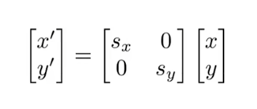  

#### Reflection 反射/对称

需要**反射矩阵**，如图，会对x进行反射，y不变  
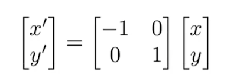  

#### Shear 切变

可以看作图像有弹性，被**拉扯变形**，依然能通过矩阵实现，**切变矩阵**  
可以想像在**x方向、最上端**进行切变：**水平上**发生了对应的偏移，**最上端**偏移最大，为**a**；**最下端**则没有移动。**竖直上**则没有发生变化。图形高为h，由此可以得到：  
  

#### Rotate 旋转

默认绕原点、逆时针旋转。  
推导**旋转矩阵**方式：**找特殊点、列方程**  
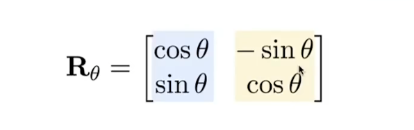  
**补充**：设想旋转-θ角时，矩阵刚好是旋转θ时矩阵的**转置**，因此，**旋转-θ矩阵是旋转θ矩阵的逆**。

#### Translation 平移

见齐次坐标部分。  

#### Inverse 逆

**逆变换矩阵**是原变换矩阵的逆矩阵  

### Homogeneous coordinates 齐次坐标

#### 平移引发的问题

倘若进行x、y方向上的平移，式子可以轻松地写出来，但是却**不再能**写成“矩阵*向量”的形式，而要加上平移量。因此，***平移操作不属于线性变换***。  
那么，有没有哪种通用的办法能够将上面这些方法都表示出来？那就是**齐次坐标**；那么代价呢？  

#### 二维坐标的第三维

尝试给二维的点与向量**增加一个维度**：  
+ 对于**点**，其第三维是**0**，即(x,y,0)^T  
+ 对于**向量**，其第三维是**1**，即(x,y,1)^T  

这样，**平移变换**就可以表示成：  
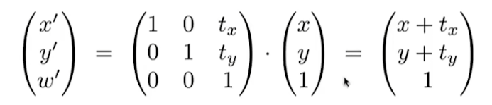  
结合此式，可以明白点与向量第三维不一样的原因：**向量具有平移不变性**，向量乘以这个矩阵，仍然不变，能够体现。  

#### 第三维的好处

+ 能够将**平移**与**其他变换**统一起来  
+ 在平移时保持了**向量的平移不变性**  
+ 确保了进行的操作是**有意义的**，如“向-向”“点-点”“点+向”都能得到对应的，而“点+点”实际上没有意义，所得2也无法响应  
而根据下图定义，“点+点”可以拓展为两点间的**中点**。  
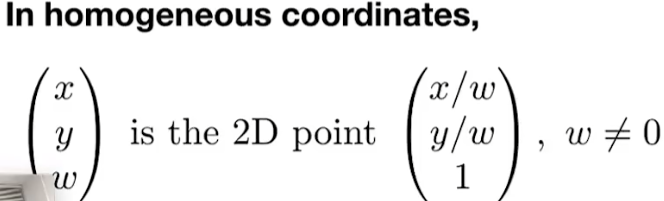  

#### 正式的定义

我们可以将**线性变换+平移**的这种组合统一地用**仿射变换地齐次坐标**来表示，如下图：  
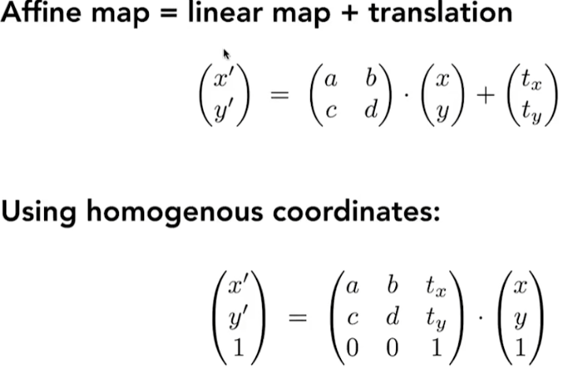  
这个式子也说明了先线性变换，再平移。  

#### 那么代价是

引入了额外的维度，但是代价并没有很大，所以值得  

### 变换的组合

变换需要按一定的顺序。譬如先旋转再平移与先平移再旋转是不一样的，这正与**矩阵乘法没有交换律**相对应。  
同样的，在写时要把向量放在最右边，每一个操作依此**从右往左**写。  

**妙用：**  
+ 利用结合律将多个变化矩阵结合成一个  
+ 实现以任意一点为圆心的旋转，可以先将目标点**平移到原点**-->旋转-->平移回去  

### 3D变换

在2维变换的基础上进行**类比与延伸**  

+ 依然第四维是0为**向量**，剩下的标准化后为**点**  
+ 缩放、平移很简单  

#### 较为复杂：旋转

需要拆解为**绕固定轴旋转**，而且其中y相较于其他两轴，**是反的**，见下图：  
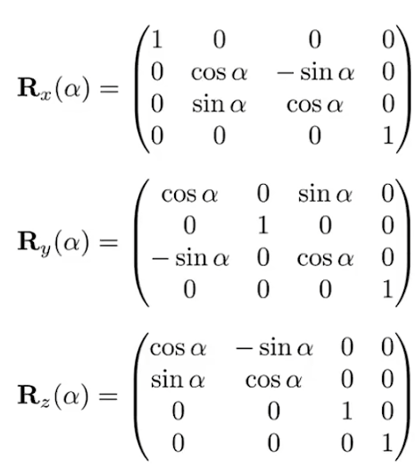  
+ **原因**：从我们所得到的xyz坐标系的定义出发，x叉乘y得到z，y叉乘z得到x，而**z叉乘x得到y**（观察“xyzxyz……”的顺序）  
+ **拓展**：从绕轴旋转出发，如何得到任意旋转？**Rodrigues' Rotation Formula**就给出了方法：  
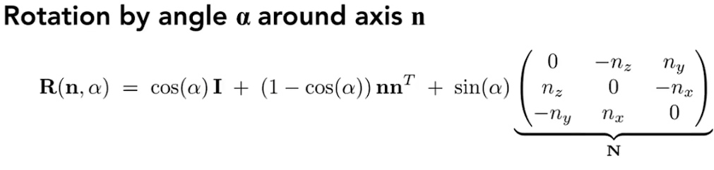
	+ **前提**：转轴都过原点（倘若是任意一向量可以先平移回原点）  
	+ **证明**：  
	+ **补充**：四元数相关  

***

## PA4 MVP Transformation 变换：模型、视图、投影  

***this lecture will be difficult :)***  

**Viewing Transformation**：观测变换  
试想拍照的步骤：模特摆pose-->模型变换，相机找角度-->视图变换，茄子-->投影变换。  

### View/Vamera 视图/相机变换（模型视图变换）

#### 定义

以下三个向量**定义**后即可确定相机：  
+ 位置 Position，记作**e**  
+ 朝向 Look-at/Gaze，记作**g**  
+ 向上方向 Up，记作**t**，（若没有此向量，则相机自身的角度无法确定）  

#### 简化

在具体的实现上，我们可以想：只要相机与其他要素之间相对静止，那么整体在任何地方都能有一样的view。因此：  
+ 相机**Position**在**原点origin**(0,0,0)  
+ **Look-up**朝向-**z**方向  
+ **up**向**y**方向  
（约定俗成，**简化**计算）  

#### 基本思路

1. 将**e**平移到origin  
2. 将**g**旋转至-z  
3. 将**t**旋转至y  
4. 将(**g**×**t**)旋转至x  

#### 矩阵实现

1. **顺序**：根据**仿射变换**部分的思考，进行变换时是**先旋转，再平移**，因此回到原点的过程要反过来，即**先平移，再旋转**，因此最后的矩阵应该由**旋转×平移**得到（顺序是从右到左）  
2. **平移矩阵**：由**e**可以轻松得到：  
  
3. **旋转矩阵**：直接思考是很困难的，可以**反过来**研究如何从目标的x、y、-z轴旋转到现在的轴来，代入(1,0,0,0)(0,1,0,0)(0,0,1,0)可以得到对应的矩阵。  
这时，再利用**逆旋转矩阵是旋转矩阵的转置**，把上述矩阵求转置后就得到真正的旋转矩阵：  
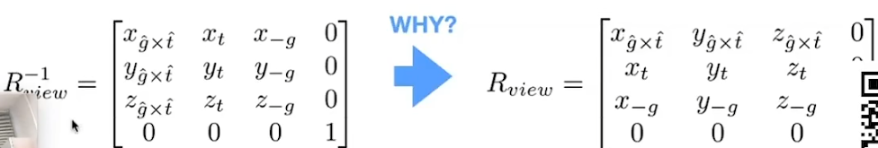  
4. 就这样，将相机与物体用同样的方法进行需要的变换。**因此，相机与模型是相似的，所以称为模型视图变换**  

### Projection 投影变换

#### 投影类别
**投影**分为：  
+ **Orthographic正交**：原本平行的线仍然平行。通常用于**工程制图**，但无法表示**近大远小**。  
认为相机**无限远**，因而原本的深度可以忽略。
+ **Perspective透视**：原本平行的线不在平行，更偏向于**人的感觉**，能够表示**近大远小**。  
认为摄像机是一个**点**，与空间中要投影的深度部分连成一个锥。（同样也解释了相机的焦距）  
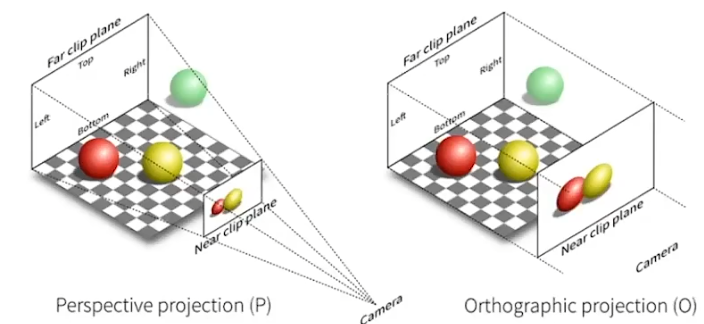  
  

#### Orthographic 正交投影

+ **简单理解**：
	1. 相机位于原点、lookat向-z、up向y（**公式化**放相机）  
	2. 这样能够**忽略**z轴  
	3. **平移、缩放**结果到一个\[-1,1\]\[-1,1\]的矩形里，约定俗成，便于后续计算  
	
+ **正式做法**：
	1. 定义一个空间立方体，通过**三组六个数**（x轴\[**l**(eft),**r**(ight)\]、y轴\[**b**(ottom),**t**(op)\]、z轴\[**f**(ar),**n**(ear)\]的范围）即可。其中左右、上下都是正常，而远近由于方向-z的缘故，越远值越小。  
	2. 将这个立方体**映射（缩放）**到一个体心位于原点的“**canonical cube(\[1,1,1\]^3)**”中，根据几何关系可以写出：  

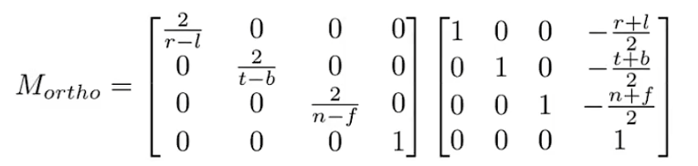  

#### Perspective 透视投影

最广泛使用、近大远小。欧氏几何是在同一平面内，而现实中是有着更多角度。  

##### 理解
1. 依然公式化放相机  
1. 假设需要的都在一个台形(**Frustum**)内  
2. 将其“**挤压**”成一个标准的立方体  
3. 对此立方体进行**正交投影**  
4. 规定：**近**平面**完全**不变；**远**平面z值不变，只进行放缩，**中心点**也完全不变  

##### 视锥(Frustum)的定义
1. 首先**定义两个基本数据**：  
	+ 定义**近平面n**的宽度、高度（即**宽高比Aspect ratio**），一般定义**左为-r(ight)**，**下为-t(op)**  
	+ 定义**视角(field of view)**，即**垂直可视角度(fovY)**，是相机与远平面上下边中点连线所成角（可与水平可视角度相互转化）  
2. 然后可以推出**fovY、l、r、b、t**之间的关系：  
	+ tan(fovY/2) = t/|n|  
	+ aspect = r/t  
	+ 

##### 透视->正交推导
1. 保留z方向上的\[n,f\]，与**x平行**观察，发现Frustum中每一点与近平面组成**相似三角形**：*y prime = y\*n(ear)/z*，同理，*x prime = x\*n(ear)/z*  
2. 根据性质，在z≠0时，只要**比例相同，就是同一个点**，**同乘z**进行简化：  
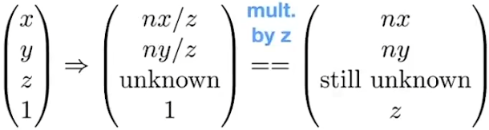  
3. 可以列出方程：  
  
根据矩阵乘法的定义，得到三行：  
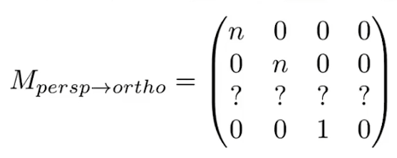  
4. 分别代入**近平面n上一点**与**远平面f中点**（因为根据定义其是不变的）：  
  
5. 联立求解，可得*C=n+f*、*D=-nf*，由此可以补完**透视->正交矩阵**：  
  

**思考**：在这样的*挤压*过程中，位于**正中心**的点会挤到哪里？经过自己的仿真计算，得到中间点是向**更近的方向**挤压的。  

***

## PA5 Rasterization Triangles 三角形的光栅化

### What's after MVP? Screen!
接着PA4完成MVP后，视锥内所有物品都投影在了\[-1,1\]^3内，接下来就是要将其显示在屏幕上。  

1. **屏幕**的定义：  
	+ 图形学中，对屏幕进行**抽象**，认为是一个**二维数组**，每个元素代表一个**像素(pixel)**  
	+ 数组的**大小**即为**分辨率(resolution)**，比如2560*1600等  
	+ 是一个**光栅成像(raster display)**设备  
2. **像素**的定义：  
	+ 认为一个像素不可再分，是最小单位，内部只能有一种状态  
	+ 当然上方并不是物理事实，也是我们抽象的结果  
	+ 用RGB表示法  
3. **屏幕空间**的定义  
	+ 相当于在屏幕上建立坐标系，认为左下角为**原点**，向右为x，向上为y  
	+ 像素的坐标（indices）都写成**整数坐标**(x,y)的形式  
	+ 所有像素的坐标都从(0,0)到(width-1,height-1)  
	+ 像素(x,y)的**中心**为(x+0.5,y+0.5)  
	+ 整个屏幕是从(0,0)到(width,height)  

### Canonical Cube到屏幕（视口变换Viewport）
+ 本阶段先忽略z轴  
+ 将xy平面映射到屏幕，可以轻松写出矩阵：  
  
（先线性，再平移）  

### 图形->图像：光栅化

示波器（及其art）、阴极射线管(CRT)显示器、平板显示设备(液晶显示LCD、OLED、墨水屏)  

#### 为什么选择三角形
+ 最**基础**的多边形，**任何图形**都可以拆成**三角形**  
+ 其内部一定为**平面**  
+ “内”与“外”定义清晰  
+ 定义了三点的某些性质，在内部可以做渐变  

#### 最简单的方法：采样
采样是把函数离散化的做法，是图形学中的**核心思想**。  

1. 定义一个*inside*函数：*inside*(*tri, x, y*)用于判断点(x,y)是否在三角形tri内部，返回逻辑值
2. ~~遍历屏幕上所有的像素~~，将其中心坐标输入*inside*函数  
**优化**：使用**包围盒Bounding Box**，只要算出三角形左右、上下的起点终点，遍历该区域即可
3. *inside*函数的判断逻辑用到**叉积结论**：▲ABC中，**AB**×**AP**、**BC**×**BP**、**CA**×**CP**都同号，则点P在三角形内部；否则在外部
4. **特殊情况**：点在边上，自己定义，算与不算都无所谓

***

## PA6 光栅化：反走样(Antialiasing)、深度缓冲(Z-buffering)
**锯齿**(Jaggies)的学名是**走样**(Alias)。   

本节课思维路线：实践上直接采样有锯齿->理论上频域分析为什么有锯齿->理论上抗锯齿的思路->实践上抗锯齿的实现。  

### 采样理论(Sampling)

**采样是广泛存在的**：图片是对现实颜色的采样，视频是对时间的采样  
**采样的问题也是广泛存在的**：**Artifacts**(瑕疵，CG黑话)有锯齿、摩尔纹Moire、车轮倒转等  
Artifacts背后的**原因**是信号改变的太快，采样速度没有跟上导致。

### 频域(frequency domain)分析：why aliasing

**傅里叶分解 Fourier Transform**：将函数分解为多个三角函数的和的近似。这说明了任何一个函数都可以分解成**从低到高不同的频率**的部分，**信号**也一样。  

在采样频率不变的情况下，信号**低频部分**采样失真不明显，但**高频部分**会严重失真。  

可以得出一系列定义：  
+ **傅里叶变换**：时域信号->频域信号。（时域不一定是时间，也可以是空间），也有**逆傅里叶变换**。  
+ **走样Alias**：同样一个采样方法，采样两种不同频率的函数，会导致无法区分。  
+ **滤波Filtering**：去掉特定频率的信号。  

实地变换一张图片为频域，并将其**可视化**，中心低频，往外高频，亮度表示信息量，有下图：  
  
可以发现**低频携带了大量的信息，而高频携带较少信息**，基本所有图像都如此。

同样的，进行一下**高通滤波HighPassFilter**，再逆变换回去，可以得到下图：
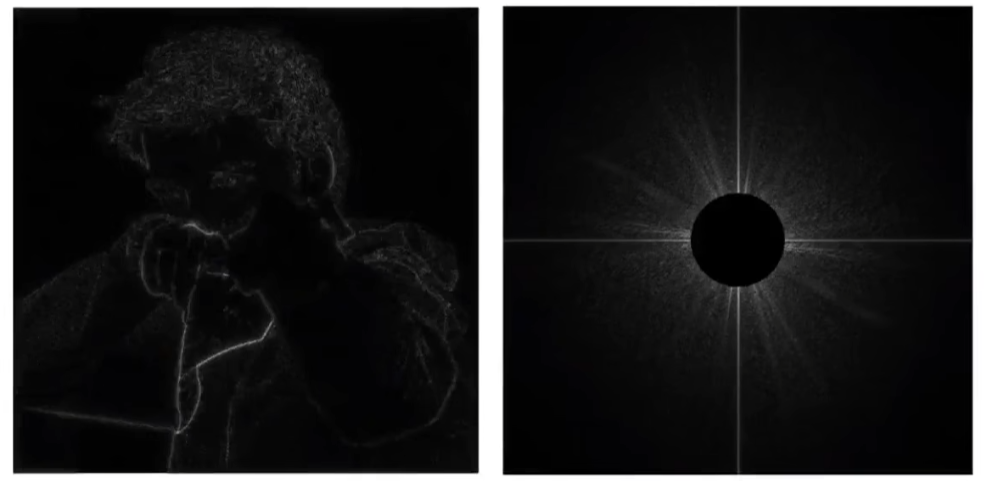  
保留下来的信息是**图像中内容的边界**，可以认为意义是在不同内容的边界处携带的信息在信号上属于**高频信号**。

继续进行**低通滤波LowPassFilter**，逆变换，得到下图：  
  
保留下来的**低频信息**显然失去了细节，从高通滤波的结论也可以理解为失去了边界。

同理，进行**不高不低通滤波**则可以得到可以解释的结论。  

#### 滤波=卷积(Convolution)=平均(Averaging)

##### 卷积Convolution
假设有**一排信号**，**滤波器**是一个横跨几个信号、可以左右移动的**窗口**，其与**相对齐**的信号进行**点乘**（对应相乘、求和），结果写进中间对齐的格子里，从而得到一个**新的信号**，如下图：  
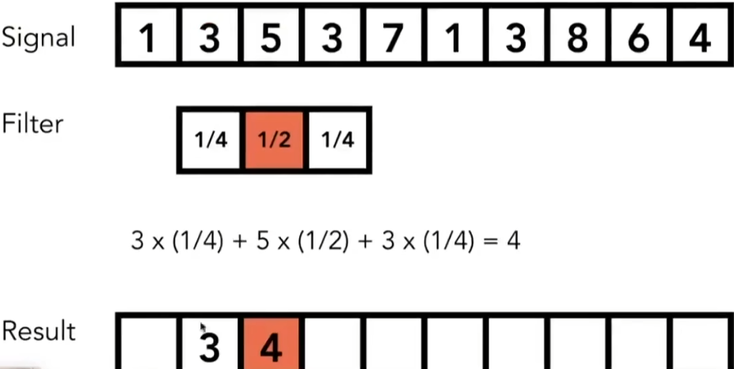  
以上就是图形学中简化的**卷积**定义，可以看到**滤波器**就是一个（加权）**平均**。

##### 卷积定理
+ **时域上**对两个信号进行卷积，相当于**频域上**两信号频域的乘积。  
+ 也就是说，在时域上对图像进行卷积（滤波）得到的结果，相当于将原图像与滤波盒(BoxFilter)分别进行傅里叶变换的结果相乘，再逆变换回去，二者是一样的。  

+ **滤波盒的大小**与傅里叶变换后的**频域范围关系**：Box越大，频域越小，留下的频率低；Box越小，频域越大，保留下的频率多。  

+ 卷积定理具有**对偶性**，也就是说对偶过来，**时域上的乘积**也等于**频域上的卷积**。

#### 采样=重复(Repeating)频谱

+ **采样的过程**可以理解为：连续的**原函数**乘以一个**采样函数**，这个采样函数由一系列的冲激函数构成，就只留下离散的数据点，就是**采样结果**了。  

+ 其中冲激函数经过傅里叶变换得到的频域形式**也是一系列的冲激函数**。  

+ 因此根据**对偶的卷积定理**，时域上的连续信号经采样后变为离散的信号，在频域上相当于对原信号的频谱进行许多重复，总结为**时域的离散化对应频域上的周期化**  

#### 走样Aliasing = 频谱混叠

根据上面所得，可知**走样的产生原因**：由于采样频率低，**时域上**数据点之间离**远**，对应在**频域上**频谱复制粘贴之间的距离**近**（**卷积盒**外又一个相反），产生了混叠，堆叠的部分即为**走样**

### 得知走样原因，进行反走样：do antialiasing

**方法**：  
1. **增加采样率**：增加频域上频谱之间的距离，可以通过*增加分辨率*等，但耗费高。  
2. **反走样**：**先做模糊再做采样**，这在频域上相当于先进行**低通滤波**，去除高频信息，这样原频谱覆盖的面积变小，这样后续采样时相同的间距，重复的部分变少。  

 **滤波操作**：一个像素取平均。实际上相当于原来是非0则1的二值函数，没有中间渐变的颜色，现在是一个多值函数。求得像素内颜色的比例换算成中间值的颜色。  
（*这里的一个疑问与自己的解：为何不是选取多个像素组成更大的box进行滤波，滤掉高频的波，而是依然选取最小的一个单位像素进行滤波？我的想法是：首先明确图形与图像之间的界限，图形是原原本本的几何图形，图像是光栅化后显示的离散数据，因此即便是一个像素，也可以根据像素的面积范围来计算图形在其中的占比，所以用一个并没有问题。然后为什么不用多个像素，这在分辨率超高下似乎是更自然的，但想想光栅化给出的例子，是一个分辨率与图形差不多的三角形，在那种情况下用多个像素进行卷积的确不如单个像素，因为多个的话box又有些太大了，过于模糊也不好，求面积某种意义上也就是看作一个大像素里面有小像素；并且即便是多么高分辨率显示器，在微观上也会有很小的三角形需要渲染，这个时候高分辨率与低分辨率的处境就是一样的了。*
所以，得出我的结论：***选取一个像素是一种接近问题通解的方法，多个像素成一个大box也就是一个像素思路的特殊情况***）

#### 反走样近似：MSAA（想的没错，但还有点差距）
认为一个像素由**若干小像素**（其实不是真的像素，而是叫采样点）组成，而不是上面理想情况的直接获得精确占比（那样相当于内部有无限个小像素，不实际）。  

计算像素内各个**小像素是否在三角形内部**，然后将占比给像素，譬如4x的话，一个像素就有0、25、50、75、100（%）这几档的中间颜色，其他8x、16x也是同理，这样就实现了**模糊**的操作。  

**注意**：  
+ MSAA是一种**先模糊**的方法，**后采样**可以认为是隐藏在其中，毕竟其执行完后直接一个像素就决定了。
+ MSAA不是通过提升分辨率实现。

**其做出的牺牲：开销提升**：  
x的越多开销越大。在工业界为了减小开销，并不会规整的对像素进行均分来取样，而是采取某种图案，并且样本复用，以实现放最少的采样点，达到最灵敏的效果，间接减小开销。

**其他抗锯齿**：  
+ FXAA(fast)，通过先获取有锯齿的图像进行后期处理，而与采样无关（十分快，找到锯齿边界进行替换）  
+ TAA(temporal，时间上，适合静态物体)，复用上一帧，在时间上进行抗锯齿，相当于延时摄影，直接时间上取平均，因此处理运动会有拖影  
+ 超分辨率（与抗锯齿不是一回事，但目的差不多）：拥有1k的显示器，却只有512的采样，与MSAA一样都是为了弥补采样率不足。方法：DLSS(DeepLearning)，图片放大后弥补锯齿，用‘猜’的方式，采用深度学习。  

### 不同物体之间可见性、遮挡

#### 画家算法（一般不用）
+ **原理**：很**直观**的思路：从远到近，这样就能达到正确的遮挡关系，这称为“**画家算法**(**Painter's Algorithm**)”。在某些情况下工作正常。  
+ **不足**：  
	1. 需要对**深度**（depth）进行精确的计算以确定渲染顺序，n个三角形的时间复杂度为O(nlogn)  
	2. 面对复杂图形（比如相互遮挡的情况）会宕机  
	
因此***一般不使用画家算法***。  

#### 深度缓冲（Z-Buffer）
+ **原理**：既然对于空间中三角形渲染顺序不好判断，那么直接**将渲染最小单元变为像素**，在每一个像素内记录其上几何物体**最浅的深度**。  
+ **形式**：在生成图像（存入framebuffer）的同时，**额外同步生成**一个图像，只存储各个像素所看到的物体最浅的深度，这个图像就叫**深度图/深度缓存**。  
+ **更新假设**：为了简化计算，我们这里认为Z值（深度）一直是正的，所以越小越近，越大越远。
+ **实践方式**：  
	1. 用**伪代码**表示如下  
	
	init all depth buffer = ∞  
	for(每一个三角形 T)  
	for(T内的每一个像素 p(x,y,z))  
	if(z < zbuffer\[x,y\])  
	framebuffer\[x,y\] = p.rgb;  
	zbuffer\[x,y\] = z;
	else ;

	2. **文字描述**：  
	首先将深度缓存中所有像素深度初始化为∞；  
	遍历每一个三角形中的每一个像素p，p具有(x,y,z)的坐标与rgb的待渲染颜色；  
	判断：如果当前像素p的深度更小（更近），则用其颜色更新framebuffer，同时用其深度更新zbuffer，否则什么都不做。  
+ **复杂度**：n个三角形为O(n)  
+ **优点**：与渲染顺序无关，都会得到一致的图像（忽略深度完全相同时候，因为基本都是浮点数，绝对相等很少；实际上也有绝对相等时候，也不做考虑）  
+ **拓展**：对深度zbuffer同样进行MSAA反走样，边界会更美观。  

***

## PA7 Shading 着色

### 定义

引入明暗、颜色；在图形学中具体的定义是**对不同的物体应用不同的材质**。  

### 最简易的着色模型：B-P反射模型

现实光照下有这几种着色特征：  
1. **高光**：特别亮的地方，称为高光，镜面反射将光集中反射  
2. **漫反射**：颜色变化相对不剧烈的部分，较为粗糙表面将光反射到四面八方  
3. **间接光照**：没有直接接收到光源光照，而是由环境中的反射光照亮，比较复杂，在**路径追踪**中再研究，这里简化。  

我们只要将上面三种表示出来，就可以实现**一种材质着色模型**。  

#### 基本参数定义
+ **ShadingPoint**：我们需要着色的点，在物体表面，在极小范围内认为是平面  
+ **法线n**：垂直于ShadingPoint所在平面的单位向量  
+ **观测方向v**：ShadingPoint与相机（观察点）的连线，是**单位向量**  
+ **光照方向l**：ShadingPoint与光源的连线，也是**单位向量**  
+ **表面参数**：ShadingPoint的颜色color、shiniess（并非亮度）  

**注意**：我们这里的着色是**局部(Local)**的，并不会考虑这个点是否在阴影内，也就是不考虑其他物体的存在。**Shading≠Shadow**  

#### Diffuse Reflection 漫反射
+ **物理特性**：  
	1. 光照**均匀反射至各个方向**。因此表面颜色在**各个方向看都一样**（这里是光线与表面夹角不变，改变观测方向）；  
	2. 每一根光线（或每一单位光照）都**携带一定的能量**。因此物体自身旋转时，漫反射的亮度会改变（旋转时在光线上的投影面积变化，能量变化，光强变化）。  
	也就是根据**法线与光照方向l的夹角**来确定强度，**cos = l·n**，称为Lambert's cosine law  
	3. 点光源能量球壳模型，高中有学，直接结论：如果认为在距离点光源单位距离上一点的强度为*I*，那么距离点光源r的点上强度就变为*I/r^2*  
	
综合2、3，可以得到**漫反射看到的明暗**公式为：  
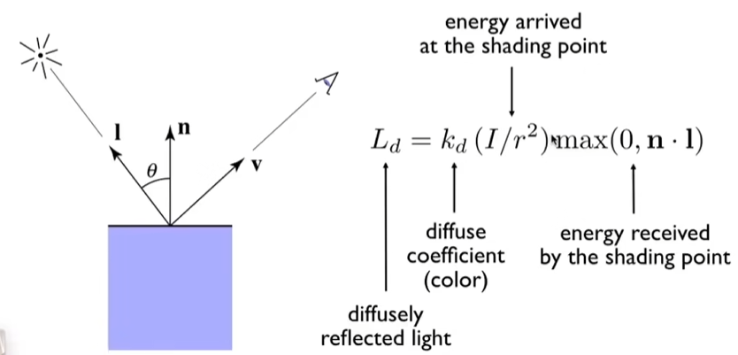  
**L_d**为最后的接收到的漫反射光  
**k_d**为**漫反射系数**，用来描述不同材料对光照能量的吸收程度（认为材料本身会吸收一定能量）并且通过颜色来表示；  
**I/r^2**为点光源能量球壳公式；  
**max**表示限定反射这一情景，以免出错  